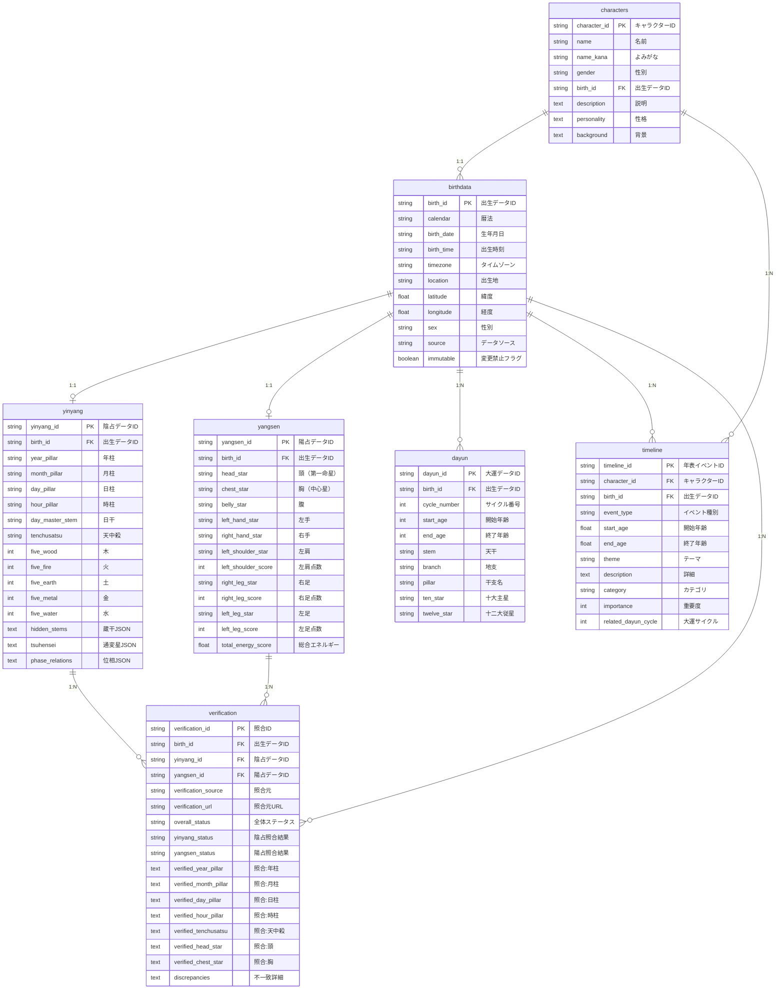
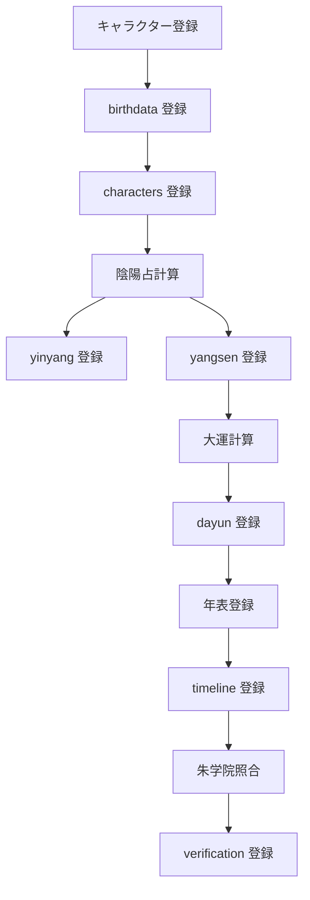
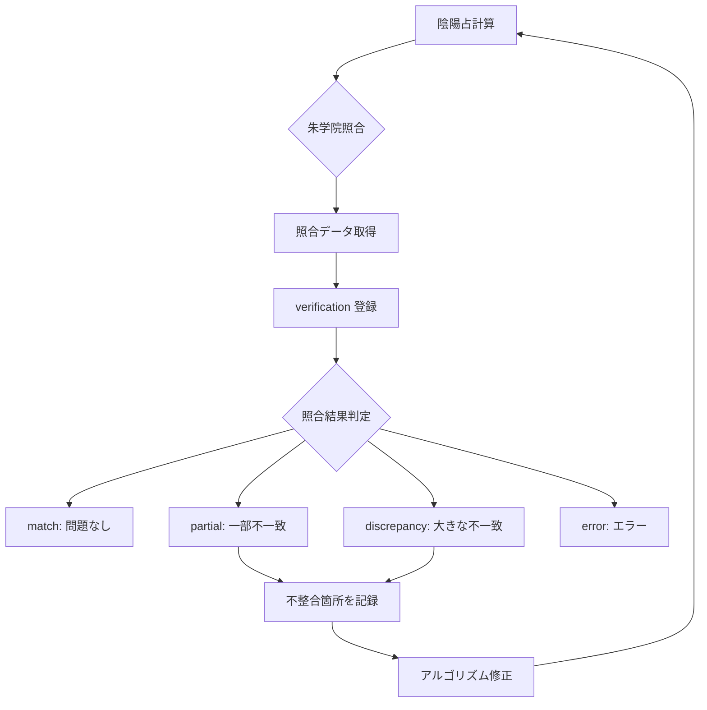

# キャラクター算命学データベース ER 図

## エンティティ関係図 (Mermaid)



## テーブル詳細定義

### 1. characters (キャラクター基本情報)

| カラム名 | データ型 | 制約 | 説明 |
|---------|---------|------|------|
| character_id | TEXT | PK | キャラクターID (C001, C002, ...) |
| name | TEXT | NOT NULL | キャラクター名 |
| name_kana | TEXT | | よみがな |
| nickname | TEXT | | ニックネーム |
| gender | TEXT | NOT NULL, CHECK | 性別 (male/female/other) |
| birth_id | TEXT | NOT NULL, FK, UNIQUE | 出生データID |
| avatar_url | TEXT | | アバター画像URL |
| description | TEXT | | キャラクター説明 |
| personality | TEXT | | 性格特徴 |
| background | TEXT | | 背景ストーリー |
| created_at | TEXT | NOT NULL | 作成日時 |
| updated_at | TEXT | NOT NULL | 更新日時 |

**インデックス:**
- `idx_characters_birth_id`: birth_id
- `idx_characters_gender`: gender

### 2. birthdata (生年月日データ)

| カラム名 | データ型 | 制約 | 説明 |
|---------|---------|------|------|
| birth_id | TEXT | PK | 出生データID (B001, B002, ...) |
| calendar | TEXT | NOT NULL | 暦法 (gregorian/lunar) |
| birth_date | TEXT | NOT NULL | 生年月日 (ISO 8601) |
| birth_time | TEXT | | 出生時刻 (HH:MM) |
| timezone | TEXT | NOT NULL | タイムゾーン |
| location | TEXT | | 出生地 |
| latitude | REAL | | 緯度 |
| longitude | REAL | | 経度 |
| sex | TEXT | NOT NULL, CHECK | 性別 |
| source | TEXT | NOT NULL | データソース |
| immutable | BOOLEAN | NOT NULL | 変更禁止フラグ |
| note | TEXT | | メモ |
| created_at | TEXT | NOT NULL | 作成日時 |
| updated_at | TEXT | NOT NULL | 更新日時 |

**インデックス:**
- `idx_birthdata_date`: birth_date
- `idx_birthdata_location`: location

### 3. yinyang (陰占データ)

| カラム名 | データ型 | 制約 | 説明 |
|---------|---------|------|------|
| yinyang_id | TEXT | PK | 陰占データID |
| birth_id | TEXT | NOT NULL, FK, UNIQUE | 出生データID |
| system | TEXT | NOT NULL | システム種別 |
| year_pillar | TEXT | NOT NULL | 年柱 |
| year_stem | TEXT | NOT NULL | 年干 |
| year_branch | TEXT | NOT NULL | 年支 |
| month_pillar | TEXT | NOT NULL | 月柱 |
| month_stem | TEXT | NOT NULL | 月干 |
| month_branch | TEXT | NOT NULL | 月支 |
| day_pillar | TEXT | NOT NULL | 日柱 |
| day_stem | TEXT | NOT NULL | 日干 |
| day_branch | TEXT | NOT NULL | 日支 |
| hour_pillar | TEXT | | 時柱 |
| hour_stem | TEXT | | 時干 |
| hour_branch | TEXT | | 時支 |
| day_master_stem | TEXT | NOT NULL | 日干 |
| day_master_yinyang | TEXT | NOT NULL, CHECK | 陰陽 |
| day_master_element | TEXT | NOT NULL, CHECK | 五行 |
| tenchusatsu | TEXT | | 天中殺種別 |
| tenchusatsu_branches | TEXT | | 空亡の地支 (JSON) |
| five_wood | INTEGER | NOT NULL | 木の点数 |
| five_fire | INTEGER | NOT NULL | 火の点数 |
| five_earth | INTEGER | NOT NULL | 土の点数 |
| five_metal | INTEGER | NOT NULL | 金の点数 |
| five_water | INTEGER | NOT NULL | 水の点数 |
| hidden_stems | TEXT | | 蔵干データ (JSON) |
| tsuhensei | TEXT | | 通変星データ (JSON) |
| phase_relations | TEXT | | 位相関係 (JSON) |
| day_stem_strength | TEXT | CHECK | 身強/身弱 |
| extensions | TEXT | | 拡張フィールド (JSON) |
| calculated_at | TEXT | NOT NULL | 計算日時 |
| calculation_method | TEXT | | 計算方法 |
| note | TEXT | | メモ |

**インデックス:**
- `idx_yinyang_birth_id`: birth_id
- `idx_yinyang_day_master`: day_master_stem
- `idx_yinyang_tenchusatsu`: tenchusatsu

### 4. yangsen (陽占データ)

| カラム名 | データ型 | 制約 | 説明 |
|---------|---------|------|------|
| yangsen_id | TEXT | PK | 陽占データID |
| birth_id | TEXT | NOT NULL, FK, UNIQUE | 出生データID |
| system | TEXT | NOT NULL | システム種別 |
| head_star | TEXT | NOT NULL | 頭（第一命星） |
| chest_star | TEXT | NOT NULL | 胸（中心星） |
| belly_star | TEXT | NOT NULL | 腹 |
| left_hand_star | TEXT | NOT NULL | 左手 |
| right_hand_star | TEXT | NOT NULL | 右手 |
| left_shoulder_star | TEXT | NOT NULL | 左肩 |
| left_shoulder_score | INTEGER | NOT NULL, CHECK | 左肩点数 (1-12) |
| right_leg_star | TEXT | NOT NULL | 右足 |
| right_leg_score | INTEGER | NOT NULL, CHECK | 右足点数 (1-12) |
| left_leg_star | TEXT | NOT NULL | 左足 |
| left_leg_score | INTEGER | NOT NULL, CHECK | 左足点数 (1-12) |
| total_energy_score | REAL | | 総合エネルギー点数 |
| calculated_at | TEXT | NOT NULL | 計算日時 |
| calculation_method | TEXT | | 計算方法 |
| note | TEXT | | メモ |

**インデックス:**
- `idx_yangsen_birth_id`: birth_id
- `idx_yangsen_head_star`: head_star
- `idx_yangsen_chest_star`: chest_star

### 5. dayun (大運データ)

| カラム名 | データ型 | 制約 | 説明 |
|---------|---------|------|------|
| dayun_id | TEXT | PK | 大運データID |
| birth_id | TEXT | NOT NULL, FK | 出生データID |
| cycle_number | INTEGER | NOT NULL | サイクル番号 (0-9) |
| start_age | INTEGER | NOT NULL | 開始年齢 |
| end_age | INTEGER | NOT NULL | 終了年齢 |
| stem | TEXT | NOT NULL | 天干 |
| branch | TEXT | NOT NULL | 地支 |
| pillar | TEXT | NOT NULL | 干支名 |
| ten_star | TEXT | NOT NULL | 十大主星 |
| twelve_star | TEXT | NOT NULL | 十二大従星 |
| twelve_star_score | INTEGER | | 十二大従星の点数 |
| direction | TEXT | CHECK | 順行/逆行 |
| calculated_at | TEXT | NOT NULL | 計算日時 |
| note | TEXT | | メモ |

**制約:**
- UNIQUE(birth_id, cycle_number)

**インデックス:**
- `idx_dayun_birth_id`: birth_id
- `idx_dayun_cycle`: (birth_id, cycle_number)
- `idx_dayun_age_range`: (start_age, end_age)

### 6. timeline (年表データ)

| カラム名 | データ型 | 制約 | 説明 |
|---------|---------|------|------|
| timeline_id | TEXT | PK | 年表イベントID |
| character_id | TEXT | NOT NULL, FK | キャラクターID |
| birth_id | TEXT | NOT NULL, FK | 出生データID |
| event_type | TEXT | NOT NULL | イベント種別 |
| start_age | REAL | NOT NULL | 開始年齢 |
| end_age | REAL | | 終了年齢 |
| period_start | TEXT | | 期間開始日 |
| period_end | TEXT | | 期間終了日 |
| theme | TEXT | NOT NULL | テーマ・タイトル |
| description | TEXT | | 詳細説明 |
| category | TEXT | | カテゴリ |
| importance | INTEGER | CHECK | 重要度 (1-5) |
| related_dayun_cycle | INTEGER | | 大運サイクル番号 |
| tags | TEXT | | タグ (JSON) |
| source | TEXT | | データソース |
| created_at | TEXT | NOT NULL | 作成日時 |
| updated_at | TEXT | NOT NULL | 更新日時 |
| note | TEXT | | メモ |

**インデックス:**
- `idx_timeline_character_id`: character_id
- `idx_timeline_birth_id`: birth_id
- `idx_timeline_age_range`: (start_age, end_age)
- `idx_timeline_event_type`: event_type
- `idx_timeline_category`: category

### 7. verification (照合結果)

| カラム名 | データ型 | 制約 | 説明 |
|---------|---------|------|------|
| verification_id | TEXT | PK | 照合ID |
| birth_id | TEXT | NOT NULL, FK | 出生データID |
| yinyang_id | TEXT | FK | 陰占データID |
| yangsen_id | TEXT | FK | 陽占データID |
| verification_source | TEXT | NOT NULL | 照合元 |
| verification_url | TEXT | | 照合元URL |
| verification_date | TEXT | NOT NULL | 照合日時 |
| overall_status | TEXT | NOT NULL, CHECK | 全体ステータス |
| yinyang_status | TEXT | CHECK | 陰占照合結果 |
| yangsen_status | TEXT | CHECK | 陽占照合結果 |
| verified_year_pillar | TEXT | | 照合:年柱 |
| verified_month_pillar | TEXT | | 照合:月柱 |
| verified_day_pillar | TEXT | | 照合:日柱 |
| verified_hour_pillar | TEXT | | 照合:時柱 |
| verified_tenchusatsu | TEXT | | 照合:天中殺 |
| verified_head_star | TEXT | | 照合:頭 |
| verified_chest_star | TEXT | | 照合:胸 |
| verified_belly_star | TEXT | | 照合:腹 |
| verified_left_hand_star | TEXT | | 照合:左手 |
| verified_right_hand_star | TEXT | | 照合:右手 |
| verified_left_shoulder_star | TEXT | | 照合:左肩 |
| verified_right_leg_star | TEXT | | 照合:右足 |
| verified_left_leg_star | TEXT | | 照合:左足 |
| discrepancies | TEXT | | 不一致詳細 (JSON) |
| screenshot_url | TEXT | | スクリーンショットURL |
| raw_data | TEXT | | 生データ (JSON) |
| verified_by | TEXT | | 照合実行者 |
| note | TEXT | | メモ |
| created_at | TEXT | NOT NULL | 作成日時 |
| updated_at | TEXT | NOT NULL | 更新日時 |

**インデックス:**
- `idx_verification_birth_id`: birth_id
- `idx_verification_source`: verification_source
- `idx_verification_status`: overall_status
- `idx_verification_date`: verification_date

## ビュー定義

### v_character_birth
キャラクター基本情報と出生データの結合ビュー。

```sql
CREATE VIEW v_character_birth AS
SELECT
    c.character_id,
    c.name,
    c.gender,
    b.birth_id,
    b.birth_date,
    b.birth_time,
    b.location,
    b.latitude,
    b.longitude
FROM characters c
JOIN birthdata b ON c.birth_id = b.birth_id;
```

### v_character_complete_fortune
キャラクターの陰陽占データ統合ビュー。

```sql
CREATE VIEW v_character_complete_fortune AS
SELECT
    c.character_id,
    c.name,
    b.birth_date,
    y.year_pillar,
    y.day_pillar,
    y.tenchusatsu,
    ys.head_star,
    ys.chest_star,
    ys.total_energy_score,
    y.five_wood,
    y.five_fire,
    y.five_earth,
    y.five_metal,
    y.five_water
FROM characters c
JOIN birthdata b ON c.birth_id = b.birth_id
LEFT JOIN yinyang y ON b.birth_id = y.birth_id
LEFT JOIN yangsen ys ON b.birth_id = ys.birth_id;
```

### v_character_timeline
大運・年表統合ビュー。

```sql
CREATE VIEW v_character_timeline AS
SELECT
    c.character_id,
    c.name,
    t.event_type,
    t.theme,
    t.start_age,
    t.end_age,
    d.cycle_number,
    d.pillar AS dayun_pillar,
    d.ten_star AS dayun_ten_star
FROM characters c
JOIN timeline t ON c.character_id = t.character_id
LEFT JOIN dayun d ON t.birth_id = d.birth_id AND t.related_dayun_cycle = d.cycle_number
ORDER BY c.character_id, t.start_age;
```

### v_verification_summary
照合結果サマリービュー。

```sql
CREATE VIEW v_verification_summary AS
SELECT
    v.verification_id,
    c.name AS character_name,
    b.birth_date,
    v.verification_source,
    v.overall_status,
    v.yinyang_status,
    v.yangsen_status,
    v.verification_date
FROM verification v
JOIN birthdata b ON v.birth_id = b.birth_id
JOIN characters c ON b.birth_id = c.birth_id;
```

## トリガー定義

### trg_characters_updated_at
characters テーブルの updated_at 自動更新トリガー。

```sql
CREATE TRIGGER trg_characters_updated_at
AFTER UPDATE ON characters
FOR EACH ROW
BEGIN
    UPDATE characters SET updated_at = datetime('now') WHERE character_id = OLD.character_id;
END;
```

### trg_birthdata_updated_at
birthdata テーブルの updated_at 自動更新トリガー。

### trg_timeline_updated_at
timeline テーブルの updated_at 自動更新トリガー。

### trg_verification_updated_at
verification テーブルの updated_at 自動更新トリガー。

## データフロー

### 1. キャラクター登録フロー



### 2. 照合フロー



## クエリ例

### キャラクター一覧取得

```sql
SELECT
    character_id,
    name,
    gender,
    birth_date,
    location
FROM v_character_birth
ORDER BY character_id;
```

### 特定キャラクターの完全な運命データ取得

```sql
SELECT * FROM v_character_complete_fortune
WHERE character_id = 'C001';
```

### 年表と大運の統合取得

```sql
SELECT * FROM v_character_timeline
WHERE character_id = 'C001'
ORDER BY start_age;
```

### 照合結果の取得

```sql
SELECT * FROM v_verification_summary
WHERE overall_status != 'verified'
ORDER BY verification_date DESC;
```

### 特定の天中殺を持つキャラクター検索

```sql
SELECT
    c.name,
    b.birth_date,
    y.tenchusatsu,
    y.day_master_stem
FROM characters c
JOIN birthdata b ON c.birth_id = b.birth_id
JOIN yinyang y ON b.birth_id = y.birth_id
WHERE y.tenchusatsu = '申酉天中殺';
```

### 陽占の頭星が「司禄星」のキャラクター検索

```sql
SELECT
    c.name,
    b.birth_date,
    ys.head_star,
    ys.total_energy_score
FROM characters c
JOIN birthdata b ON c.birth_id = b.birth_id
JOIN yangsen ys ON b.birth_id = ys.birth_id
WHERE ys.head_star = '司禄星';
```

---

## 注意点

1. **JSON データの扱い**: SQLite は JSON 型をサポートしていますが、複雑なクエリにはアプリケーション側での処理が必要です。

2. **外部キー制約**: 全ての外部キーに対して適切な CASCADE ルールを設定しています。

3. **インデックス設計**: よく使用する検索条件に対してインデックスを作成しています。

4. **データ型**: TEXT 型を多用していますが、必要に応じて INTEGER や REAL 型を使用しています。

5. **制約**: CHECK 制約を使用して、データの整合性を保っています。
