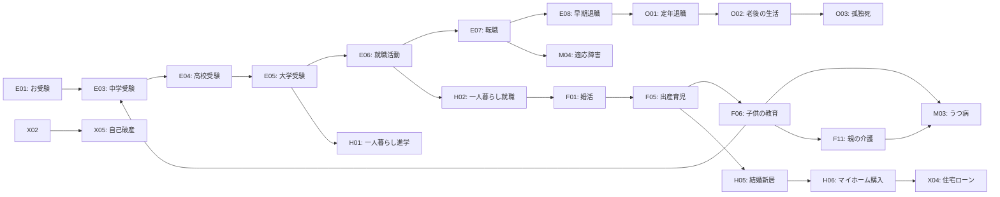

# ライフイベント網羅的リスト

**更新日**: 2026-02-09
**目的**: 「めぐり物語」キャラクター設定のための日本主要ライフイベント

---

## ライフイベント一覧

### 1. 教育・キャリア

| ID | イベント | 概要 | ターゲット年齢 | 社会的影響度 |
|----|----------|------|----------------|--------------|
| E01 | 幼稚園受験（お受験） | 有名幼稚園の入試 | 3-4歳（親） | 高 |
| E02 | 小学校受験 | 私立小学校の入試 | 5-6歳（親） | 高 |
| E03 | 中学受験 | 私立中学校の入試 | 11-12歳 | 中 |
| E04 | 高校受験 | 高校入試 | 14-15歳 | 中 |
| E05 | 大学受験 | 大学入試（一般・推薦・AO） | 17-18歳 | 高 |
| E06 | 就職活動 | 新卒採用・既卒採用 | 22-25歳 | 高 |
| E07 | 転職 | キャリアチェンジ・転籍 | 25-45歳 | 中 |
| E08 | 早期退職 | 希望・リストラ | 30-50歳 | 高 |
| E09 | 再雇用 | シニア就労・定年後 | 60-70歳 | 中 |

### 2. 家族・人間関係

| ID | イベント | 概要 | ターゲット年齢 | 社会的影響度 |
|----|----------|------|----------------|--------------|
| F01 | 婚活 | 結婚活動（結婚相談所・アプリ） | 25-45歳 | 中 |
| F02 | 見合い結婚 | 伝統的・デジタル見合い | 25-40歳 | 中 |
| F03 | 恋愛結婚 | 長距離恋愛・同棲 | 20-35歳 | 中 |
| F04 | 不妊治療 | 不妊検査・ART治療 | 28-45歳 | 高 |
| F05 | 出産・育児 | 妊娠・出産・子育て | 25-40歳 | 高 |
| F06 | 子供の教育 | 保育園〜大学までの教育 | 25-50歳 | 高 |
| F07 | 不倫・浮気 | パートナーの不貞 | 25-55歳 | 高 |
| F08 | 離婚 | 協議離婚・調停・裁判 | 25-60歳 | 高 |
| F09 | 再婚 | 離婚後・死別後 | 30-60歳 | 中 |
| F10 | シングルマザー/ファーザー | 单親での子育て | 25-50歳 | 高 |
| F11 | 親の介護 | 在宅・施設 | 35-65歳 | 高 |

### 3. 住宅・生活

| ID | イベント | 概要 | ターゲット年齢 | 社会的影響度 |
|----|----------|------|----------------|--------------|
| H01 | 一人暮らし（進学） | 大学進学・専門学校 | 18-22歳 | 中 |
| H02 | 一人暮らし（就職） | 就職による独立 | 22-25歳 | 中 |
| H03 | 同居（恋人） | 同棲開始 | 20-35歳 | 低 |
| H04 | 同居（家族） | 三世代同居・親との同居 | 25-65歳 | 中 |
| H05 | 結婚（新居） | 新婚世帯の住居選び | 25-35歳 | 中 |
| H06 | マイホーム購入 | 新築・中古・注文住宅 | 30-50歳 | 高 |
| H07 | 住宅ローン | 借入・返済・繰上返済 | 30-65歳 | 高 |
| H08 | 引っ越し | 転勤・住替え・ダウンサイジング | 25-70歳 | 中 |
| H09 | 実家帰り | Uターン・帰省常駐 | 25-40歳 | 中 |

### 4. 健康・メンタル

| ID | イベント | 概要 | ターゲット年齢 | 社会的影響度 |
|----|----------|------|----------------|--------------|
| M01 | がん診断 | 治療・仕事との両立 | 40-75歳 | 高 |
| M02 | 生活習慣病 | 糖尿病・高血圧・脂質異常症 | 35-70歳 | 中 |
| M03 | うつ病 | 仕事・育児・介護による発症 | 20-65歳 | 高 |
| M04 | 適応障害 | 職場・人間関係によるストレス | 20-50歳 | 中 |
| M05 | 大人びADHD | 診断・治療・職場対応 | 25-45歳 | 中 |
| M06 | 自閉スペクトラム症 | 診断・社交的困難 | 20-40歳 | 中 |
| M07 | アルコール依存症 | 依存・断酒・AAミーティング | 30-65歳 | 高 |
| M08 | ギャンブル依存症 | パチンコ・オンラインカジノ | 25-65歳 | 高 |
| M09 | 摂食障害 | 過食症・拒食症 | 15-40歳 | 中 |

### 5. 金銭・経済

| ID | イベント | 概要 | ターゲット年齢 | 社会的影響度 |
|----|----------|------|----------------|--------------|
| X01 | クレジットカード債務 | リボ払い・多重債務 | 20-50歳 | 中 |
| X02 | 消費者金融借入 | キャッシング・過払い | 20-60歳 | 高 |
| X03 | オワコン | 個人保証・連帯保証 | 25-65歳 | 高 |
| X04 | 住宅ローン滞納 | 返済困難・競売 | 30-65歳 | 高 |
| X05 | 自己破産 | 債務整理・再生 | 25-65歳 | 高 |
| X06 | 老後の資産形成 | NISA・iDeCo・投資信託 | 30-65歳 | 中 |

### 6. その他

| ID | イベント | 概要 | ターゲット年齢 | 社会的影響度 |
|----|----------|------|----------------|--------------|
| O01 | 定年退職 | 定年・再雇用 | 60-65歳 | 高 |
| O02 | 老後の生活 | 認知症・要介護 | 70-90歳 | 高 |
| O03 | 孤独死 | 独居老人の孤立死 | 60-90歳 | 高 |
| O04 | 身元保証 | 保証人・身元保証人 | 20-70歳 | 中 |

---

## イベント間の関連性

### 主要なライフコース

---

## 優先度ランキング

### キャラクター設定に重要度が高いイベント

1. **F05: 出産・育児** - 高い社会的影響度、多様な悩み
2. **E05: 大学受験** - 日本独自のプレッシャー文化
3. **F08: 離婚** - 家族崩壊と再構築
4. **M03: うつ病** - 現代社会のメンタルヘルス
5. **X05: 自己破産** - 経済的破綻と再生
6. **F11: 親の介護** - 介護離職・三世代問題
7. **F04: 不妊治療** - 少子化・生殖医療
8. **H06: マイホーム購入** - 住宅ローン・人生最大の買い物
9. **E06: 就職活動** - 新卒一括採用・就活病
10. **O01: 定年退職** - 第二の人生・アイデンティティ喪失

---

## 注釈

- **社会的影響度**: X（Twitter）での言及量と感情的インパクトの総合評価
- **ターゲット年齢**: 主要な当事者の年齢（括弧内は親等、間接的当事者）
- **関連性**: イベント間の因果関係・時系列関係を示す

---

## 次のステップ

1. 各イベントのGrok用プロンプト作成（GROK-PROMPTS.md）
2. 既存94キャラクターとの対応（CHARACTER-INTEGRATION.md）
3. リサーチ効率化ガイド（RESEARCH-GUIDE.md）
