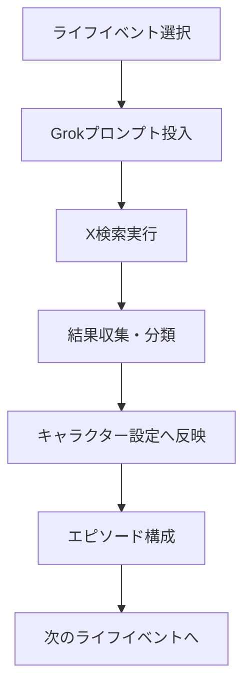

# Grokリサーチ効率化ガイド

**更新日**: 2026-02-09
**目的**: X（Twitter）でのリアルな意見収集を効率的に進めるための手順

---

## リサーチの基本フロー



---

## Phase 1: 準備

### 1.1 ツールの準備

- **Grokアカウント**: X（Twitter）プレミアム加入済みのアカウント
- **スプレッドシート**: Google SheetsまたはExcelで結果を整理
- **メモツール**: Notion、Obsidian、または `.tmp/notes.md` に直接記録

### 1.2 テンプレートの準備

以下のカラムを持つスプレッドシートを作成：

| 日付 | ライフイベント | ペルソナ | ツイート内容 | リツイート数 | いいね数 | 返信内容 | キャラクター設定への反映 |
|------|--------------|----------|--------------|--------------|----------|----------|------------------------|
| 2026-02-09 | F05: 出産・育児 | 産後うつの母親 | 「眠れない、赤ちゃんを愛せない」 | 12 | 89 | 「大丈夫、あなたは十分良い母親」 | 高橋 優子の基本設定に採用 |

---

## Phase 2: Grokプロンプトの実行

### 2.1 プロンプトの投入手順

1. **`.tmp/GROK-PROMPTS.md`** を開く
2. 対象となるライフイベントのプロンプトをコピー
3. Grokにプロンプトを貼り付け
4. 実行

### 2.2 プロンプトの最適化

**基本プロンプト**:
```
「[ライフイベント]」に関するX（Twitter）のリアルな意見を調査してください。
```

**追加オプション**:
```
以下の条件で調査：
- 期間: 過去6ヶ月以内
- エンゲージメント: いいね10以上
- 言語: 日本語のみ
- フィルタ: 広告・botを除外
```

### 2.3 ハッシュタグ戦略

**主要ハッシュタグ**:
- `#[ライフイベント]`（例: `#婚活`）
- `#[感情]`（例: `#辛い`、`#幸せ`）
- `#[年代]`（例: `#30代`）
- `#[質問]`（例: `#どうすれば`）

**複合検索**:
```
#婚活 AND #30代 AND #辛い
#介護 AND #離職 AND #相談
#産後 AND #うつ AND #母親
```

---

## Phase 3: 結果の収集と分類

### 3.1 収集基準

**採用するツイートの条件**:
- ✅ 具体的なエピソードがある
- ✅ 感情表現が豊か
- ✅ 複数のユーザーから共感を得ている（いいね10+）
- ✅ 返信で追加情報がある
- ❌ 明らかな誇張・虚偽
- ❌ 営業・宣伝目的

### 3.2 分類カテゴリー

#### 感情分類

| 感情 | キーワード | 例 |
|------|-----------|---|
| 悲しみ | 辛い、泣ける、絶望 | 「産後、毎日泣いてる」 |
| 怒り | 最悪、ふざける、信じられない | 「夫が育児参加しない、離婚したい」 |
| 不安 | 怖い、不安、心配 | 「住宅ローン返せるか」 |
| 喜び | 幸せ、嬉しい、最高 | 「待望の赤ちゃん誕生」 |
| 希望あり | 頑張る、続ける、前向き | 「治療続けて、妊娠した」 |
| 諦め | 無理、限界、どうでもいい | 「もう婚活やめる」 |

#### ペルソナ分類

| ペルソナ | 特徴 | 例 |
|---------|------|---|
| 当事者 | 直接悩みを抱える | 「自分が不妊治療中」 |
| 家族 | 家族の悩みに関わる | 「妻の産後うつが心配」 |
| 専門家 | 専門的視点 | 「産婦人科医として」 |
| 経験者 | 過去に経験 | 「5年前、私もそうだった」 |
| 第三者 | 一般的意見 | 「みんな大変だよね」 |

### 3.3 データ抽出

**各ツイートから抽出する情報**:

```json
{
  "tweet_id": "ツイートID",
  "author": {
    "age": "年代（不明の場合あり）",
    "gender": "性別（不明の場合あり）",
    "situation": "状況（不明の場合あり）"
  },
  "content": {
    "surface_worry": "表層的な悩み",
    "deep_worry": "深層的な悩み",
    "specific_episode": "具体的エピソード",
    "emotional_words": "感情言葉",
    "action_taken": "取った行動"
  },
  "engagement": {
    "likes": "いいね数",
    "retweets": "リツイート数",
    "replies": "返信内容"
  },
  "character_applicability": {
    "applicable": true/false,
    "character_id": "該当キャラクターID",
    "modification_needed": "修正が必要な点"
  }
}
```

---

## Phase 4: キャラクター設定への反映

### 4.1 キャラクタープロフィールの作成

**基本情報**:
```markdown
## [キャラクター名]

- **年齢**: [年齢]
- **職業**: [職業]
- **家族構成**: [家族]
- **居住地**: [地域]
```

**悩みの深層**:
```markdown
### 表層的な悩み
[ツイートからの引用]

### 深層的な悩み
[分析・解釈]

### 根本原因
[ライフイベントとの関連]
```

### 4.2 SNS投稿のシミュレーション

**リアルな投稿の再構成**:
```markdown
@username [年齢][性別][地域]

[ツイート内容]

[ハッシュタグ]

---

**返信**:
- @user1: [返信内容]
- @user2: [返信内容]
```

### 4.3 算命学的計算

**生年月日から算命学要素を計算**:
```markdown
- **生年月日**: [年月日]
- **六十星士**: [結果]
- **日干**: [結果]
- **陽占**: [結果]
- **十二星**: [結果]
- **五行**: [結果]
```

---

## Phase 5: エピソード構成

### 5.1 来院エピソードの構成

**構成要素**:
1. **きっかけ**: SNSで「運命外来」を見つける
2. **来院**: 初めての来院、緊張と期待
3. **問診**: 悩みを語る、巡の傾聴
4. **算命学診断**: 命式の作成、アドバイス
5. **処方箋**: 具体的なアクションプラン
6. **帰宅後**: 実践、変化の兆し

### 5.2 マンガ構成案

**10ページ構成**:
```markdown
### ページ1: きっかけ（1コマ）
SNSで「運命外来」の広告を見る

### ページ2-3: 来院（10コマ）
- 受付でのやり取り
- 待合室の他の患者
- 巡との対面

### ページ4-5: 問診（10コマ）
- 悩みを語る
- 感情の爆発
- 巡の共感

### ページ6-7: 算命学診断（10コマ）
- 生年月日の入力
- 命式の表示
- 解説とアドバイス

### ページ8-9: 処方箋（10コマ）
- 具体的なアクション
- 不安と希望
- 決意

### ページ10: 帰宅後（5コマ）
- 実践の開始
- 変化の兆し
- 次回の来院予約
```

---

## 効率化のヒント

### 1. 並列処理

**同時に複数のライフイベントをリサーチ**:
- タブを複数開く
- 異なるハッシュタグを同時検索
- スプレッドシートに並列入力

### 2. テンプレート活用

**定型プロンプトの保存**:
- Grokの「保存済みプロンプト」機能
- クリップボードマネージャー
- Text Expanderツール

### 3. 自動化

**可能な自動化**:
- ツイートの自動収集（X API）
- スプレッドシートへの自動入力（Google Apps Script）
- 感情分析の自動化（自然言語処理）

### 4. 優先順位の明確化

**第1優先（最重要）**:
1. E05: 大学受験
2. F05: 出産・育児
3. F08: 離婚
4. M03: うつ病
5. X05: 自己破産

**第2優先**:
6-10位のライフイベント

**第3優先**:
11位以降のライフイベント

---

## 品質管理

### データ品質のチェック

**チェックリスト**:
- ✅ ツイートが具体的か
- ✅ 感情表現が豊かか
- ✅ 複数の視点があるか
- ✅ 専門家の意見が含まれているか
- ✅ ペルソナの多様性があるか

### キャラクター設定のチェック

**チェックリスト**:
- ✅ 表層的な悩みと深層的な悩みが区別されているか
- ✅ ライフイベントとの関連が明確か
- ✅ 感情の移動が追えるか
- ✅ 解決への道筋が見えるか
- ✅ 読者が共感できるか

---

## トラブルシューティング

### 問題1: Grokが十分な結果を返さない

**解決策**:
- プロンプトを修正：より具体的なキーワードを追加
- ハッシュタグを変更：関連する別のハッシュタグを試す
- 期間を広げる：6ヶ月→1年など

### 問題2: ツイートがスパム・広告ばかり

**解決策**:
- フィルター条件を強化：いいね数を20+にする
- 手動で除外：明らかな広告はスキップ
- 別のハッシュタグを試す

### 問題3: 感情分析が難しい

**解決策**:
- 返信を参照：他者の反応で感情を推測
- 文脈を考慮：前後のツイートを確認
- 複数の意見を統合：単一のツイートに固執しない

---

## 次のステップ

### 即座に開始できるタスク

1. **スプレッドシートの作成**: テンプレートに従って作成
2. **最初のリサーチ**: 第1優先の「E05: 大学受験」から開始
3. **結果の記録**: 収集したツイートをスプレッドシートに入力
4. **キャラクター作成**: 山本 大輔（浪人生）の基本情報を作成

### 週次計画

**週1**:
- 2-3ライフイベントのリサーチ
- 2-3キャラクターの基本情報作成

**週2**:
- 2-3ライフイベントのリサーチ
- 2-3キャラクターの基本情報作成
- 算命学的計算の開始

**週3**:
- 残りのライフイベントのリサーチ
- 全キャラクターの算命学的計算
- エピソード構成の開始

**週4**:
- エピソード構成の完了
- マンガ構成案の作成
- レビューと修正

---

## 注釈

### 用語定義

- **当事者**: 直接そのライフイベントを経験している人
- **家族**: 当事者の家族で、間接的に影響を受ける人
- **専門家**: その分野の専門家（医師、弁護士、カウンセラーなど）
- **経験者**: 過去にそのライフイベントを経験した人
- **第三者**: 直接の関係者ではない一般の人

### 参考資料

- `.tmp/LIFE-EVENTS-LIST.md`: ライフイベントの一覧
- `.tmp/GROK-PROMPTS.md`: Grok用プロンプト集
- `.tmp/CHARACTER-INTEGRATION.md`: キャラクター対応表

---

**作成者**: Claude
**最終更新**: 2026-02-09
