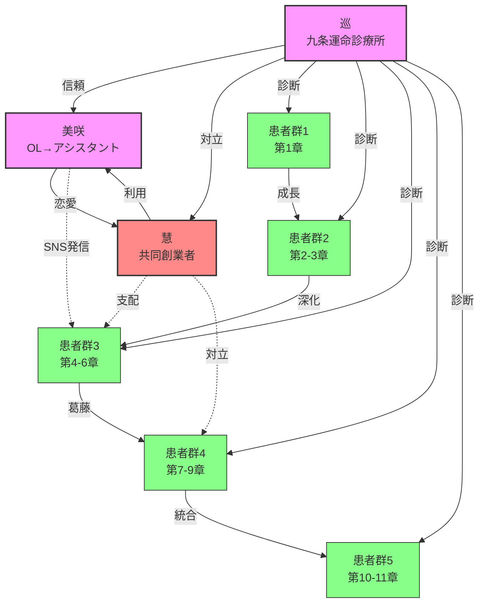

# めぐり物語 120話構造修正依頼プロンプト

## 作成日
2026年2月9日

## 依頼背景
現在の「めぐり物語」120話構造ダッシュボード（120-EPISODE-DASHBOARD.md）と既存の3話（第一話〜第三話）の間に矛盾があり、統一的な物語構造への修正が必要。

---

## 第一部：現状分析

### A. 問題点の特定

#### 1. キャラクター設定の矛盾
- **120-EPISODE-DASHBOARD.md**: 美咲を「看護師」として描写
- **meguru-storyline.md（実際の3話）**: 美咲は広告代理店勤務のOL（28歳、1997年8月14日生まれ）
- **矛盾**: 看護師という職業設定が存在しない

#### 2. キャラクターの重複
- **120-EPISODE-DASHBOARD.md**: 栞（秘書）という別キャラクターが登場
- **問題**: 美咲が「巡を支える役割」を果たす予定であり、栞という別キャラクターは不要
- **リスク**: キャラクターが増えすぎ、物語が散漫になる

#### 3. ストーリーラインとの整合性
- 既存3話では美咲が「広告代理店勤務のOL」として明確に描写されている
- その後の展開（アシスタント就任）に向けて、職業変更のプロセスが必要

---

## 第二部：修正要件

### A. キャラクター設定修正

#### 1. 栞の削除
- **対象**: 120-EPISODE-DASHBOARD.md の全記述
- **削除対象**:
  - キャラクター関係図（SA[栞<br/>秘書]）
  - 全体的なキャラクター数（97名→96名に修正）
  - 栞に関する全記述

#### 2. 美咲の職業修正
- **修正前**: 看護師
- **修正後**: 広告代理店勤務→アシスタントへ転職
- **根拠**: meguru-storyline.mdの第一話の描写

### B. 新しいストーリーライン展開

#### 1. 美咲のアシスタント就任までの流れ

**第一話（既存）**: 初診患者として登場
- 生年月日: 1997年8月14日
- 職業: 広告代理店勤務
- 悩み: 仕事を辞めるか続けるか
- 結果: 巡の診断により、「木」の重要性を理解

**第二話〜第三話（既存）**: 登場せず
- 巡が他の患者を診断する中で、美咲の診断が読者の心に残る

**第四話以降（新規展開）**: SNS経由での集客増加
- **現象**: 運命診療所に新規患者が急増
- **特徴**: 患者の多くが「SNSで見つけた」と回答
- **巡の疑問**: 「なぜSNSで注目されているのか」

**第五話〜第六話（新規展開）**: 原因究明
- 巡が患者に「どのアカウントを見たか」尋ねる
- 回答: 無名のアカウントが巡の診断を感動的に発信
- アカウント名の判明、しかし本人はまだ不明

**第七話〜第八話（新規展開）**: 美咲の再来院
- 美咲が予約なしに来院
- 理由: 「自分のSNS発信が原因と知り、責任を感じて」
- 巡との対話: 「なぜ発信を始めたのか」「どのような影響があったか」

**第九話〜第十話（新規展開）**: アシスタント就任
- 美咲からの申し出: 「私があなたを支えたい」
- 巡の葛藤: 「患者と関係を持っていいのか」「自分の過去の裏切りを思い出す」
- 最終決断: 美咲をアシスタントとして採用

#### 2. SNS発信の背景設定

**美咲の動機**:
- 第一話での診断体験が「人生を変える」衝撃だった
- 同じように悩む人に巡の診断を届けたい
- 自分の感受性（調舒星）とSNSスキルを活かした行動

**SNSの内容**:
- 匿名での発信（プライバシー配慮）
- 巡の診断のエッセンスを感動的に伝える
- 「運命は変えられる」というメッセージ
- 実際の変化を感じた人からの反響

**集客の増加**:
- 最初は数人/月
- 次第に数十人/月へ
- 巡が気づく頃には、新規患者の50%以上がSNS経由に

---

## 第三部：修正後の物語構造

### A. 全体タイムライン（修正版）

```
第一話（2026年4月初旬）: 開院
  - 巡の背景
  - 美咲の初診（広告代理店勤務）

第二話（2026年4月中旬）: 天中殺の告白
  - 村田健一の診断

第三話（2026年4月下旬）: 箱の外の龍
  - 森川陽菜と母親の診断
  - 慧からの電話

第四話〜第六話（2026年5月）: SNS現象の発覚
  - 新規患者増加の謎
  - アカウントの特定
  - 巡の困惑

第七話〜第八話（2026年6月）: 美咲の再来院
  - SNS発信者の告白
  - 責任感と葛藤
  - 巡の選択

第九話〜第十話（2026年6月下旬〜7月初旬）: 新たな始まり
  - 美咲のアシスタント就任
  - 二人の共同作業の開始
  - 診療所の変化

第十一話〜第四十話（2026年7月〜10月）: 基礎編の展開
  - 美咲が成長しながら巡を支える
  - 二人の関係性の深化
  - 第五部「関係性篇」での恋愛開始へ
```

### B. キャラクター成長曲線（修正版）

#### 美咲の成長軌跡

```
第一話: 疲れたOL
  ↓ 診断体験
第二話〜第三話: 内面の変化（登場せず）
  ↓ SNS発信開始
第四話〜第六話: 無名の発信者
  ↓ 自分の行動の影響を知る
第七話〜第八話: 責任感と葛藤
  ↓ 巡に会いに来る
第九話〜第十話: アシスタント就任
  ↓ 新たな役割
第十一話〜第四十話: 成長と信頼
  ↓ 巡への想いの芽生え
第四十一話〜第八十話: 葛藤編
  ↓ 慧に利用される可能性
第八十一話〜第百二十話: 自立と新たな道
```

### C. キャラクター関係図（修正版）



**変更点**:
- 栞（SA）の削除
- 美咲の職業を「看護師」から「OL→アシスタント」へ修正
- MI（美咲）からPA3への「SNS発信」リンクを追加

---

## 第四部：実装タスク

### タスク1: 120-EPISODE-DASHBOARD.md の修正

#### 1-1. キャラクター数の修正
```markdown
修正前: **主要キャラクター**: 97名（巡、美咲、慧 + 患者94名）
修正後: **主要キャラクター**: 96名（巡、美咲、慧 + 患者93名）
```

#### 1-2. キャラクター関係図の修正
- 栞（SA）ノードの削除
- 美咲（MI）のラベルを「看護師」から「OL→アシスタント」へ変更
- SNS発信リンクの追加

#### 1-3. キャラクター成長曲線の修正
```markdown
修正前: B1[疲れたOL] → B2[巡に出会う] → B3[自己発見] → B4[慧に利用] → B5[自立]
修正後: B1[疲れたOL] → B2[巡に出会う] → B3[SNS発信開始] → B4[アシスタント就任] → B5[慧に利用] → B6[自立]
```

### タスク2: 詳細タイムラインの作成

#### 2-1. 第一話〜第十話の詳細化
- 各話のサブタイトル
- 主要な出来事
- 美咲の登場の有無
- SNS要素の組み込み

#### 2-2. 第四話〜第十話の新規エピソード設計
- 第四話: 「SNSの不思議」
- 第五話: 「匿名の発信者」
- 第六話: 「真実の顔」
- 第七話: 「再会」
- 第八話: 「責任という名の愛」
- 第九話: 「提案」
- 第十話: 「始動」

### タスク3: 120話構造への統合

#### 3-1. 各話数の調整
- 基礎編（1-40話）の最初の10話を詳細化
- 残りの30話は既存構造を維持
- 美咲の成長を基礎編全体に統合

#### 3-2. サブテーマの調整
- 「SNSと現代社会」テーマの追加
- 「転職」テーマの強化
- 「自己実現」テーマの深化

---

## 第五部：検証項目

### A. 整合性チェック

#### 1. 既存3話との整合性
- [ ] 美咲の職業が広告代理店勤務で一貫している
- [ ] 生年月日（1997年8月14日）が正確に反映されている
- [ ] 命式（丁火、調舒星、車騎星）が活かされている

#### 2. キャラクター成長の論理性
- [ ] 第一話からアシスタント就任までの流れが自然
- [ ] SNS発信の動機が美咲の性格（調舒星）と合致
- [ ] 巡の葛藤（過去の裏切り）が反映されている

#### 3. 物語構造への影響
- [ ] 全120話のテーマ配分に支障がない
- [ ] 基礎編（1-40話）の目的が達成できる
- [ ] 美咲と慧の対立構造が維持されている

### B. 物語的品質チェック

#### 1. 感情的共鳴
- [ ] 美咲のSNS発信が読者に感動を与える
- [ ] 巡と美咲の再会シーンが切ない
- [ ] アシスタント就任までの葛藤がリアル

#### 2. 算命学的正確性
- [ ] 美咲の命式（丁火、調舒星、車騎星）が活かされている
- [ ] SNS発信という行動が感受性（調舒星）と整合している
- [ ] 巡の選択が申酉天中殺の経験と関連している

#### 3. 現代社会との接続
- [ ] SNSという現代的要素が自然に組み込まれている
- [ ] 転職という現代的な悩みが深く扱われている
- [ ] 読者が自分の人生に重ねやすい構造になっている

---

## 第六部：納品物

### A. 必須納品物

1. **修正版120-EPISODE-DASHBOARD.md**
   - 栞の削除
   - 美咲の職業修正
   - キャラクター数の更新

2. **詳細タイムライン.md**
   - 第一話〜第十話の詳細な各話内容
   - SNS要素の統合
   - 美咲の成長曲線

3. **キャラクター設定資料.md**
   - 美咲の詳細設定
   - 巡の成長曲線（修正版）
   - 二人の関係性の進展

### B. 推奨納品物

4. **第四話〜第十話のプロット概要**
   - 各話のあらすじ
   - 主要なシーン
   - セリフの抜粋

5. **SNS投稿内容のサンプル**
   - 美咲が投稿した内容の例
   - 読者の反応の例
   - 巡の診断との対比

---

## 第七部：制約条件

### A. 既存コンテンツの制約
- 第一話〜第三話の内容は変更しない
- meguru-storyline.mdの描写は絶対遵守
- 巡・慧の関係性は維持

### B. 物語的制約
- 美咲と慧の恋愛関係は第41話以降（葛藤編）へ
- アシスタント就任は第9話〜第10話までに完了
- SNS現象は第4話〜第6話で展開・解決

### C. テーマ的制約
- 基礎編（1-40話）の目的「陰陽五行の基礎」を損なわない
- 算命学的解説の質を落とさない
- 読者の学習曲線を考慮

---

## 第八部：成功基準

### A. 修正の完了基準
- [ ] 120-EPISODE-DASHBOARD.mdから栞が完全に削除されている
- [ ] 美咲が「広告代理店勤務→アシスタント」で一貫している
- [ ] キャラクター数が96名に修正されている
- [ ] 第一話〜第十話の詳細なタイムラインが作成されている

### B. 物語的品質基準
- [ ] 美咲の成長が感情的に納得できる
- [ ] SNS要素が唐突でない
- [ ] 巡の葛藤がリアルに描かれている
- [ ] 既存3話との整合性が保たれている

### C. 実用性基準
- [ ] 120話全体の構造に支障がない
- [ ] 将来的な執筆に使用できる詳細さ
- [ ] 算命学的正確性が保たれている

---

## 第九部：優先順位

### 🔴 優先度1（必須）
1. 栞の削除
2. 美咲の職業修正（看護師→OL→アシスタント）
3. キャラクター数の修正（97名→96名）
4. 第一話〜第十話の詳細タイムライン作成

### 🟡 優先度2（重要）
5. 第四話〜第十話のプロット概要
6. SNS投稿内容のサンプル作成
7. キャラクター成長曲線の詳細化

### 🟢 優先度3（推奨）
8. キャラクター関係図の修正
9. 各話数の調整
10. サブテーマの再配分

---

## 第十部：依頼メッセージ

### AIへの依頼文

```
# めぐり物語 120話構造修正依頼

## 背景
「めぐり物語」は、九条巡という元外科医が算命学の運命診断を行う物語です。
現在、120話構造のダッシュボードと既存3話の間に矛盾があります。

## 問題点
1. ダッシュボードで美咲を「看護師」としているが、実際の3話では広告代理店勤務のOL
2. 「栞」というキャラクターが登場するが、美咲が巡を支える役割であり重複
3. 美咲がどのようにしてアシスタントになるかのプロセスが不明

## 求める展開
1. 第一話: 美咲が広告代理店勤務のOLとして初診（既存）
2. 第四話〜第六話: SNS経由の新規患者急増、巡が原因を調査
3. 第七話〜第八話: 美咲が再来院、自分がSNSで発信していたと告白
4. 第九話〜第十話: 美咲がアシスタントを希望、巡が葛藤の末に採用

## 制約条件
- 第一話〜第三話の内容は変更しない
- 美咲の命式（丁火、1997年8月14日生まれ、調舒星・車騎星）を活かす
- 120話全体の構造（基礎編・葛藤編・統合編）を維持

## 納品物
1. 修正版120-EPISODE-DASHBOARD.md（栞削除、美咲修正）
2. 第一話〜第十話の詳細タイムライン
3. 第四話〜第十話のプロット概要
4. キャラクター設定資料

## 参考資料
- 120-EPISODE-DASHBOARD.md（現状）
- meguru-storyline.md（既存3話）

上記に基づき、統一的な物語構造を提案してください。
```

---

## 作成完了

この依頼プロンプトは、以下の構造で構成されています:

1. **現状分析**: 問題点の特定
2. **修正要件**: 具体的な修正内容
3. **物語構造**: 修正後の全体像
4. **実装タスク**: 具体的な作業項目
5. **検証項目**: 品質チェックリスト
6. **納品物**: 期待される成果物
7. **制約条件**: 守るべきルール
8. **成功基準**: 完了の判断基準
9. **優先順位**: 作業の順序
10. **依頼メッセージ**: AIへの直接依頼文

このプロンプトをを使用して、AIエージェントチームに修正作業を依頼できます。
