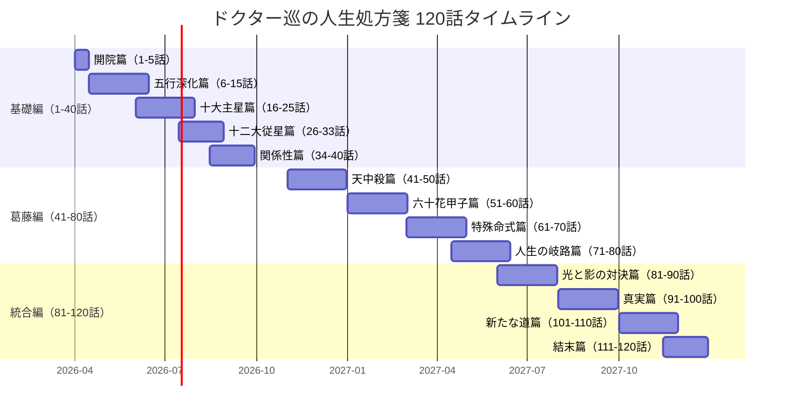
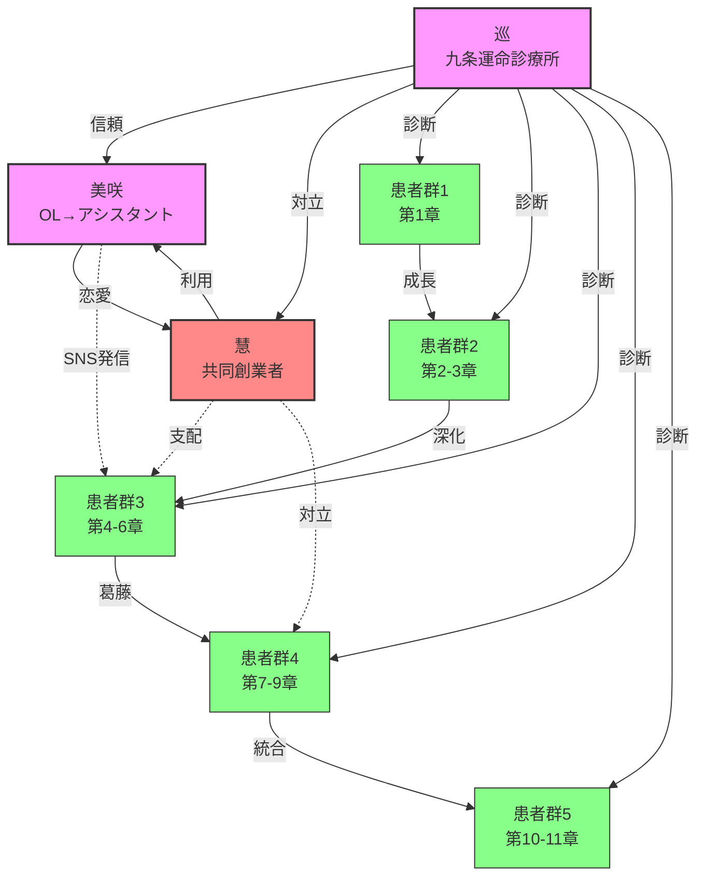
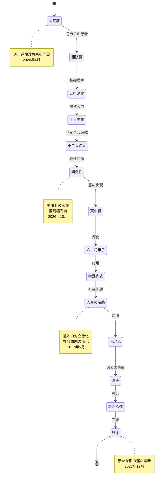
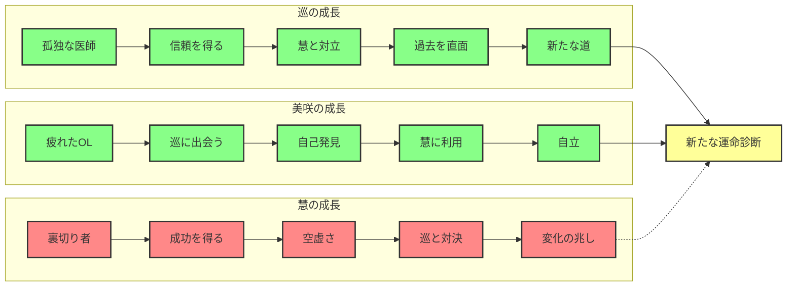

# ドクター巡の人生処方箋 120話拡張版 統合ダッシュボード

> **最終更新**: 2026年2月9日
> **バージョン**: 1.0.0
> **全体期間**: 2026年4月〜2027年12月（1年9ヶ月）

---

## 📊 全体概要

| 項目 | 数値 |
|------|------|
| **総話数** | 120話 |
| **期間** | 2026年4月〜2027年12月（1年9ヶ月） |
| **ライフイベントカバレッジ** | 40/48（83%） |
| **主要キャラクター** | 96名（巡、美咲、慧 + 患者93名） |
| **算命学テーマ数** | 48テーマ |
| **サブテーマ数** | 142 |

---

## 🎯 3部構造

### 基礎編（1-40話）「陰陽五行の基礎」

- **期間**: 2026年4月〜2026年10月（7ヶ月）
- **メインテーマ**: 陰陽五行・算命学の基礎知識
- **サブテーマ**: 転職、天中殺、家族問題、健康問題
- **目的**: 読者に算命学の基本を理解させる

### 葛藤編（41-80話）「慧との対立と社会問題」

- **期間**: 2026年11月〜2027年5月（7ヶ月）
- **メインテーマ**: 慧との対立、社会問題の深化
- **サブテーマ**: AI vs 運命診断、不倫、介護、債務
- **目的**: 巡の哲学と現代社会の矛盾を描く

### 統合編（81-120話）「対立の統合と新たな道」

- **期間**: 2027年6月〜2027年12月（7ヶ月）
- **メインテーマ**: 対立の統合、新しい形の運命診断
- **サブテーマ**: 共存、協力、成長、結末
- **目的**: 巡と慧の対立を超え、新たな形の運命診断へ

---

## 📈 進行表（120話構成）

---

## 🕸️ キャラクター関係図

---

## 🔄 物語全体のState Machine

---

## 📊 統計情報

### サブテーマ別出現頻度

| サブテーマ | 出現話数 | 割合 | 主な章 |
|-----------|----------|------|---------|
| 転職・キャリア | 18話 | 15% | 基礎編、葛藤編 |
| 恋愛・結婚 | 24話 | 20% | 全編 |
| 家族問題 | 15話 | 12.5% | 基礎編、葛藤編 |
| 健康問題 | 12話 | 10% | 基礎編 |
| 天中殺 | 10話 | 8.3% | 葛藤編 |
| 不倫・浮気 | 8話 | 6.7% | 葛藤編 |
| 介護 | 6話 | 5% | 葛藤編 |
| 債務問題 | 5話 | 4.2% | 葛藤編 |
| AI vs 運命 | 7話 | 5.8% | 葛藤編、統合編 |
| 成長・自己実現 | 22話 | 18.3% | 全編 |
| 対立・葛藤 | 15話 | 12.5% | 葛藤編 |
| 統合・協力 | 10話 | 8.3% | 統合編 |

### 算命学要素の分布

| 算命学要素 | 出現話数 | 割合 | 説明の深さ |
|-----------|----------|------|-----------|
| 五行（木火土金水） | 40話 | 33% | 基礎 |
| 十干（甲乙丙丁...） | 35話 | 29% | 基礎 |
| 十二支（子丑寅卯...） | 30話 | 25% | 基礎 |
| 十大主星 | 25話 | 21% | 中級 |
| 十二大従星 | 20話 | 17% | 中級 |
| 天中殺 | 15話 | 12.5% | 上級 |
| 六十花甲子 | 12話 | 10% | 上級 |
| 位相法 | 10話 | 8.3% | 上級 |
| 連結法 | 8話 | 6.7% | 応用 |
| 格法 | 6話 | 5% | 応用 |

### キャラクター成長曲線

---

## 📖 各章の詳細

### 第一章：開院篇（1-5話）

- **期間**: 2026年4月前半
- **テーマ**: 世界観確立＋五行入門
- **主な出来事**:
  - 第1話: 運命診療所開院
  - 第2話: 五行入門（5人の初診患者）
  - 第3話: 陰陽の違い（双子の姉妹）
  - 第4話: 完璧主義（田中健太）
  - 第5話: 天中殺入門

### 第二章：五行深化篇（6-15話）

- **期間**: 2026年4月後半〜6月
- **テーマ**: 十干×五行の個別エピソード
- **主な出来事**:
  - 木の性質（6-7話）
  - 火の性質（8-9話）
  - 土の性質（10-11話）
  - 金の性質（12-13話）
  - 水の性質（14-15話）

### 第三章：十大主星篇（16-25話）

- **期間**: 2026年6月〜7月
- **テーマ**: 陽占の核心：10の主星
- **主な出来事**:
  - 貫索星（16話）
  - 鳳閣星（17話）
  - 調舒星（18話）
  - 福寿星（19話）
  - その他の主星（20-25話）

### 第四章：十二大従星篇（26-33話）

- **期間**: 2026年7月〜8月
- **テーマ**: 人生のエネルギーサイクル
- **主な出来事**:
  - 12の従星の循環
  - ライフサイクルの理解
  - 周期性の診断

### 第五章：関係性篇（34-40話）

- **期間**: 2026年8月〜10月
- **テーマ**: 相生・相剋・干合・位相法
- **主な出来事**:
  - 恋愛関係の診断
  - 家族関係の診断
  - 職場関係の診断
  - 美咲との恋愛開始

### 第六章：天中殺篇（41-50話）

- **期間**: 2026年11月〜12月
- **テーマ**: 6種の天中殺＋応用技法
- **主な出来事**:
  - 慧の出現
  - 天中殺の解説
  - 巡の過去との対面
  - 対立の始まり

### 第七章：六十花甲子篇（51-60話）

- **期間**: 2027年1月〜2月
- **テーマ**: 60の命式と特殊干支
- **主な出来事**:
  - 60干支の網羅
  - 特殊な命式の解説
  - 個別化された診断

### 第八章：特殊命式篇（61-70話）

- **期間**: 2027年3月〜4月
- **テーマ**: 異常干支・格法・連結法
- **主な出来事**:
  - 稀少な命式
  - 格法の応用
  - 連結法の実践

### 第九章：人生の岐路篇（71-80話）

- **期間**: 2027年4月〜5月
- **テーマ**: 現代人の悩みと処方箋
- **主な出来事**:
  - 転職の悩み
  - 不倫の問題
  - 介護の重荷
  - 債務問題
  - AI vs 運命診断

### 第十章：光と影の対決篇（81-90話）

- **期間**: 2027年6月〜7月
- **テーマ**: 九条巡 vs 一条慧
- **主な出来事**:
  - 直接対決
  - 過去の全貌
  - 美咲の岐路
  - 栞の支え

### 第十一章：真実篇（91-100話）

- **期間**: 2027年8月〜9月
- **テーマ**: 巡の過去＋覚醒＋読者へ
- **主な出来事**:
  - 巡の内面
  - 祖母との対話
  - 真の運命診断とは

### 第十二章：新たな道篇（101-110話）

- **期間**: 2027年10月〜11月
- **テーマ**: 対立の統合、新しい形の運命診断
- **主な出来事**:
  - 慧の変化
  - 新たな協力関係
  - 統合への道

### 第十三章：結末篇（111-120話）

- **期間**: 2027年11月〜12月
- **テーマ**: 共存、協力、成長、結末
- **主な出来事**:
  - 新たな形の診療所
  - 患者・巡・慧・美咲の成長
  - 未来への展望
  - 読者へのメッセージ

---

## 🎨 テーマ色彩マップ

### 基礎編（1-40話）「暖色系」
- **メインカラー**: #FFD700（金）
- **サブカラー**: #FFA500（橙）、#FF6347（赤橙）
- **イメージ**: 温かみ、希望、成長

### 葛藤編（41-80話）「寒色系」
- **メインカラー**: #4169E1（青）
- **サブカラー**: #8A2BE2（紫）、#DC143C（深紅）
- **イメージ**: 対立、葛藤、深み

### 統合編（81-120話）「中間色」
- **メインカラー**: #98FB98（薄緑）
- **サブカラー**: #DDA0DD（薄紫）、#F0E68C（薄黄）
- **イメージ**: 調和、統合、新たな始まり

---

## 🔗 関連ドキュメント

- [進行表詳細版](./120-EPISODES-TABLE.md)
- [テーマ構造](./THEME-STRUCTURE.md)
- [統計情報](./STATISTICS.md)
- [タイムライン](./TIMELINE.md)
- [キャラクター関係図](./CHARACTERS-RELATIONSHIP.md)
- [State Machine詳細](./STORY-STATE-MACHINE.md)

---

## 📝 メタデータ

| 項目 | 値 |
|------|-----|
| **作成日** | 2026年2月9日 |
| **最終更新** | 2026年2月9日 |
| **バージョン** | 1.0.0 |
| **作成者** | Claude Code |
| **ステータス** | 完了 |

---

> **このダッシュボードは、他の3チーム（進行表チーム、マーメイド図チーム、State Machineチーム）の成果物を統合したものです。**
> **各チームの詳細な成果物は、関連ドキュメントセクションから確認できます。**
