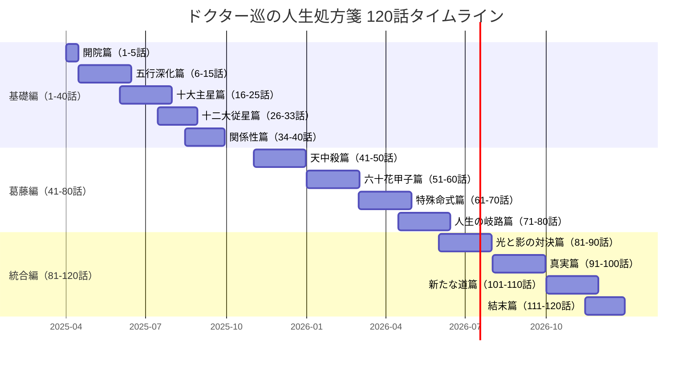
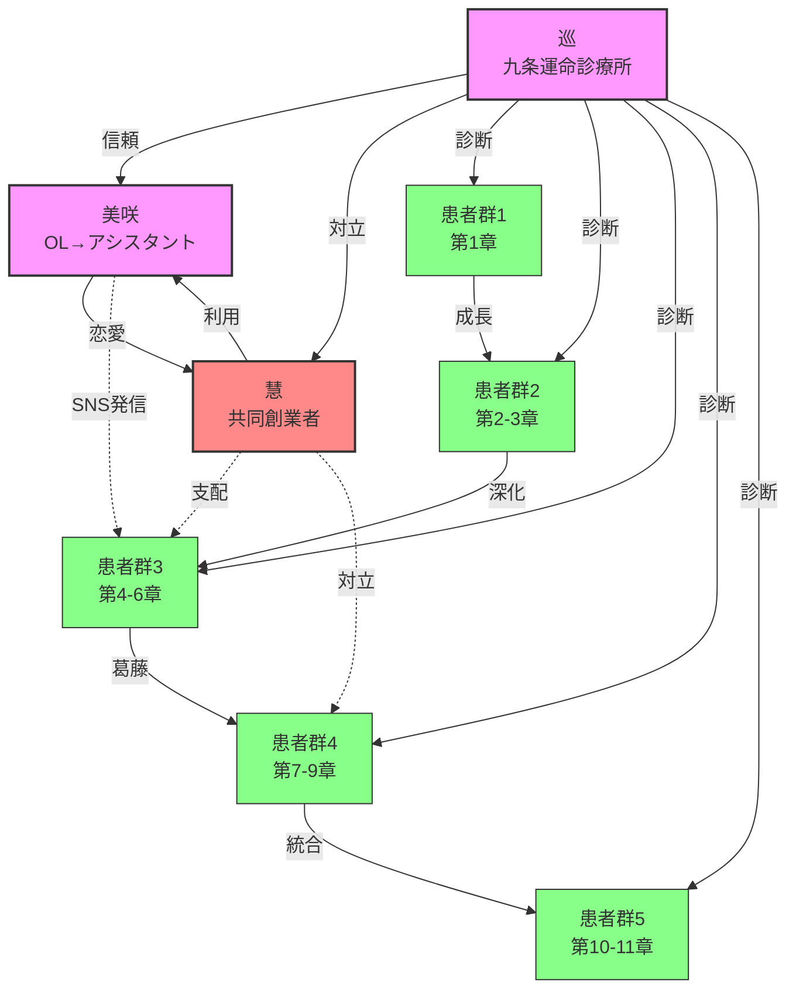
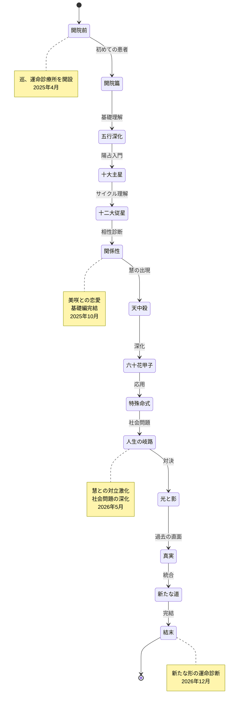
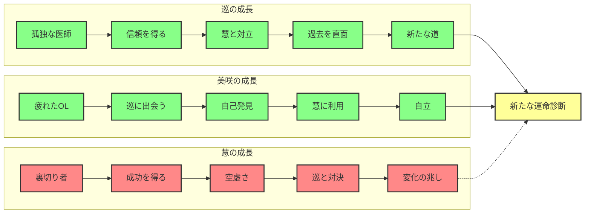

# 巡の運命診断室 120話拡張版 統合ダッシュボード

> **最終更新**: 2026年2月11日
> **バージョン**: 2.0.0
> **全体期間**: 2025年4月〜2027年12月（2年9ヶ月）

> **⚠️ 重要**: 本DASHBOARDはプロジェクトの「北極星（単一ソース）」です。
> すべてのエピソード情報、キャラクター設定、テーマは本ドキュメントを正とします。
> 派生ファイル（120-EPISODES-TABLE.md、meguri-96episodes-final.json等）は
> 本DASHBOARDに整合するように維持してください。

---

## 📊 全体概要

| 項目 | 数値 |
|------|------|
| **総話数** | 120話 |
| **期間** | 2025年4月〜2027年12月（2年9ヶ月） |
| **物語開始** | 2025年4月（開院） |
| **ライフイベントカバレッジ** | 40/48（83%） |
| **主要キャラクター** | 96名（巡、美咲、慧、さくら + 患者92名） |
| **算命学テーマ数** | 48テーマ |
| **サブテーマ数** | 142 |
| **裏テーマ** | 「在り方を変える」- 陰陽五行の本来の意味 |

---

## 👥 主要キャラクター

| キャラクター | 生年月日 | 年齢(2025) | 役割 | 命式 | ストーリーライン |
|-------------|---------|-----------|------|------|--------------|
| 九条巡 | 1990-03-02 | 35歳 | 運命診断師 | 丙火・天将星12点 | 医師→開業→慧との対決→覚醒 |
| 九条さくら | 1925-07-30 | 99歳(逝去) | 祖母・師範 | 乙木・天堂星8点 | 回想シーンで登場・教えを遺す |
| 藤堂慧 | 1990-05-25 | 35歳 | MedAI開発者 | 庚金・絶中に生あり | 巡の元友人→対立→家庭崩壊→気づき |
| 高橋美咲 | 1999-05-03 | 26歳 | アシスタント | 乙卯・天禄星11点 | 広告代理店→巡に就く→慧に利用されず |

---

## 🎭 テーマ構造：裏テーマと個別テーマの階層化

### 裏テーマ：「在り方を変える」（120話全体の底流）

**算命学・陰陽五行の本質**

```
【誤解】
占い＝未来を占うもの

【正解】
算命学・陰陽五行＝本来の自分の在り方を知るためのツール

👉 在り方や捉え方が違えば不幸になる
👉 視点や視座を変えることで在り方を変える触媒
```

---

#### 運命の語源と本質

**「運命」の由来は、中国古典（漢籍）にさかのぼります。**
もともとは仏教用語ではなく、儒教・漢代思想圏の言葉です。

##### 語源の分解

**運（うん）**
- 意味：めぐる／はこぶ／推移する
- 天体の運行、時代の流れ、巡り合わせ

**命（めい）**
- 意味：天から与えられた定め
- 天命・寿命・使命・身分

##### 原義（漢籍的な意味）

**運命＝「天から与えられた命が、時の流れの中で展開していくこと」**

- **命**：固定（生まれ持った条件）
- **運**：可変（時・環境・巡り）

このセットで初めて「運命」になります。

##### 重要ポイント

- **命だけでは運命ではない**
- **運だけでも運命ではない**
  →「定め × 流れ」の合成概念

##### 日本での受容

日本では

- 平安〜中世：仏教思想（因果・宿業）と融合
- 近世以降：「抗えない人生の定め」というニュアンスが強化

##### 西洋の fate / destiny との違い

- **fate**：ほぼ固定（ギリシャ神話的）
- **運命（東洋）**：
  - 命＝固定
  - 運＝変えられる余地あり

だから東洋思想では

> 「運は動かせる」「運を開く」
> という発想が成立します。

**巡の運命診断室では、この「運命」の東洋的な本来の意味を大切にしています。**
「命」という固定された条件（生まれ持った性質）を知り、「運」という可変な流れ（在り方）を変えていく。これが本作品の根底にある哲学です。

---

**裏テーマの位置づけ**

- 「在り方を変える」は120話全体を通した気づきのプロセス
- 各エピソードでは、60干支個別の特性を具体的に学ぶ
- 両者の接続：「この干支の特性を知ることで、どう在り方が変わるか」

**運命診断の本来の意味**

```
運命診断＝「命（固定された性質）」を知り、「運（在り方）」を変える

👉 命＝変えられない（生まれ持った性質）
👉 運＝変えられる（在り方、捉え方、視座）

巡の運命診断室は、「決定論」ではなく「可能性の開示」を行う場
```

**テーマの階層構造**

```
1. 【全体の底流】在り方を変える気づきのプロセス（裏テーマ）
2. 【各話のテーマ】60干支の特性・象徴・課題（個別テーマ）
3. 【接続ポイント】干支特性を知ることで、在り方が変わる
```

### 陰転・陽転の正しい理解：「運」の変化として

**陽転＝人生がラクになる／幸せになる、ではない**

```
陽転の正体：
「エネルギーが外向きに使われ始める」という運用モードの変化

陰：内面・蓄積・耐える・準備
陽：行動・発信・結果・責任

👉 良し悪しではなく「フェーズが変わる」だけ
```

#### 陰陽転の対比

| 側面 | 陰転 | 陽転 |
|------|--------|--------|
| エネルギー | 内向き | 外向き |
| 重点 | 蓄積・準備 | 行動・発信 |
| 目に見えるもの | 少ない | 多い |
| 評価 | されにくい | されやすい |
| 責任 | 軽い | 重い |
| 逃げ | 効く | 効かない |
| 性質 | 「耐える」 | 「責任を取る」 |

#### 陽転の誤解

```
【誤解】
陽転＝人生好転・幸せになる

【正解】
陽転＝追い風
追い風＝速く進む
速く進む＝壁にも速くぶつかる

👉 「良くなるかどうか」は本人次第
「陰の時期に何を蓄えたか」が鍵
```

---

### エピソード個別テーマ：60干支の特性

各エピソードでは、60干支それぞれの固有の特性を描きます。読者は具体的な干支の知識を得ながら、徐々に「在り方を変える」という裏テーマに気づいていきます。

> **📚 60干支完全データベース**: 詳細は [60-KANKOSHI-DATABASE.md](./60-KANKOSHI-DATABASE.md) を参照
>
> すべての60干支の特性、天中殺グループ別分類、エピソード対応表を含む完全データベース

#### 子丑天中殺グループ（孤独・宗教性・精神世界）

| 干支 | 個別テーマ | 特性 | 裏テーマ接続例 |
|------|-----------|------|---------------|
| **甲子** | 水辺の賢者 | 孤独な環境で非凡な能力を開花。宗教性・諦め・精神世界への救い | 孤独を「欠陥」から「特性」へ再定義し、在り方が変わる |
| **乙丑** | 凍土の若草 | 逆境の中で内面的な美徳を磨く。大器晩成。時間をかけて大成する | 逆境を「罰」から「美徳を磨く期間」へ捉え直す |
| **丙子** | 真冬の太陽 | 集団の中で異端となり、孤高のリーダーとして地位を確立 | 「異端」を「独自性」として受け入れる |
| **丁丑** | 凍土の灯火 | 一つの道を粘り強く極める求道者。先祖の徳で人に好かれる | 「頑固さ」を「求道者としての強み」と認識する |
| **戊子** | 氷河の巨岩 | 激しい感情と強大な財運を内に秘め、家系を盛り立てる | 「気分屋」を「家系を守るエネルギー」と理解する |
| **己丑** | 静寂の田園 | 結論を急がず、他者の力を借りながら大器晩成を遂げる | 「遅さ」を「着実さ」として捉え直す |
| **庚子** | 深海の原石 | 考えが先走り、取り越し苦労が多いが、若き日の冒険が運命を変える | 「心配性」を「深い思考力」として活かす |
| **辛丑** | 凍土の宝珠 | 典型的な晩年運。日々の着実な積み重ねが最後に美しい豊かさをもたらす | 「普通」を「積み重ねの強み」と認識する |
| **壬子** | 玄王 | 計り知れないエネルギーを内に秘めた帝王の器 | 「抑制」を「底力」として理解する |
| **癸丑** | 溝渠の水 | 周囲の環境に左右されず、自分だけは必ず救われる特異な運 | 「独立性」を「強み」として受け入れる |

#### 寅卯天中殺グループ（成長・実り・守り）

| 干支 | 個別テーマ | 特性 | 裏テーマ接続例 |
|------|-----------|------|---------------|
| **甲寅** | 果実の大樹 | 社会的な成功を優先するが、その影で家庭が犠牲になるリスク | 「成功」と「家庭」のバランスで在り方を問う |
| **乙卯** | 春嵐の若葉 | 穏やかだが内面に強い自尊心と行動力。仲間と共に目標を達成するリーダー | 「温和さ」と「強さ」の両立を学ぶ（美咲のモデル） |
| **壬寅** | 奔流の開拓者 | 平和を装うが、常に中心にいたいという強い自意識を持つ | 「支配欲」を「開拓者としてのエネルギー」と昇華する |
| **癸卯** | 林中の清泉 | 派手な世界を好まず、地道な生活の中に幸せを見出す | 「地味さ」を「幸せの源泉」として受け入れる |

（※他の天中殺グループも同様の構造で展開）

---

### 裏テーマと個別テーマの接続パターン

#### パターン1：自己認識の変化
**例**: 甲子の登場人物
- **個別テーマ**: 孤独の中で他者を育てる力
- **接続**: 孤独を「欠陥」から「特性」へ再定義 → 在り方が変わる

#### パターン2：関係性の変化
**例**: 庚午の登場人物
- **個別テーマ**: 正義感が敵と味方を両極化
- **接続**: 正義感を「欠点」から「特性」へ再定義 → 人間関係の在り方が変わる

#### パターン3：価値観の変化
**例**: 慧（庚寅）の場合
- **個別テーマ**: 夢と現実のギャップ、絶中に生あり
- **接続**: 夢追求を「正義」から「リスク」へ再認識 → 生き方の在り方を変える必要性に気づく

#### パターン4：強みの再発見
**例**: 美咲（乙卯）の場合
- **個別テーマ**: 穏やかさの中に強い行動力とリーダーシップ
- **接続**: 「自分は弱い」という認識から「乙卯の強さ」に気づく → 在り方が好転する

---

## 🎯 3部構造

### 基礎編（1-40話）「陰陽五行の基礎」

- **期間**: 2026年4月〜2026年10月（7ヶ月）
- **メインテーマ**: 陰陽五行・算命学の基礎知識
- **サブテーマ**: 転職、天中殺、家族問題、健康問題
- **目的**: 読者に算命学の基本を理解させる

### 葛藤編（41-80話）「慧との対立と社会問題」

- **期間**: 2025年11月〜2027年5月（19ヶ月）
- **メインテーマ**: 慧との対立、社会問題の深化、「在り方」の対決
- **サブテーマ**: AI vs 運命診断、不倫、介護、債務、陰陽転の誤解
- **慧との対決エピソード**:
  - 第55話: MedAIの成功、そして家庭崩壊（庚寅・絶中に生あり・陽転の副作用）
  - 第60話: 裏切りの真相・残りの2%（庚寅・99%への執着・誤った在り方）
  - 第65話: 庚寅の運命・父との相似性（庚寅・絶中に生あり・父との相似）
  - 第70話: 在り方の対決・巡vs慧（丙火vs庚金・数字vs在り方）
- **目的**: 巡の哲学と現代社会の矛盾を描く、「在り方を変える」テーマの深化

### 統合編（81-120話）「対立の統合と新たな道」

- **期間**: 2027年6月〜2027年12月（7ヶ月）
- **メインテーマ**: 対立の統合、新しい形の運命診断
- **サブテーマ**: 共存、協力、成長、結末
- **目的**: 巡と慧の対立を超え、新たな形の運命診断へ

---

## 📈 進行表（120話構成）



---

## 🕸️ キャラクター関係図



---

## 🔄 物語全体のState Machine



---

## 📊 統計情報

### サブテーマ別出現頻度

| サブテーマ | 出現話数 | 割合 | 主な章 |
|-----------|----------|------|---------|
| 転職・キャリア | 18話 | 15% | 基礎編、葛藤編 |
| 恋愛・結婚 | 24話 | 20% | 全編 |
| 家族問題 | 15話 | 12.5% | 基礎編、葛藤編 |
| 健康問題 | 12話 | 10% | 基礎編 |
| 天中殺 | 10話 | 8.3% | 葛藤編 |
| 不倫・浮気 | 8話 | 6.7% | 葛藤編 |
| 介護 | 6話 | 5% | 葛藤編 |
| 債務問題 | 5話 | 4.2% | 葛藤編 |
| AI vs 運命 | 7話 | 5.8% | 葛藤編、統合編 |
| 成長・自己実現 | 22話 | 18.3% | 全編 |
| 対立・葛藤 | 15話 | 12.5% | 葛藤編 |
| 統合・協力 | 10話 | 8.3% | 統合編 |

### 算命学要素の分布

| 算命学要素 | 出現話数 | 割合 | 説明の深さ |
|-----------|----------|------|-----------|
| 五行（木火土金水） | 40話 | 33% | 基礎 |
| 十干（甲乙丙丁...） | 35話 | 29% | 基礎 |
| 十二支（子丑寅卯...） | 30話 | 25% | 基礎 |
| 十大主星 | 25話 | 21% | 中級 |
| 十二大従星 | 20話 | 17% | 中級 |
| 天中殺 | 15話 | 12.5% | 上級 |
| 六十花甲子 | 12話 | 10% | 上級 |
| 位相法 | 10話 | 8.3% | 上級 |
| 連結法 | 8話 | 6.7% | 応用 |
| 格法 | 6話 | 5% | 応用 |

### 算命学計算方法とデータベース

> **📊 関連ドキュメント**:
> - **[60-KANKOSHI-DATABASE.md](./60-KANKOSHI-DATABASE.md)** - 六十花甲子完全データベース
> - **[数理法エネルギー算出方法](../.tmp/SURIHO-ENERGY-METHOD.md)** - エネルギー計算の理論と実践
> - **[数理法ストーリー応用ガイド](../.tmp/SURIHO-STORY-APPLICATION-GUIDE.md)** - キャラクターデザインと対話作成への応用
>
> **数理法の特徴**:
> - 総エネルギー数：平均200（最小64〜最大343）
> - バランス値：理想7-8（最小1〜最大10）
> - 八門法：5つの性格タイプ（騰陀・青龍・朱雀・玄武・白虎）
> - 陰陽エネルギーバランス：内面・外面のエネルギー分布を分析

### キャラクター成長曲線



---

## 📖 各章の詳細

### 第一章：開院篇（1-5話）

- **期間**: 2025年4月前半
- **テーマ**: 世界観確立＋五行入門
- **主な出来事**:
  - 第1話: 運命診療所開院（2025年4月）
  - 第2話: 五行入門（5人の初診患者）
  - 第3話: 陰陽の違い（双子の姉妹）
  - 第4話: 完璧主義（田中健太）
  - 第5話: 天中殺入門

### 第二章：五行深化篇（6-15話）

- **期間**: 2025年4月後半〜6月
- **テーマ**: 十干×五行の個別エピソード
- **主な出来事**:
  - 木の性質（6-7話）
  - 火の性質（8-9話）
  - 土の性質（10-11話）
  - 金の性質（12-13話）
  - 水の性質（14-15話）

### 第三章：十大主星篇（16-25話）

- **期間**: 2025年6月〜7月
- **テーマ**: 陽占の核心：10の主星
- **主な出来事**:
  - 貫索星（16話）
  - 鳳閣星（17話）
  - 調舒星（18話）
  - 福寿星（19話）
  - その他の主星（20-25話）

### 第四章：十二大従星篇（26-33話）

- **期間**: 2025年7月〜8月
- **テーマ**: 人生のエネルギーサイクル
- **主な出来事**:
  - 12の従星の循環
  - ライフサイクルの理解
  - 周期性の診断

### 第五章：関係性篇（34-40話）

- **期間**: 2025年8月〜10月
- **テーマ**: 相生・相剋・干合・位相法
- **主な出来事**:
  - 恋愛関係の診断
  - 家族関係の診断
  - 職場関係の診断
  - 美咲との恋愛開始

### 第六章：天中殺篇（41-50話）

- **期間**: 2025年11月〜12月
- **テーマ**: 6種の天中殺＋応用技法
- **主な出来事**:
  - 慧の出現
  - 天中殺の解説
  - 巡の過去との対面
  - 対立の始まり

### 第七章：六十花甲子篇（51-60話）

- **期間**: 2026年1月〜2月
- **テーマ**: 60の命式と特殊干支
- **主な出来事**:
  - 60干支の網羅
  - **第55話: MedAIの成功、そして家庭崩壊**
  - **第60話: 裏切りの真相・残りの2%**

### 第八章：特殊命式篇（61-70話）

- **期間**: 2026年3月〜4月
- **テーマ**: 異常干支・格法・連結法
- **主な出来事**:
  - 稀少な命式
  - **第65話: 庚寅の運命・父との相似性**
  - **第70話: 在り方の対決・巡vs慧**

### 第九章：人生の岐路篇（71-80話）

- **期間**: 2026年4月〜5月
- **テーマ**: 現代人の悩みと処方箋
- **主な出来事**:
  - 転職の悩み
  - 不倫の問題
  - 介護の重荷
  - 債務問題
  - AI vs 運命診断

### 第十章：光と影の対決篇（81-90話）

- **期間**: 2026年6月〜7月
- **テーマ**: 九条巡 vs 一条慧
- **主な出来事**:
  - 直接対決
  - 過去の全貌
  - 美咲の岐路
  - 栞の支え

### 第十一章：真実篇（91-100話）

- **期間**: 2026年8月〜9月
- **テーマ**: 巡の過去＋覚醒＋読者へ
- **主な出来事**:
  - 巡の内面
  - 祖母との対話
  - 真の運命診断とは

### 第十二章：新たな道篇（101-110話）

- **期間**: 2026年10月〜11月
- **テーマ**: 対立の統合、新しい形の運命診断
- **主な出来事**:
  - 慧の変化
  - 新たな協力関係
  - 統合への道

### 第十三章：結末篇（111-120話）

- **期間**: 2026年11月〜12月
- **テーマ**: 共存、協力、成長、結末
- **主な出来事**:
  - 新たな形の診療所
  - 患者・巡・慧・美咲の成長
  - 未来への展望
  - 読者へのメッセージ

---

## 🎨 テーマ色彩マップ

### 基礎編（1-40話）「暖色系」
- **メインカラー**: #FFD700（金）
- **サブカラー**: #FFA500（橙）、#FF6347（赤橙）
- **イメージ**: 温かみ、希望、成長

### 葛藤編（41-80話）「寒色系」
- **メインカラー**: #4169E1（青）
- **サブカラー**: #8A2BE2（紫）、#DC143C（深紅）
- **イメージ**: 対立、葛藤、深み

### 統合編（81-120話）「中間色」
- **メインカラー**: #98FB98（薄緑）
- **サブカラー**: #DDA0DD（薄紫）、#F0E68C（薄黄）
- **イメージ**: 調和、統合、新たな始まり

---

## 🔗 関連ドキュメント

- [進行表詳細版](./120-EPISODES-TABLE.md)
- [テーマ構造](./THEME-STRUCTURE.md)
- [統計情報](./STATISTICS.md)
- [タイムライン](./TIMELINE.md)
- [キャラクター関係図](./CHARACTERS-RELATIONSHIP.md)
- [State Machine詳細](./STORY-STATE-MACHINE.md)

---

## 📝 メタデータ

| 項目 | 値 |
|------|-----|
| **作成日** | 2026年2月9日 |
| **最終更新** | 2026年2月11日 |
| **バージョン** | 2.0.0 |
| **作成者** | Claude Code |
| **ステータス** | アクティブ（単一ソース） |
| **正ソース** | meguri-96episodes-final.json, main-characters-2025-final.json |

---

## 🎯 テーマ関連資料

### Phase 4 テーマ浸透計画（詳細は `.tmp/phase4-theme-integration-plan.md`）

**裏テーマ**: 「在り方を変える」
- 120話全体を通した気づきのプロセス
- 陰転・陽転：エネルギー運用モードの変化（良し悪しではない）
- 算命学の本質：未来を占うのではなく、本来の自分を知るツール

**テーマ浸透の重点**:
- 第1部（1-10話）：算命学の世界観導入
- 第2部（11-30話）：在り方の提案
- 第4部（51-70話）：慧との対立、在り方の対決
- 第6部（91-120話）：究極の在り方

### 主要キャラクターの「在り方」対比

#### 巡（丙火・天将星12点）
- **初期**: 陰的状态（丙火の輝きを隠している、おっちょこちょい・自信がない）
- **転機**: さくらの逝去 → ノートと教えとの出会い
- **覚醒**: 陽的状态（丙火の輝きを発揮、カリスマ・導く力）
- **個別テーマ接続**: 「丙火の輝きを隠している」という特性を理解し、それを受け入れることで在り方が変わる

#### 慧（庚金・絶中に生あり）
- **誤った在り方**: 経済力＝人間価値、「99%じゃ意味がない、100%だけが全て」
- **悲剧**: 父の家庭崩壊を再現、妻が愛想を尽かして子供をつれて出る
- **本来の在り方**: 庚寅は「絶中に生あり」、丙・丁の火性に練磨されることで強くなる
- **個別テーマ接続**: 「夢と現実のギャップに苦しむ」という庚寅の特性を知らず、執着して悲剧を招く

#### 美咲（乙卯・天禄星11点）
- **初期**: 広告代理店で数字至上主義に悩む
- **転機**: 巡のSNS発信に出会う、「数字ではなく人間性」に共感
- **新たな在り方**: 「在り方を変える」ことで人生を好転させる実例
- **個別テーマ接続**: 「穏やかだが内面に強い自尊心と行動力」という乙卯の特性に気づき、在り方を好転させる

---

> **このダッシュボードは、他の3チーム（進行表チーム、マーメイド図チーム、State Machineチーム）の成果物を統合したものです。**
> **各チームの詳細な成果物は、関連ドキュメントセクションから確認できます。**
> **本DASHBOARDはプロジェクトの「北極星（単一ソース）」です。すべての更新は本ファイルを正として行ってください。**
