# ドクター巡の人生処方箋 タイムライン図

## 全体タイムライン（78日間）

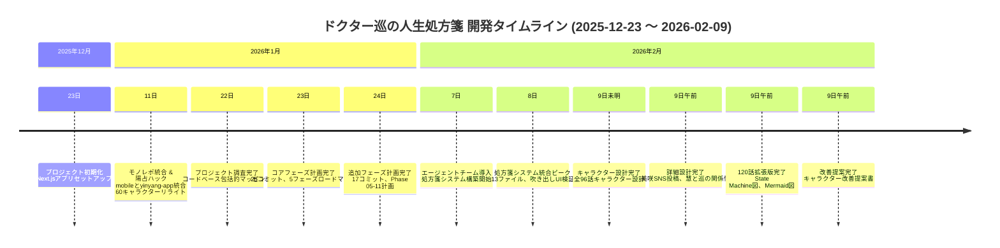

---

## ファイル数推移

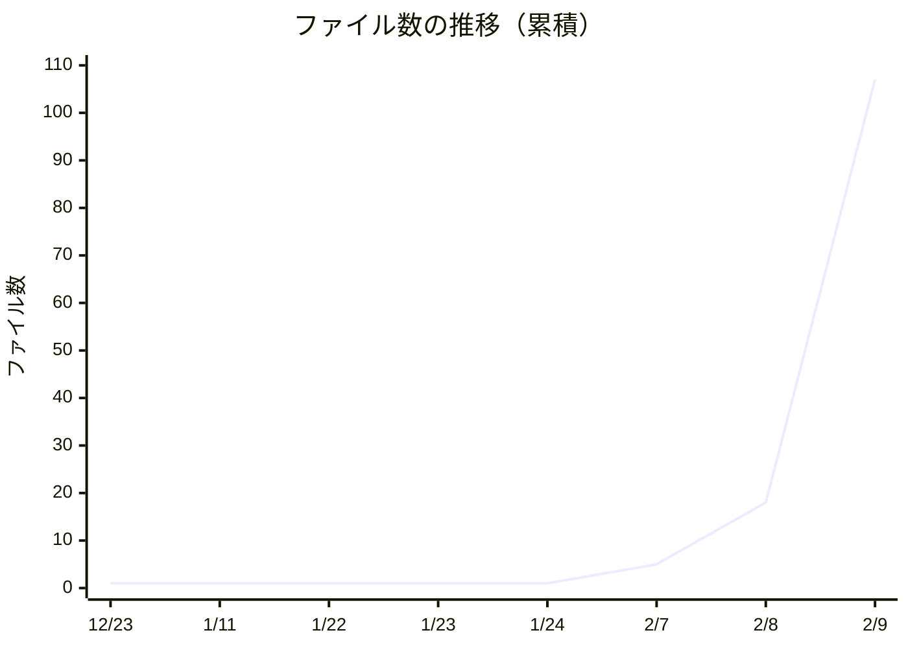

---

## カテゴリ別ファイル数

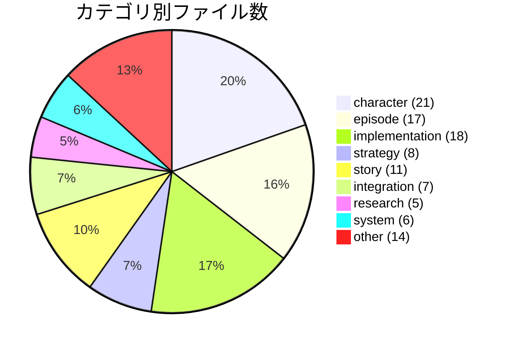

---

## フェーズ別ファイル数

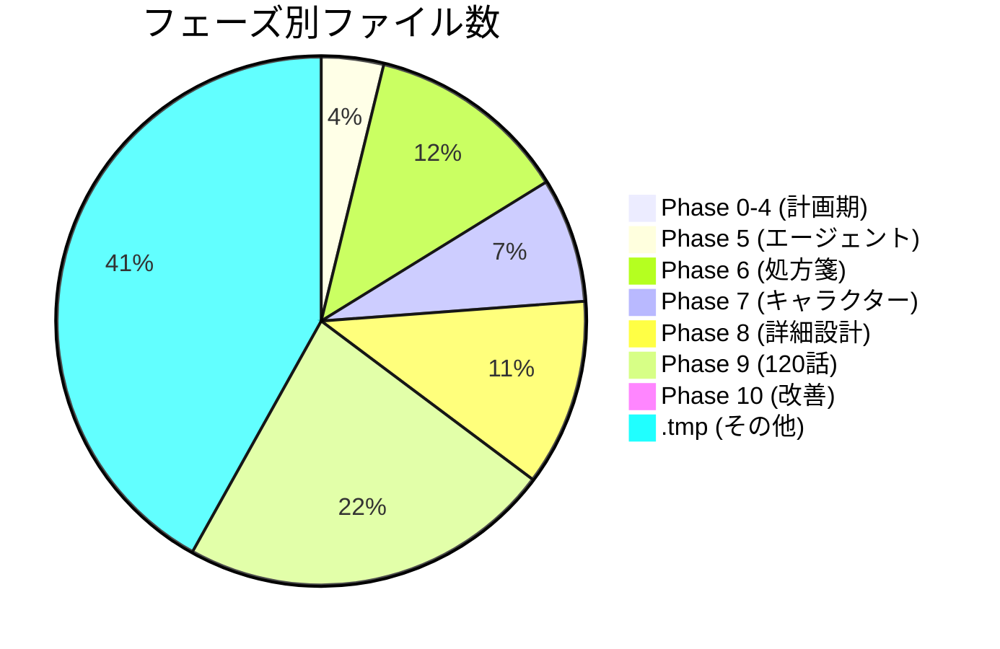

---

## 主要ファイルサイズ比較

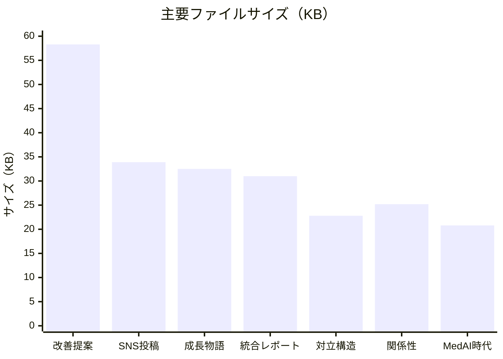

---

## 日次活動量

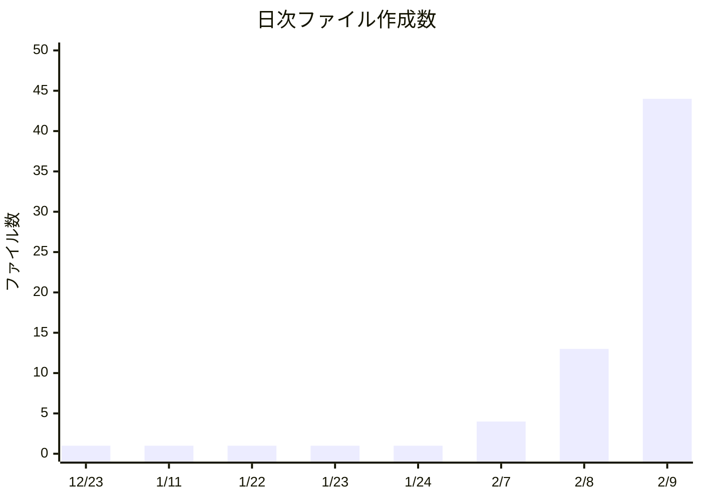

---

## 構造の進化

---

## ストーリー構造の進化

---

## 主要マイルストーン

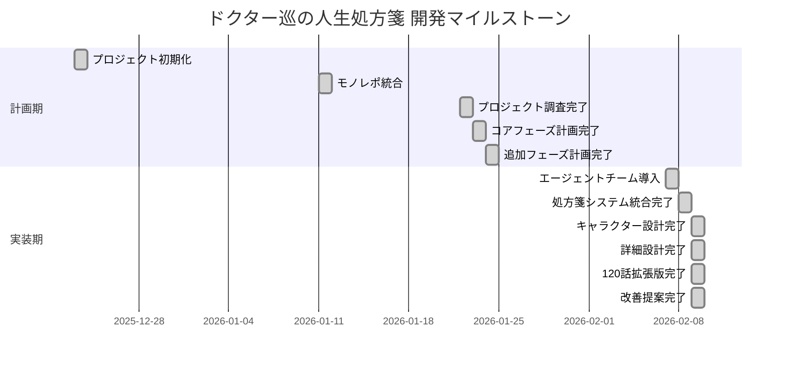

---

## ドキュメントパターンの変遷

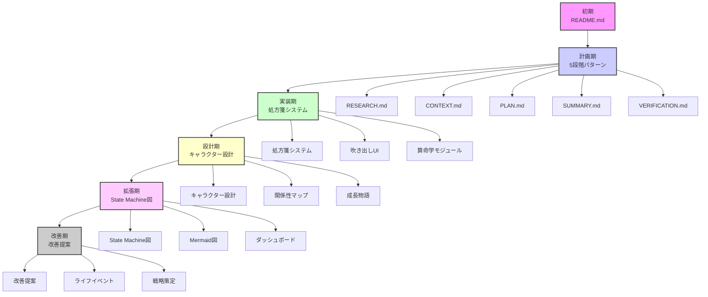

---

## カテゴリ間の関係性

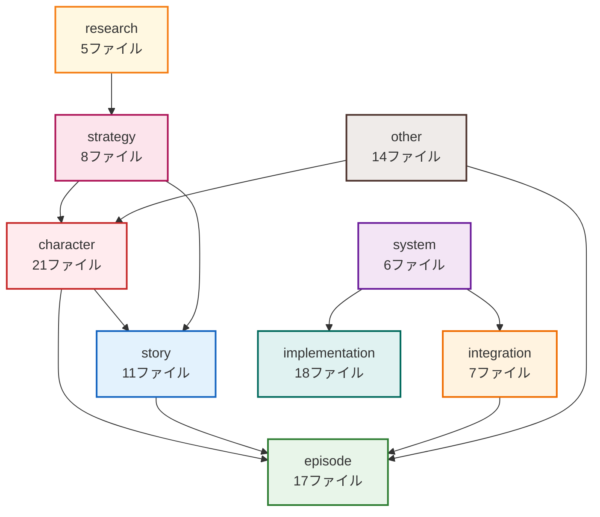

---

## 今後のロードマップ

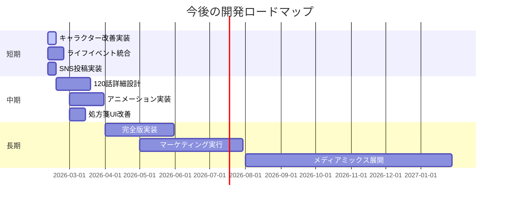

---

## .tmpディレクトリの活動状況

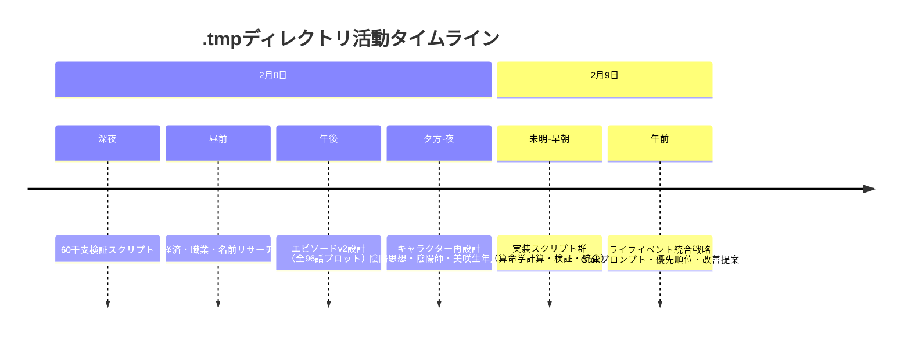

---

## 技術スタックの進化

---

## 成果物の階層構造

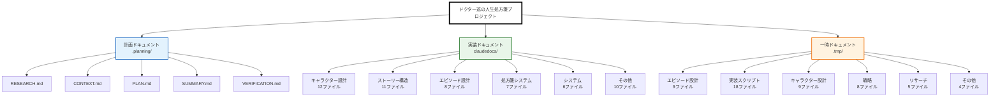

---

**作成日**: 2026年2月9日
**データソース**: claudedocs/ (54ファイル) + .tmp/ (53ファイル) + git履歴
