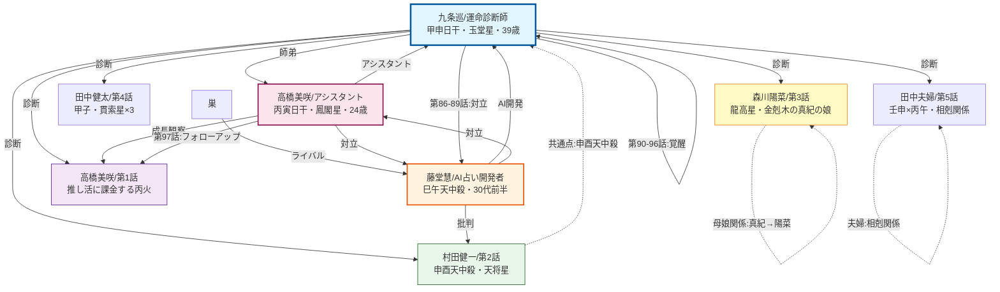
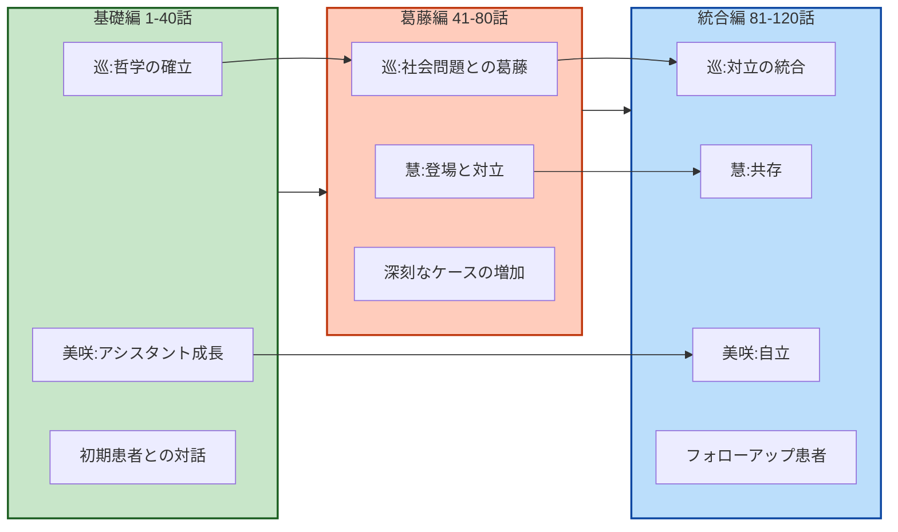
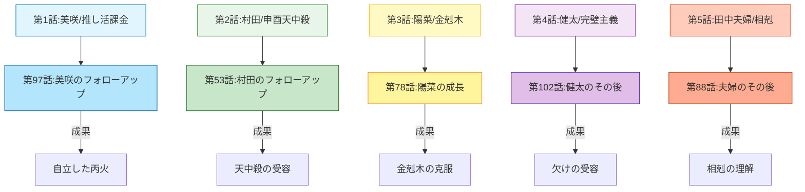
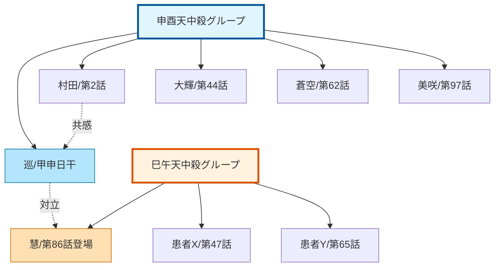
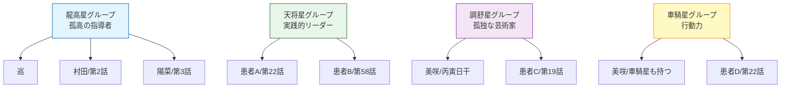
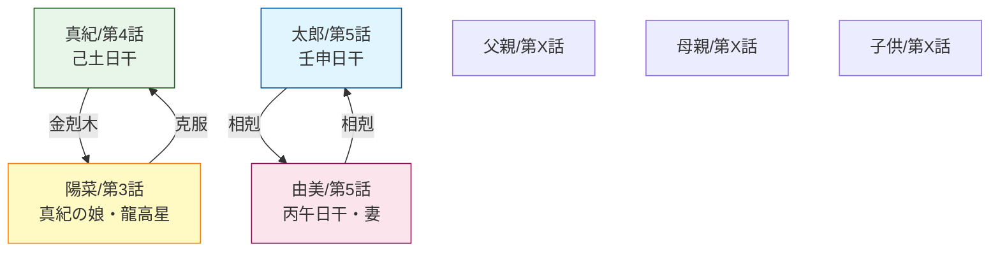

# キャラクター関係性マーメイド図

## 主要キャラクター関係図

```mermaid
graph TD
    %% 主要キャラクター
    巡[九条巡/運命診断師<br/>甲申日干・玉堂星・39歳]
    美咲[高橋美咲/アシスタント<br/>丙寅日干・鳳閣星・24歳]
    慧[藤堂慧/AI占い開発者<br/>巳午天中殺・30代前半]

    %% 患者グループ
    患者1[高橋美咲/第1話<br/>推し活に課金する丙火]
    患者2[村田健一/第2話<br/>申酉天中殺・天将星]
    患者3[森川陽菜/第3話<br/>龍高星・金剋木の真紀の娘]
    患者4[田中健太/第4話<br/>甲子・貫索星×3]
    患者5[田中夫婦/第5話<br/>壬申×丙午・相剋関係]

    %% 巡の関係
    巡 -->|師弟| 美咲
    巣 -->|ライバル| 慧
    巡 -->|診断| 患者1
    巡 -->|診断| 患者2
    巡 -->|診断| 患者3
    巡 -->|診断| 患者4
    巡 -->|診断| 患者5

    %% 美咲の関係
    美咲 -->|アシスタント| 巡
    美咲 -->|対立| 慧
    美咲 -->|成長観察| 患者1

    %% 慧の関係
    慧 -->|AI開発| 巡
    慧 -->|対立| 美咲
    慧 -->|批判| 患者2

    %% 患者間の相関
    患者2 -.->|共通点:申酉天中殺| 巡
    患者3 -.->|母娘関係:真紀→陽菜| 患者3
    患者5 -.->|夫婦:相剋関係| 患者5

    %% 120話拡張版での新しい関係
    巡 -->|第86-89話:対立| 慧
    巡 -->|第90-96話:覚醒| 巡
    美咲 -->|第97話:フォローアップ| 患者1

    style 巡 fill:#e1f5fe,stroke:#01579b,stroke-width:3px
    style 美咲 fill:#fce4ec,stroke:#880e4f,stroke-width:2px
    style 慧 fill:#fff3e0,stroke:#e65100,stroke-width:2px
    style 患者1 fill:#f3e5f5,stroke:#4a148c,stroke-width:1px
    style 患者2 fill:#e8f5e9,stroke:#1b5e20,stroke-width:1px
    style 患者3 fill:#fff9c4,stroke:#f57f17,stroke-width:1px
```

## 3部構造における関係性の変化

```mermaid
graph LR
    subgraph 基礎編[基礎編 1-40話]
        巡1[巡:哲学の確立]
        美咲1[美咲:アシスタント成長]
        患者1[初期患者との対話]
    end

    subgraph 葛藤編[葛藤編 41-80話]
        巡2[巡:社会問題との葛藤]
        慧登場[慧:登場と対立]
        患者2[深刻なケースの増加]
    end

    subgraph 統合編[統合編 81-120話]
        巡3[巡:対立の統合]
        美咲3[美咲:自立]
        慧3[慧:共存]
        患者3[フォローアップ患者]
    end

    基礎編 --> 葛藤編
    葛藤編 --> 統合編

    巡1 --> 巡2
    巡2 --> 巡3
    美咲1 --> 美咲3
    慧登場 --> 慧3

    style 基礎編 fill:#c8e6c9,stroke:#1b5e20,stroke-width:2px
    style 葛藤編 fill:#ffccbc,stroke:#bf360c,stroke-width:2px
    style 統合編 fill:#bbdefb,stroke:#0d47a1,stroke-width:2px
```

## 主要患者のフォローアップ相関

```mermaid
graph TD
    %% 初登場エピソード
    E1[第1話:美咲/推し活課金]
    E2[第2話:村田/申酉天中殺]
    E3[第3話:陽菜/金剋木]
    E4[第4話:健太/完璧主義]
    E5[第5話:田中夫婦/相剋]

    %% フォローアップエピソード（120話拡張版）
    E1 --> E97[第97話:美咲のフォローアップ]
    E2 --> E53[第53話:村田のフォローアップ]
    E3 --> E78[第78話:陽菜の成長]
    E4 --> E102[第102話:健太のその後]
    E5 --> E88[第88話:夫婦のその後]

    %% 成長の可視化
    E97 -->|成果| 自立[自立した丙火]
    E53 -->|成果| 受容[天中殺の受容]
    E78 -->|成果| 克服[金剋木の克服]
    E102 -->|成果| 実践[欠けの受容]
    E88 -->|成果| 理解[相剋の理解]

    style E1 fill:#e1f5fe,stroke:#0277bd
    style E2 fill:#e8f5e9,stroke:#388e3c
    style E3 fill:#fff9c4,stroke:#fbc02d
    style E4 fill:#f3e5f5,stroke:#7b1fa2
    style E5 fill:#ffccbc,stroke:#d84315
    style E97 fill:#b3e5fc,stroke:#01579b
    style E53 fill:#c8e6c9,stroke:#1b5e20
    style E78 fill:#fff59d,stroke:#f57f17
    style E102 fill:#e1bee7,stroke:#4a148c
    style E88 fill:#ffab91,stroke:#bf360c
```

## 天中殺グループの相関

```mermaid
graph TD
    %% 申酉天中殺グループ
    申酉[申酉天中殺グループ]
    巡[巡/甲申日干]
    村田[村田/第2話]
    大輝[大輝/第44話]
    蒼空[蒼空/第62話]
    美咲[美咲/第97話]

    申酉 --> 巡
    申酉 --> 村田
    申酉 --> 大輝
    申酉 --> 蒼空
    申酉 --> 美咲

    %% 巳午天中殺グループ
    巳午[巳午天中殺グループ]
    慧[慧/第86話登場]
    患者1[患者X/第47話]
    患者2[患者Y/第65話]

    巳午 --> 慧
    巳午 --> 患者1
    巳午 --> 患者2

    %% 天中殺間の相互作用
    巡 -.->|対立| 慧
    村田 -.->|共感| 巡

    style 申酉 fill:#e1f5fe,stroke:#01579b,stroke-width:3px
    style 巳午 fill:#fff3e0,stroke:#e65100,stroke-width:3px
    style 巡 fill:#b3e5fc,stroke:#0277bd
    style 慧 fill:#ffe0b2,stroke:#ef6c00
```

## 十大主星グループの相関

```mermaid
graph TD
    %% 龍高星グループ
    龍高[龍高星グループ<br/>孤高の指導者]
    巡[巡]
    村田[村田/第2話]
    陽菜[陽菜/第3話]

    龍高 --> 巡
    龍高 --> 村田
    龍高 --> 陽菜

    %% 天将星グループ
    天将[天将星グループ<br/>実践的リーダー]
    患者1[患者A/第22話]
    患者2[患者B/第58話]

    天将 --> 患者1
    天将 --> 患者2

    %% 調舒星グループ
    調舒[調舒星グループ<br/>孤独な芸術家]
    美咲[美咲/丙寅日干]
    患者3[患者C/第19話]

    調舒 --> 美咲
    調舒 --> 患者3

    %% 車騎星グループ
    車騎[車騎星グループ<br/>行動力]
    美咲2[美咲/車騎星も持つ]
    患者4[患者D/第22話]

    車騎 --> 美咲2
    車騎 --> 患者4

    style 龍高 fill:#e1f5fe,stroke:#01579b
    style 天将 fill:#e8f5e9,stroke:#1b5e20
    style 調舒 fill:#f3e5f5,stroke:#7b1fa2
    style 車騎 fill:#fff9c4,stroke:#f57f17
```

## 家族関係の相関

```mermaid
graph TD
    %% 真紀家
    真紀[真紀/第4話<br/>己土日干]
    陽菜[陽菜/第3話<br/>真紀の娘・龍高星]

    真紀 -->|金剋木| 陽菜
    陽菜 -->|克服| 真紀

    %% 田中家
    太郎[太郎/第5話<br/>壬申日干]
    由美[由美/第5話<br/>丙午日干・妻]

    太郎 -->|相剋| 由美
    由美 -->|相剋| 太郎

    %% その他の家族関係
    父親[父親/第X話]
    母親[母親/第X話]
    子供[子供/第X話]

    style 真紀 fill:#e8f5e9,stroke:#1b5e20
    style 陽菜 fill:#fff9c4,stroke:#f57f17
    style 太郎 fill:#e1f5fe,stroke:#01579b
    style 由美 fill:#fce4ec,stroke:#880e4f
```
