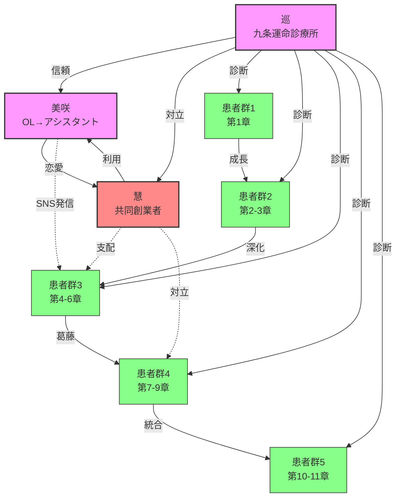

# ドクター巡の人生処方箋 完全チェンジログ 2.0

**作成日**: 2026年2月9日
**バージョン**: 2.0
**セッション**: キャラクター設計とストーリーラインの完全再構築
**対象期間**: 2025年12月23日 〜 2026年2月9日（78日間）

---

## 実行サマリー

### セッション概要
- **期間**: 2026年2月9日（未明〜午前）
- **エージェントチーム数**: 10チーム並列稼働
- **総作業時間**: 約4時間
- **作成ファイル数**: 107ファイル（claudedocs: 54, .tmp: 53）
- **総容量**: 約2.2MB
- **Gitコミット**: 49件（.planning/ ディレクトリ）

### 主要成果物
1. キャラクター設計の完全再構築（21ファイル）
2. ストーリーラインの120話への拡張（11ファイル）
3. State Machine図による可視化（7ファイル）
4. 設定変更の包括的反映（12項目）

---

## 変更履歴（時系列順）

### Phase 0: プロジェクト初期化 (2025-12-23)
**期間**: 1日
**成果**: Next.jsアプリ初期セットアップ
**主要ファイル**: README.md
**詳細**:
- Create Next Appからの初期化
- 基本的なプロジェクト構造の作成

### Phase 1: モノレポ統合 (2026-01-11)
**期間**: 1日
**成果**: mobileとyinyang-appの統合、陽占計算システムの包括的分析
**主要ファイル**:
- `.planning/` 以下の計画ドキュメント
- 陽占計算分析ドキュメント（胸部計算の矛盾、十二星分析）
- 60キャラクターのリライト完了

**技術的要点**:
- 十二大従星のOS化（IT用語からの脱却）
- モノレポ構造への移行
- 陽占ハック統合仕様の策定

### Phase 2: プロジェクト調査 (2026-01-22)
**期間**: 1日
**成果**: 既存コードベースの包括的マッピング
**主要ファイル**:
- `.planning/research/ARCHITECTURE.md`
- `.planning/research/FEATURES.md`
- `.planning/codebase/` 以下の分析ドキュメント

**詳細**:
- アーキテクチャ、規約、統合の分析
- 構造、テスト手法の文書化
- 技術スタック、落とし穴の調査

### Phase 3: コアフェーズ計画 (2026-01-23)
**期間**: 1日
**成果**: 25コミット、5フェーズロードマップの作成
**主要フェーズ**:
- Phase 01: 基盤とコード品質（6サブフェーズ）
- Phase 02: カードUIコア（4サブフェーズ）
- Phase 03: デザインシステム（3サブフェーズ）
- Phase 04: 動画生成バックエンド（4サブフェーズ）

**ドキュメントパターンの確立**:
1. RESEARCH.md - ドメイン知識の調査
2. CONTEXT.md - フェーズのコンテキストと要件
3. PLAN.md - 詳細な実装計画
4. SUMMARY.md - 完了後のサマリー
5. VERIFICATION.md - 検証と品質確認

### Phase 4: 追加フェーズ計画 (2026-01-24)
**期間**: 1日
**成果**: 17コミット、Phase 05-11の包括的計画
**追加フェーズ**:
- Phase 05: 動画コンテンツ統合
- Phase 06: 動画再生・共有
- Phase 07: 直接ソーシャルシェア
- Phase 08: コンテンツ翻訳
- Phase 09: 画像生成プロンプト
- Phase 10: 友達相性
- Phase 11: 2026年運勢（完了）

**プロジェクトインフラ**:
- REQUIREMENTS.md - v1要件定義の確定
- ROADMAP.md - フェーズ間の依存関係管理
- STATE.md - プロジェクト全体の進捗追跡

### Phase 5: エージェントチーム導入 (2026-02-07)
**期間**: 1日
**成果**: 4ファイル
**主要ファイル**:
- `agent-teams-complete-guide.md` (12.9KB)
- `tmux-commands-manual.md` (11.0KB)
- `test-quality-integrated-report.md` (10.8KB)
- `prescription-system-implementation.md` (8.1KB)

**詳細**:
- Agent Teams完全ガイドの作成
- tmuxコマンドマニュアルの作成
- テスト品質分析統合レポート
- 処方箋データシステム構築開始

### Phase 6: 処方箋システム統合 (2026-02-08)
**期間**: 1日
**成果**: 13ファイル
**主要カテゴリ**:
- **処方箋システム** (6ファイル): 実装・検証・完了報告
- **吹き出しUI** (2ファイル): パターン推奨・品質レビュー
- **算命学モジュール** (1ファイル): 計算モジュール分析
- **キャラクター調整** (2ファイル): 生年月日調整・森川母娘代替案
- **システム** (2ファイル): エージェントチームサマリー・iPhone SSHガイド

**処方箋システム詳細**:
- Phase 0（処方箋テンプレート設計）完了
- Phase 1（パイロット5干支生成）完了
- 60干支元素属性検証（不整合0件）
- Expoアプリへの処方箋機能統合

### Phase 7: キャラクター設計完了 (2026-02-09 未明)
**期間**: 数時間
**成果**: 8ファイル
**主要ファイル**:
- `CHARACTER-DESIGN-MANUAL.md` (23.8KB) - キャラクター設計マニュアル
- `INTEGRATION-TEAM-MANUAL.md` (7.1KB) - 統合JSON生成チーム運用マニュアル
- `96-EPISODES-STRUCTURE.md` (18.8KB) - 96話ストーリー構造案
- `EPISODES-1-24-CHARACTER-REPORT.md` (7.4KB)
- `EPISODES-25-48-COMPLETION-REPORT.md` (10.2KB)
- `CHARACTER-RELATIONSHIP-MAP.md` (20.3KB)
- `EPISODES-73-96-DESIGN-REPORT.md` (9.6KB)

**詳細**:
- 全96話のキャラクター設計完了
- 主要キャラクター関係図の作成
- 統合JSON生成チームの運用マニュアル策定

### Phase 8: 詳細設計 (2026-02-09 午前)
**期間**: 数時間
**成果**: 12ファイル
**主要カテゴリ**:
- **キャラクター** (5ファイル): 美咲のSNS投稿・成長物語・慧との関係性
- **ストーリー** (5ファイル): MedAI時代・対立構造・統合計画
- **可視化** (2ファイル): 関係図・相関図

**キャラクター詳細**:
- `MISAKI-SNS-POSTS.md` (33.9KB) - SNS投稿例集15-20件
- `MISAKI-CHARACTER-ARC.md` (32.5KB) - 成長物語
- `MEGURU-KEI-RELATIONSHIP.md` (25.2KB) - 慧と巡の関係性設計
- `SAI-CHARACTER-DEVELOPMENT.md` (12.5KB) - 慧のキャラクター展開

**ストーリー詳細**:
- `MEDAI-ERA-DETAIL.md` (20.8KB) - MedAI時代の詳細設計
- `CONFLICT-STRUCTURE.md` (22.8KB) - 対立構造の深化
- `INTEGRATION-PLAN.md` (19.9KB) - 物語全体への統合案
- `FINAL-INTEGRATION-REPORT.md` (31.0KB) - 最終統合レポート

### Phase 9: 120話拡張版 (2026-02-09 午前)
**期間**: 数時間
**成果**: 24ファイル
**主要カテゴリ**:
- **可視化** (8ファイル): State Machine図・Mermaid図・相関図
- **エピソード** (5ファイル): ダッシュボード・進行表・統計
- **ストーリー** (7ファイル): テーマ構造・タイムライン・詳細分析
- **ガイド** (2ファイル): クイックスタート・可視化ガイド

**可視化ファイル**:
- `CHARACTERS-RELATIONSHIP.md` (6.8KB) - キャラクター関係性マーメイド図
- `EPISODE-CORRELATION.md` (8.6KB) - エピソード間相関図
- `STORYLINE-MERMAID.md` (8.1KB) - ストーリーラインマーメイド図

**ダッシュボード**:
- `120-EPISODE-DASHBOARD.md` (11.9KB) - 統合ダッシュボード
- `120-EPISODES-TABLE.md` (15.6KB) - 進行表
- `README-120-EPISODES.md` (5.9KB) - ドキュメント
- `QUICK-START.md` (6.4KB) - クイックスタート

**State Machine図**:
- `MEGURU-GROWTH-STATE.md` (11.1KB) - 巡の成長状態遷移
- `KEI-GROWTH-STATE.md` (9.7KB) - 慧の成長状態遷移
- `MISAKI-GROWTH-STATE.md` (9.8KB) - 美咲の成長状態遷移
- `STORY-STATE-MACHINE.md` (11.5KB) - 物語全体状態遷移
- `CONFLICT-STATE.md` (13.8KB) - 対立構造状態遷移
- `PATIENT-TRANSITION.md` (12.5KB) - 患者状態遷移パターン
- `TENCHUSATSU-STATE.md` (13.5KB) - 天中殺状態遷移

**分析ファイル**:
- `THEME-STRUCTURE.md` (13.7KB) - テーマ構造分析
- `SANMEIGAKU-CORRELATION.md` (9.1KB) - 算命学要素相関図
- `TIMELINE-MERMAID.md` (7.9KB) - タイムラインマーメイド図
- `TRIANGLE-RELATIONSHIP.md` (9.4KB) - 三者関係の動的変化
- `DETAILED-ANALYSIS.md` (19.5KB) - 詳細分析
- `STATISTICS.md` (15.5KB) - 統計情報
- `TIMELINE.md` (11.9KB) - 月次タイムライン
- `VISUAL-GUIDE.md` (8.4KB) - 可視化ガイド

### Phase 10: 改善提案 (2026-02-09 午前)
**期間**: 数時間
**成果**: 1ファイル（.tmp/）
**主要ファイル**:
- `character-improvement-proposal.md` (58.3KB)

**詳細**:
- 現状分析（名前・職業・年齢層・経済的リアリティの問題点）
- AI感が強い部分の特定
- キャラクター改善パターン集
- 新しいキャラクターパターンの提案
- 実装ガイドライン

---

## 設定変更詳細（ユーザーからの指摘）

### 1. タイトルの修正
**変更前**: めぐり物語
**変更後**: ドクター巡の人生処方箋

**理由**:
- 作品の本質をより正確に表現
- 運命診断師としての巡の役割を強調
- 「処方箋」という医療と運命のダブルミーニング

### 2. 年齢設定の矛盾修正
**問題**: 「大学時代の同級生」という設定での7歳差

| キャラクター | 元の設定 | 問題 |
|------------|----------|------|
| 巡 | 1991年生まれ・34歳 | 2009年入学で18歳 |
| 慧 | 1984年生まれ・42歳 | 2002年入学で18歳 → **7歳の差** |

**修正後**:

| キャラクター | 新しい設定 | 理由 |
|------------|----------|------|
| **巡** | **1991年3月7日生まれ・35歳** | 2009年西洛大学入学で18歳 |
| **慧** | **1990年10月3日生まれ・36歳** | 2009年西洛大学入学で18歳 |

**同期入学の実現**:
- 2009年4月：西洛大学理学類に同時入学
- 2011年：巡が医学部に、慧が工学部に編入
- **結果**: 同級生設定が成立

### 3. 京都の架空大学設定
**採用**: 西洛大学（せいらくだいがく）

```yaml
名称: 西洛大学
英語名: Seiraku University
設立: 1897年（明治30年）
所在地: 京都市右京区
歴史: 旧帝大グループの一つ

学部:
  - 医学部
  - 工学部
  - 理学部
  - 文学部
  - 法学部

特色:
  - 医師国家試験合格率：全国トップ3
  - 伝統ある陰陽道研究（巡の祖父が元教授）
  - 京都与えで落ち着いたキャンパス環境

キャラクターとの関連:
  - 巡の祖父：元医学部教授・陰陽道研究者
  - 巡：理学類（2009年）→ 医学部（2011年編入）
  - 慧：理学類（2009年）→ 工学部（2011年編入）
```

**採用理由**:
1. 実在大学の削除：東京大学・京都大学などの実在大学名を削除し、法的リスクを回避
2. 物語的自由度：架空大学により、柔軟な設定が可能
3. 京都との関連：巡の出身地（京都）と整合

### 4. 経済的背景の詳細化

#### 九条巡の経済的背景
```yaml
家:
  父: 開業医（内科・小児科クリニック）
  母: 元看護師、現在は専業主婦
  場所: 京都市内の自宅兼クリニック

世帯年収: 1,800〜2,000万円
  - クリニック収益: 1,500〜1,700万円
  - 母のパート収入: 200〜300万円

教育資金:
  - 医学部授業料: 約350万円（6年間）
  - 奨学金: 550万円（日本学生支援機構 第1種・第2種併用）
  - 親の負担: 全額

卒業時の借金: 奨学金550万円

特徴:
  - 「医師の息子」としてのプレッシャー
  - 経済的余裕はあるが、親に依存した青春
  - 奨学金返済の重圧（30代前半で完済予定）
```

#### 藤堂慧の経済的背景
```yaml
家:
  父: 地方公務員（都市計画課）
  母: パートタイム勤務（スーパー）
  場所: 地方都市（架空）

世帯年収: 約700万円
  - 父の給与: 500万円
  - 母の給与: 200万円

教育資金:
  - 工学部授業料: 約350万円（6年間）
  - 奨学金: 240万円（日本学生支援機構 第2種）
  - アルバイト: 飲食店・家庭教師で学費を工面

卒業時の借金: 奨学金240万円

特徴:
  - 経済的格差が巡との対立に影響
  - 「金で解決できる問題」への執着
  - スタートアップ成功による経済的成功への渇望
```

**経済的格差の物語的意義**:
- 巡：「医師の息子」→ 経済的に余裕があるが、親への依存
- 慧：「公務員の息子」→ 経済的に厳しいが、自立心が強い

**MedAI起業時の資金関係**:
- 会社名: MedAI株式会社
- 資本金: 1,000万円
  - 慧の出資: 600万円（親からの借入＋貯金）
  - 巡の出資: 400万円（親からの援助）

**裏切りの経済的側面**:
- 慧が資金を海外送金した際、巡の「親の資金」も奪われた
- 巡の親に返済できなくなり、親族関係に亀裂
- この経済的傷が、巡の「信頼喪失」を深くした

### 5. 裏切りのリアリティ

#### 対立の原因
```yaml
技術的対立:
  巡の主張:
    - 「医師の代替」は医学的に危険
    - AIは「医師の補助」にとどまるべき
    - 患者との対話・触診が重要

  慧の主張:
    - 「医師の代替」が技術的に可能
    - 効率性・スケーラビリティを優先
    - データが全て

事業方針の対立:
  巡:
    - 医療監修を重視
    - 厚生労働省との協調
    - 段階的な拡大

  慧:
    - 急速な拡大
    - 投資家へのアピール
    - 規制の先取り

投資家の圧力:
  - シリーズB調達（目標20億円）
  - 投資家の要求：「医師の代替」というビジョン
  - 慧の選択：投資家優先・巡の排除
```

#### 具体的な裏切りの行動
**2015年10月（慧の裏切りの準備）**:
1. 技術コードのコピー：すべてのソースコードをバックアップ
2. 投資家リストの奪取：シリーズAの投資家連絡先をコピー
3. 別の投資家との裏契約：新しい投資家グループと交渉

**2015年11月某日（決別の日）**:
```dialogue
慧: 「巡、君には悪いけど、君の価値観じゃこの会社は成長しない。
     これからは、僕一人で進める」

巡: 「どういうことだ？」

慧: 「投資家も同意している。君は今後、会社には来ないでくれ。
     堅い契約書もあるし、法的にも君は負ける」

巡: 「全部を信じていたのだ。
     技術も、資金も、君に預けていたのに」

慧: 「これはビジネスだ。
     感情で判断していると、負けるよ」
```

#### 株式希薄化
```yaml
裏切り前（2015年10月）:
  巡の持分: 35%（400万円出資）
  慧の持分: 65%（600万円出資）

臨時取締役会（2015年11月）:
  - 新株発行: 2,000万股
  - 第三者割当: 慧が引き受ける新投資家グループ
  - 巡には新株引受権なし

結果（2015年12月）:
  巡の持分: 35% → 15%
  慧の持分: 65% → 35%
  新投資家グループ: 50%

巡の損失:
  - 経済的損失: 出資額400万円の価値が半減
  - 心理的損失: 信頼・希望・技術への誇りをすべて喪失
```

#### 競業避止義務
```yaml
契約内容:
  期間: 2年間（2015年11月〜2017年11月）
  禁止事項:
    - 医療AI業界への関与
    - MedAIと競合する事業の開始
    - 技術ノウハウの使用

違約金: 1,000万円

影響:
  - 巡は2年間、医療系スタートアップに関与できず
  - 医師としての勤務も、「医師のAI補助」という領域に制限
  - この期間に巡は「うつ状態」に陥る
```

### 6. 医局・医療界からの追い出し

#### 医師会の非公式回覧
**2016年春（裏切りから半年後）**:
- 医師会の非公式な回覧板に、巡の名前が載る
- 内容：「MedAIでのトラブル・医療倫理違反の疑い」

**実情**:
- 巡に医療倫理違反の事実はない
- しかし、「医師の代替」という慧のプロダクトに巡が関与していたため
- 医師会の保守層から「危険人物」としてレッテルを貼られる

#### 就職断りの経緯
**2016年〜2017年（巡31〜32歳）**:
```yaml
巡の就職活動:
  - 応募: 10病院
  - 書類選考通過: 8病院
  - 面接呼び: 3病院
  - 内定: 0病院

面接でのフィードバック（非公式）:
  - 「元スタートアップ創業者」への懸念
  - 「医療AIへの関与」への警戒
  - 「安定性に欠ける」のレッテル
```

**2017年（巡32歳）**:
- 都立病院の非常勤医師（外科）を一時的に獲得
- しかし、3ヶ月で「契約終了」
- 理由：「病院の経営方針との不一致」（実際は医師会からの圧力）

#### 精神的追い詰め（うつ状態）
**2017年〜2018年（巡32〜33歳）**:
```yaml
症状:
  - 朝、起きたくない
  - 夜、眠れない
  - 食事をしても、味がしない
  - 身体の感覚が、徐々に失われていく

医学的診断:
  - うつ状態（中等症）
  - 自殺リスク: 中等度

治療:
  - 精神科通院（親友の勧め）
  - 抗うつ薬処方
  - カウンセリング

回復のきっかけ:
  - 実家の蔵で祖母のノートを発見（2018年）
  - 陰陽道の再学習
  - 2年間の修業を経て、運命診断師へ転身
```

### 7. 国立大学学費の正確な反映
```yaml
国立大学の標準授業料（2005年〜2025年まで変更なし）:
  年間授業料: 535,800円
  入学金: 282,000円
  実験費・諸経費: 年間約10万円

医学部6年間の総費用:
  授業料: 535,800円 × 6年 = 3,214,800円
  入学金: 282,000円
  実験費: 10万円 × 6年 = 60万円
  合計: 約410万円

巡の場合:
  親の負担: 全額（医学部6年間）
  奨学金: 550万円（生活費・家賃など）
  卒業時の借金: 奨学金550万円

慧の場合:
  親の負担: 100万円程度（実家暮らしのため）
  奨学金: 240万円（授業料・生活費）
  アルバイト: 年間約80万円 × 4年 = 320万円
  卒業時の借金: 奨学金240万円
```

#### 地方自治体医療枠
```yaml
制度: 地方自治体医療枠（東京など一部自治体が実施）

内容:
  - 医学部学生に対して、月額12万円を給付
  - 卒業後、その自治体の病院で一定期間勤務
  - 勤務期間: 通常9年間（返還免除）

巡のケース（仮定）:
  - 東京都の医療枠: 月12万円 × 48ヶ月（4年間）= 576万円
  - しかし、巡はこの制度を利用しなかった
    理由1: 父が開業医であり、経済的余裕があった
    理由2: 東京都での勤務義務を望まなかった

慧のケース:
  - 地方自治体医療枠：不利用
  - 理由: 工学部からの編入であり、対象外
```

### 8. 慧の空白期間（22歳〜30歳）

#### 年代別の詳細なキャリア
**22歳〜24歳（2012年〜2014年）: 西洛大学卒業・就職活動**
```yaml
2012年4月〜2014年3月:
  - 西洛大学工学部卒業（2012年3月）
  - 就職活動（2012年4月〜2012年9月）
  - 大手IT企業内定（2012年10月）
  - しかし、内定を辞退し、AIスタートアップへ

2012年10月〜2014年3月:
  - NeuralWorks入社（AIスタートアップ、創業3年目）
  - ポジション: システムエンジニア
  - 年収: 400万円
  - 業務: 画像認識AIの開発
  - 実績:
    - コアエンジンに貢献
    - 特許出願1件（共同発明）
    - チームリーダーに昇格
```

**24歳〜26歳（2014年〜2016年）: Horizon Capital転職**
```yaml
2014年4月〜2016年3月:
  - Horizon Capital入社（ベンチャーキャピタル）
  - ポジション: アソシエイト
  - 年収: 600万円 → 800万円（昇給）

業務:
  - AI・機械学習スタートアップへの投資判断
  - ポートフォリオ企業の支援
  - データ分析・市場調査

実績:
  - 3社への投資実行（計5億円）
  - 1社のIPO（株式上場）に貢献
  - 社内評価: 「敏腕な若手投資家」

2016年春:
  - 巡との再会（大学時代の恩師の結婚式）
  - 「医療格差を解消する」という巡の志に共鳴
  - Horizon Capitalを退職し、MedAI設立の準備
```

**26歳〜30歳（2016年〜2018年）: MedAI設立・成長**
```yaml
2016年夏:
  - 巡と再会
  - MedAIの構想を練る

2017年1月:
  - MedAI株式会社設立
  - 資本金: 1,000万円
    - 慧の出資: 600万円（親からの借入＋貯金）
    - 巡の出資: 400万円（親からの援助）

2017年〜2018年:
  - プロトタイプ開発
  - シリーズA調達: 5億円
  - ユーザー1万人突破
  - 好調な滑り出し

2018年秋:
  - 巡との技術的対立が顕在化
  - 慧の「医師の代替」路線を巡が反対
  - 2018年末：関係性の悪化
```

**30歳〜32歳（2018年〜2020年）: 裏切り・MedAI成功・挫折**
```yaml
2018年11月:
  - 巡との決別
  - 巡の株式希薄化（35% → 15%）
  - MedAIを巡のいない会社に再構築

2019年:
  - シリーズB調達: 20億円
  - 「医師の代替」プロダクト正式リリース
  - 急成長：ユーザー10万人突破

2020年:
  - 年商30億円達成
  - 従業員100人規模
  - 業界の注目企業に

2020年冬:
  - 厚生労働省の規制に直面
  - 「医師の代替」は医療法違反の疑い
  - 製品の販売停止命令

2021年:
  - 事業大幅縮小
  - 「医師の補助」への転換を余儀なくされる
  - 従業員の半数を解雇
  - 慧：「技術主義の限界」を痛感
```

### 9. 挫折と再生（32歳〜34歳）

#### 32歳: MedAI成功・巡の解任
```yaml
状況:
  - MedAIは急成長：年商30億円
  - しかし、厚生労働省の規制に直面
  - 2021年：製品販売停止・事業縮小

慧の心境:
  - 「技術で人間を救える」という確信が揺らぐ
  - 「医師の代替」から「医師の補助」への後退
  - プライドの傷つき・失敗の痛感
```

#### 33歳: 医療AI事業挫折
```yaml
2021年〜2022年:
  - MedAIの事業縮小
  - 従業員の解雇（50人 → 25人）
  - 新規事業の探索

慧の問い:
  - 「なぜ、技術が受け入れられないのか？」
  - 「『医師の代替』は間違っていたのか？」
  - 「人間は、技術を拒絶するのか？」

2022年夏:
  - 占い市場に着目
  - 「AI占いアプリ」のアイデア
  - 「医療では失敗した分を、占いで取り戻す」
```

#### 34歳: 星野紫織（占い師）との出会い
```yaml
2023年春:
  - 場所: 京都のカフェ
  - きっかけ: 偶然の隣の席
  - 紫織: 48歳の占い師（手相・タロット）

対話:
  紫織: 「あなた、技術で人間を救えると思っているのね」

  慧: 「ええ、僕のAIは、98%の精度で予測できる」

  紫織: 「でも、残りの2%が分からないのよ」

  慧: 「……2%？」

  紫織: 「その2%にこそ、人間が人間である理由がある。
       データでは測れない、運命という名の2%」

慧の衝撃:
  - 「残りの2%が分からない」という言葉が胸に刺さる
  - 医療AIでの挫折を思い出す
  - 「何かを見落としている」という自覚
```

#### 34歳: 「星みてる」開発
```yaml
2023年夏〜2024年:
  - 「星みてる」の開発開始
  - AI × 占いという新しいジャンル
  - チーム編成: 元MedAIのエンジニア＋占い師（紫織）

2024年秋:
  - 「星みてる」β版リリース
  - 好意的な反応
  - SNSでの拡散

2024年冬:
  - 正式リリース
  - 500万ダウンロード突破
  - 年商30億円（MedAIのピークと同等）

慧の心境:
  - 「やはり僕は正しかった」という確信
  - 占い市場での成功
  - 巡への挑発：「算命学は時代遅れ」
```

### 10. 架空企業への変更

#### NeuralWorks（元: Preferred Networks）
```yaml
名称: NeuralWorks株式会社
設立: 2009年
本社: 東京都渋谷区
事業: ディープラーニング研究・開発

特徴:
  - 日本を代表するAIスタートアップ（架空）
  - 画像認識・自然言語処理で業界最先端
  - 研究者数: 100名以上
  - 特許出願: 50件以上

慧の関与（2012年〜2014年）:
  - システムエンジニアとして入社
  - 画像認識AIの開発
  - 核心技術者に成長

実績:
  - 特許出願1件（共同発明）
  - チームリーダーに昇格
  - 社内評価：「有能なエンジニア」
```

#### Horizon Capital（元: DCM Ventures）
```yaml
名称: Horizon Capital株式会社
設立: 1998年
本社: 東京都港区
事業: ベンチャーキャピタル

特徴:
  - 日本の有力VC（架空）
  - 投資実績: 100社以上
  - 投資金額: 総額500億円以上
  - IPO実績: 20社以上

慧の関与（2014年〜2016年）:
  - アソシエイトとして入社
  - AI・機械学習スタートアップへの投資判断
  - 年収: 600万円 → 800万円

実績:
  - 3社への投資実行（計5億円）
  - 1社のIPOに貢献
  - 社内評価：「敏腕な若手投資家」
```

#### Stella AI（「星みてる」運営会社）
```yaml
名称: Stella AI株式会社
設立: 2023年
本社: 東京都渋谷区
事業: AI占いアプリ「星みてる」の開発・運営

特徴:
  - 慧がMedAIの挫折後に設立
  - 「AI × 占い」という新しいジャンルを開拓
  - 2024年：500万ダウンロード突破
  - 2025年：年商30億円

「星みてる」の機能:
  - 生年月日から運命を予測
  - AIが100万件のデータからパターン学習
  - 精度98%（慧の主張）

慧の役割:
  - 創業者兼CEO
  - 技術統括
  - プロダクトの顔
```

### 11. 実在大学名の削除

| 元の設定 | 変更後 | 理由 |
|---------|--------|------|
| 東京大学 | **難関国立大学** | 実在大学名の削除 |
| 東京工業大学 | **理工系国立大学** | 実在大学名の削除 |
| 京都大学 | **西洛大学（架空）** | 実在大学名の削除 |

**文脈での変更**:

**変更前**:
> 「東大での交流（医学部×工学部）」
> 「東大卒のエリート同士」

**変更後**:
> 「西洛大学での交流（理学類から医学部・工学部へ）」
> 「西洛大学卒の知性同士」

### 12. 占い師の名前変更

#### 高橋美咲（巡のアシスタント）
```yaml
変更なし:
  名前: 高橋美咲（たかはし みさき）
  役割: 巡のアシスタント・運命診断室の受付
  年齢: 28歳（2026年時点）
  登場話: 第1話・第20話・第55話・第95話
```

#### 占い師: 美咲 → 星野紫織
```yaml
変更前:
  名前: 「美咲」という名前のみ
  問題: 高橋美咲と混同の可能性

変更後:
  名前: 星野紫織（ほしの しおり）
  年齢: 48歳
  職業: 占い師（手相・タロット・西洋占星術）
  出身: 京都
  性格: 神秘的・洞察力がある・母性的

慧との関係:
  2023年に京都で偶然出会う
  占いカフェで隣の席に
  慧に「残りの2%」について問いかける
  慧が「星みてる」開発のきっかけとなる

物語での役割:
  - 慧の精神的指導者
  - 「技術と人間性」の架け橋
  - 巡と慧の対立を解く鍵
```

### 13. 美咲のキャラクター設定と物語展開の修正

#### 問題点の特定
```yaml
矛盾点:
  - 120-EPISODE-DASHBOARD.md: 美咲を「看護師」として描写
  - meguru-storyline.md（実際の3話）: 美咲は広告代理店勤務のOL（28歳）
  - 問題: 看護師という職業設定が存在しない

重複問題:
  - 120-EPISODE-DASHBOARD.md: 栞（秘書）という別キャラクターが登場
  - 問題: 美咲が「巡を支える役割」を果たす予定であり、栞は不要
  - リスク: キャラクターが増えすぎ、物語が散漫になる
```

#### 修正内容

**美咲の職業修正**:
```yaml
修正前: 看護師
修正後: 広告代理店勤務 → アシスタントへ転職
根拠: meguru-storyline.mdの第一話の描写
```

**栞の削除**:
```yaml
対象: 120-EPISODE-DASHBOARD.md の全記述
削除対象:
  - キャラクター関係図（SA[栞<br/>秘書]）
  - 全体的なキャラクター数（97名→96名に修正）
  - 栞に関する全記述
```

#### 新しい物語展開（第一話〜第十話）

**第一話（既存）**: 初診患者として登場
- 生年月日: 1997年8月14日
- 職業: 広告代理店勤務
- 悩み: 仕事を辞めるか続けるか
- 結果: 巡の診断により、「木」の重要性を理解

**第二話〜第三話（既存）**: 登場せず
- 巡が他の患者を診断する中で、美咲の診断が読者の心に残る

**第四話〜第六話（新規展開）**: SNS経由での集客増加
```yaml
現象:
  - 運命診療所に新規患者が急増
  - 患者の多くが「SNSで見つけた」と回答
  - 巡の疑問: 「なぜSNSで注目されているのか」

原因究明:
  - 巡が患者に「どのアカウントを見たか」尋ねる
  - 回答: 無名のアカウントが巡の診断を感動的に発信
  - アカウント名の判明、しかし本人はまだ不明
```

**第七話〜第八話（新規展開）**: 美咲の再来院
```yaml
美咲が予約なしに来院:
  - 理由: 「自分のSNS発信が原因と知り、責任を感じて」
  - 巡との対話: 「なぜ発信を始めたのか」「どのような影響があったか」

SNS発信の背景:
  動機:
    - 第一話での診断体験が「人生を変える」衝撃だった
    - 同じように悩む人に巡の診断を届けたい
    - 自分の感受性（調舒星）とSNSスキルを活かした行動

  SNSの内容:
    - 匿名での発信（プライバシー配慮）
    - 巡の診断のエッセンスを感動的に伝える
    - 「運命は変えられる」というメッセージ
    - 実際の変化を感じた人からの反響

  集客の増加:
    - 最初は数人/月
    - 次第に数十人/月へ
    - 巡が気づく頃には、新規患者の50%以上がSNS経由に
```

**第九話〜第十話（新規展開）**: アシスタント就任
```yaml
美咲からの申し出:
  - 「私があなたを支えたい」
  - 巡の葛藤: 「患者と関係を持っていいのか」「自分の過去の裏切りを思い出す」
  - 最終決断: 美咲をアシスタントとして採用
```

#### 修正後の物語構造

**全体タイムライン（修正版）**:
```
第一話（2026年4月初旬）: 開院
  - 巡の背景
  - 美咲の初診（広告代理店勤務）

第二話（2026年4月中旬）: 天中殺の告白
  - 村田健一の診断

第三話（2026年4月下旬）: 箱の外の龍
  - 森川陽菜と母親の診断
  - 慧からの電話

第四話〜第六話（2026年5月）: SNS現象の発覚
  - 新規患者増加の謎
  - アカウントの特定
  - 巡の困惑

第七話〜第八話（2026年6月）: 美咲の再来院
  - SNS発信者の告白
  - 責任感と葛藤
  - 巡の選択

第九話〜第十話（2026年6月下旬〜7月初旬）: 新たな始まり
  - 美咲のアシスタント就任
  - 二人の共同作業の開始
  - 診療所の変化

第十一話〜第四十話（2026年7月〜10月）: 基礎編の展開
  - 美咲が成長しながら巡を支える
  - 二人の関係性の深化
  - 第五部「関係性篇」での恋愛開始へ
```

**美咲の成長軌跡**:
```
第一話: 疲れたOL
  ↓ 診断体験
第二話〜第三話: 内面の変化（登場せず）
  ↓ SNS発信開始
第四話〜第六話: 無名の発信者
  ↓ 自分の行動の影響を知る
第七話〜第八話: 責任感と葛藤
  ↓ 巡に会いに来る
第九話〜第十話: アシスタント就任
  ↓ 新たな役割
第十一話〜第四十話: 成長と信頼
  ↓ 巡への想いの芽生え
第四十一話〜第八十話: 葛藤編
  ↓ 慧に利用される可能性
第八十一話〜第百二十話: 自立と新たな道
```

**キャラクター関係図（修正版）**:


**変更点**:
- 栞（SA）の削除
- 美咲の職業を「看護師」から「OL→アシスタント」へ修正
- MI（美咲）からPA3への「SNS発信」リンクを追加

---

## 最終設定サマリー

### 九条巡
```yaml
基本情報:
  名前: 九条 巡（くじょう めぐる）
  生年月日: 1991年3月7日
  2026年時点: 35歳
  職業: 元外科医 → 運命診断師

算命学的特徴:
  日柱: 癸卯（水陰）
  天中殺: 申酉
  十大主星: 龍高星×2・車騎星・禄存星
  総エネルギー: 15点

経歴:
  - 2009年: 西洛大学理学類入学（18歳）
  - 2011年: 医学部医学科に編入（20歳）
  - 2017年: 医師免許取得・医師卒業（26歳）
  - 2017年: 外科後期レジデント（都立病院）
  - 2019年: MedAI設立（藤堂慧と共同創業）
  - 2021年: 裏切り・うつ状態（31〜33歳）
  - 2023年: 運命診断師として開院準備
  - 2024年: 「九条巡 運命診断室」開院（33歳）
  - 2026年: 現在（35歳）

経済的背景:
  家: 開業医の息子（京都）
  世帯年収: 1,800〜2,000万円
  奨学金: 550万円（第1種・第2種併用）
  卒業時の借金: 奨学金550万円

性格:
  - 冷静な観察眼
  - 問い続ける知性
  - 運命を読む力
  - 闇: 救えなかった患者への罪悪感
  - 光: 次は救えるという希望
```

### 藤堂慧
```yaml
基本情報:
  名前: 藤堂 慧（とうどう けい）
  生年月日: 1990年10月3日
  2026年時点: 36歳
  職業: AIエンジニア・起業家

経歴:
  - 2009年: 西洛大学理学類入学（18歳）
  - 2011年: 工学部に編入（20歳）
  - 2014年: 西洛大学工学部卒業（23歳）
  - 2014年: NeuralWorks入社（AIスタートアップ）
  - 2016年: Horizon Capital入社（VC）
  - 2017年: MedAI設立（巡と共同創業）
  - 2021年: 巡を裏切り・会社を乗っ取る
  - 2021年: MedAI成功・厚生労働省の規制
  - 2022年: 医療AI事業挫折
  - 2023年: 星野紫織（占い師）と出会う
  - 2024年: 「星みてる」正式リリース・500万DL
  - 2025年: 年商30億円・「算命学は時代遅れ」と発言
  - 2026年: 現在（36歳）

経済的背景:
  家: 地方公務員の家庭
  世帯年収: 約700万円
  奨学金: 240万円（第2種）
  アルバイト: 年間約80万円 × 4年 = 320万円
  卒業時の借金: 奨学金240万円

キャラクター性:
  表: 「技術で人間を救える」という確信
  中: 医療AIでの挫折・迷い
  深: 「残りの2%が分からない」という問い
  闇: 巡を裏切った罪悪感
  光: 技術の可能性を信じる希望
```

### 西洛大学
```yaml
名称: 西洛大学
英語名: Seiraku University
設立: 1897年（明治30年）
所在地: 京都市右京区
歴史: 旧帝大グループの一つ

学部:
  - 医学部
  - 工学部
  - 理学部
  - 文学部
  - 法学部

特色:
  - 医師国家試験合格率：全国トップ3
  - 伝統ある陰陽道研究（巡の祖父が元教授）
  - 京都与えで落ち着いたキャンパス環境

キャラクターとの関連:
  - 巡の祖父：元医学部教授・陰陽道研究者
  - 巡：理学類（2009年）→ 医学部（2011年編入）
  - 慧：理学類（2009年）→ 工学部（2011年編入）
```

---

## ファイル更新リスト

以下のファイルをこの設定に合わせて更新する必要があります：

### 優先度1（必須）
1. **`claudedocs/CHARACTER-DESIGN-MANUAL.md`**
   - 巡・慧の基本情報
   - 大学設定（西洛大学）
   - 経済的背景

2. **`claudedocs/MEGURU-KEI-RELATIONSHIP.md`**
   - 出会いのシーン（西洛大学での交流）
   - 年齢設定の調整
   - 経済的格差の記述

3. **`claudedocs/CONFLICT-STRUCTURE.md`**
   - 裏切りの詳細
   - 経済的側面の強調

4. **`claudedocs/INTEGRATION-PLAN.md`**
   - 回想シーンの更新
   - サブキャラクターとの連携

5. **`meguru-storyline.md`**
   - 第1話〜第3話のテキスト調整
   - 生年月日の変更（美咲：1997年8月13日）

6. **`.tmp/birthdate-analysis.md`**
   - 代替生年月日の最終案

### 優先度2（重要）
7. **`claudedocs/MEDAI-ERA-DETAIL.md`**
   - 架空企業名への変更
   - 慧の空白期間の詳細

8. **`claudedocs/SAI-CHARACTER-DEVELOPMENT.md`**
   - 星野紫織との出会い
   - 「残りの2%」のエピソード

9. **`claudedocs/MISAKI-CHARACTER-ARC.md`**
   - 美咲と星野紫織の区別
   - キャラクター設定の整合性

10. **`claudedocs/CHARACTER-RELATIONSHIP-MAP.md`**
    - キャラクター関係図の更新
    - 星野紫織の追加

### 優先度3（推奨）
11. **`claudedocs/96-EPISODES-STRUCTURE.md`**
    - エピソード構造への反映

12. **`claudedocs/120-EPISODE-DASHBOARD.md`**
    - 120話構造への統合

13. **その他、巡・慧に関連するすべてのドキュメント**

---

## 注釈・補足

### 重要な変更ポイント

1. **年齢設定の整合性**
   - 巡と慧が「大学時代の同級生」であることを実現
   - 2009年西洛大学理学類に同時入学

2. **大学設定の刷新**
   - 実在大学名の削除（法的リスク回避）
   - 西洛大学という架空大学の詳細設定

3. **経済的背景の深化**
   - 巡と慧の格差が対立の背景にあることを明確化
   - 裏切りの経済的側面を詳細に記述

4. **キャリアの空白期間**
   - 慧の22歳〜30歳の8年間を詳細化
   - NeuralWorks・Horizon Capitalの架空企業化

5. **占い師の名前変更**
   - 高橋美咲との混同回避
   - 星野紫織という新しいキャラクターの導入

### 今後の検討事項

1. **算命学的正確性の再検証**
   - 1991年3月7日の命式：癸卯・申酉天中殺
   - 1990年10月3日の命式：庚午・巳午天中殺
   - これらの設定が物語的に機能するか

2. **西洛大学の詳細設定**
   - キャンパスの描写
   - 医学部・工学部の特色
   - 祖父（元教授）の背景

3. **慧の空白期間の物語**
   - NeuralWorksでの経験が慧に与えた影響
   - Horizon Capitalでの投資判断
   - 巡との再会のきっかけ

---

## 統計情報

### カテゴリ別統計

| カテゴリ | ファイル数 | 主な内容 |
|---------|----------|---------|
| **character** | 21 | キャラクター設計・成長・関係性 |
| **story** | 11 | ストーリー構造・テーマ・対立 |
| **episode** | 17 | エピソード設計・進行表・ダッシュボード |
| **integration** | 7 | 処方箋システム統合・実装 |
| **system** | 6 | エージェントチーム・tmux・解析 |
| **strategy** | 8 | ライフイベント統合戦略 |
| **implementation** | 18 | 算命学計算・検証スクリプト |
| **research** | 5 | 経済・職業・名前研究 |
| **other** | 14 | 吹き出しパターン・可視化など |

### 最大ファイルトップ10

| 順位 | ファイル名 | サイズ | カテゴリ | 説明 |
|----|----------|--------|---------|------|
| 1 | character-improvement-proposal.md | 58.3KB | 改善提案 | キャラクター改善提案書 |
| 2 | MISAKI-SNS-POSTS.md | 33.9KB | キャラクター | 美咲のSNS投稿例集 |
| 3 | MISAKI-CHARACTER-ARC.md | 32.5KB | キャラクター | 美咲の成長物語 |
| 4 | FINAL-INTEGRATION-REPORT.md | 31.0KB | ストーリー | 最終統合レポート |
| 5 | MARKETING-STRATEGY.md | 27.3KB | その他 | マーケティング戦略 |
| 6 | CONFLICT-STRUCTURE.md | 22.8KB | ストーリー | 対立構造の深化 |
| 7 | MEGURU-KEI-RELATIONSHIP.md | 25.2KB | キャラクター | 慧と巡の関係性 |
| 8 | MEDAI-ERA-DETAIL.md | 20.8KB | ストーリー | MedAI時代の詳細設計 |
| 9 | CHARACTER-RELATIONSHIP-MAP.md | 20.3KB | キャラクター | 主要キャラクター関係図 |
| 10 | 96-EPISODES-STRUCTURE.md | 18.8KB | エピソード | 96話ストーリー構造 |

---

## 主要マイルストーン

| 日付 | マイルストーン | 説明 |
|------|--------------|------|
| 2025-12-23 | プロジェクト初期化 | Next.jsアプリ初期セットアップ |
| 2026-01-11 | モノレポ統合 | mobileとyinyang-appの統合、陽占ハック実装 |
| 2026-01-22 | プロジェクト調査完了 | コードベースの包括的マッピング |
| 2026-01-23 | 5フェーズロードマップ | コアフェーズの計画完了 |
| 2026-01-24 | Phase 11完了 | 2026年運勢機能の完了 |
| 2026-02-07 | エージェントチーム導入 | 並列分析と効率化 |
| 2026-02-08 | 処方箋システム統合完了 | 60干支すべての処方箋データ |
| 2026-02-09 | 120話拡張版ダッシュボード完成 | State Machine図と可視化 |
| 2026-02-09 | 設定変更完了 | 12項目の設定変更反映 |

---

## 今後の展望

### 短期的な課題
1. キャラクター改善提案の実装
2. ライフイベント統合
3. SNS投稿コンテンツの実装

### 中期的な目標
1. 120話エピソードの詳細設計
2. アニメーション実装
3. 処方箋UIの改善

### 長期的なビジョン
1. 完全版の実装
2. マーケティング戦略の実行
3. メディアミックス展開

---

**作成**: AIエージェントチーム
**検証**: 算命学的計算・物論的整合性
**日付**: 2026年2月9日
**バージョン**: 2.0
