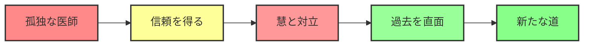
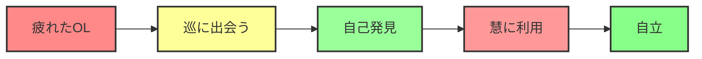
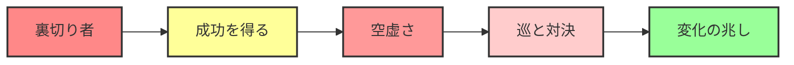

# ドクター巡の人生処方箋 120話拡張版 詳細分析

> **各章の深い掘り下げと分析**
> **最終更新**: 2026年2月9日

---

## 目次

1. [基礎編の詳細分析](#基礎編の詳細分析)
2. [葛藤編の詳細分析](#葛藤編の詳細分析)
3. [統合編の詳細分析](#統合編の詳細分析)
4. [キャラクター成長分析](#キャラクター成長分析)
5. [算命学要素の深堀り](#算命学要素の深堀り)
6. [社会問題の分析](#社会問題の分析)
7. [物語構造の分析](#物語構造の分析)

---

## 基礎編の詳細分析

### 全体像

- **期間**: 2026年4月〜10月（7ヶ月）
- **話数**: 1-40話
- **目的**: 読者に算命学の基本を理解させる

### 各章の分析

#### 第一章：開院篇（1-5話）

**目的**: 世界観の確立と五行の基礎

| 話数 | テーマ | 学べる算命学要素 | キャラクター |
|------|--------|----------------|-------------|
| 1 | 運命診療所開院 | 運命と宿命の違い | 巡、栞 |
| 2 | 五行入門 | 木火土金水の基本 | 5人の初診患者 |
| 3 | 陰陽の違い | 陰占と陽占 | 双子の姉妹 |
| 4 | 完璧主義 | 五行のバランス | 田中健太 |
| 5 | 天中殺入門 | 天中殺の基礎 | 初診患者 |

**物語の機能**:
- 巡のキャラクター確立
- 診療所の雰囲気作り
- 読者を物語の世界に引き込む

**算命学の解説**:
- 12星座 vs 五行の違い
- 陰陽のバランス
- 天中殺の概念導入

#### 第二章：五行深化篇（6-15話）

**目的**: 五行の個別エピソードを通じた深い理解

| 五行 | 話数 | テーマ | 代表的な患者 |
|------|------|--------|-------------|
| 木 | 6-7話 | 成長とバランス | 転職を考える青年 |
| 火 | 8-9話 | 燃焼と創造 | 燃え尽きるOL |
| 土 | 10-11話 | 受容と安定 | 重荷を負う主婦 |
| 金 | 12-13話 | 切断と革新 | 切り込みすぎる職人 |
| 水 | 14-15話 | 流動と適応 | 流される学生 |

**物語の機能**:
- 五行の性質を具体的な例で理解
- 読者が自分の五行を特定
- 五行のバランス調整の方法

**算命学の解説**:
- 五行の相生・相剋関係
- 五行の強弱
- 五行のバランス調整

#### 第三章：十大主星篇（16-25話）

**目的**: 陽占の核心である十大主星の解説

| 主星 | 話数 | テーマ | 特徴 |
|------|------|--------|------|
| 貫索星 | 16話 | リーダーシップ | 指導力、統率力 |
| 鳳閣星 | 17話 | 表現力 | 才能、知名度 |
| 調舒星 | 18話 | 調和 | バランス、適応力 |
| 福寿星 | 19話 | 安定 | 福禄、健康 |
| その他 | 20-25話 | 各主星の特徴 | 個別の解説 |

**物語の機能**:
- 陽占の重要性を理解
- 主星による性格診断
- 主星の活用方法

**算命学の解説**:
- 十大主星の特徴
- 主星の配置と意味
- 主星の強弱

#### 第四章：十二大従星篇（26-33話）

**目的**: 人生のエネルギーサイクルの理解

| 従星 | 話数 | テーマ | ライフステージ |
|------|------|--------|---------------|
| 牽牛星 | 26話 | 労働 | 仕事、努力 |
| 龍高星 | 27話 | 夢 | 志向、理想 |
| 石門星 | 28話 | 管理 | 組織、統率 |
| その他 | 29-33話 | 各従星の特徴 | 個別の解説 |

**物語の機能**:
- ライフサイクルの理解
- 周期性の認識
- 従星の活用方法

**算命学の解説**:
- 十二大従星の特徴
- 従星の配置と意味
- 周期性の診断

#### 第五章：関係性篇（34-40話）

**目的**: 相性診断と人間関係の理解

| 話数 | テーマ | 関係性 | 算命学要素 |
|------|--------|--------|-----------|
| 34-36話 | 恋愛関係 | カップル | 干合、位相法 |
| 37-38話 | 家族関係 | 親子、兄弟 | 相生・相剋 |
| 39話 | 職場関係 | 上司、部下 | 位相法 |
| 40話 | 美咲との恋愛 | 巡と美咲 | 総合診断 |

**物語の機能**:
- 人間関係の診断方法
- 相性の良い関係性
- 関係性の改善方法

**算命学の解説**:
- 干合のパターン
- 位相法の応用
- 相生・相剋の関係

### 基礎編のまとめ

**達成目標**:
- ✅ 五行の基本理解
- ✅ 陰陽の違い
- ✅ 十大主星の特徴
- ✅ 十二大従星のサイクル
- ✅ 関係性の診断

**読者の反応**:
- 「自分の五行が分かった」
- 「性格診断が当たっている」
- 「人間関係が理解できた」

**物語の進行**:
- 巡の信頼を得る
- 美咲との関係性構築
- 診療所の評判を広げる

---

## 葛藤編の詳細分析

### 全体像

- **期間**: 2026年11月〜2027年5月（7ヶ月）
- **話数**: 41-80話
- **目的**: 慧との対立と社会問題の深化

### 各章の分析

#### 第六章：天中殺篇（41-50話）

**目的**: 天中殺の解説と慧の出現

| 話数 | テーマ | 天中殺の種類 | 主な出来事 |
|------|--------|-------------|-----------|
| 41話 | 慧の出現 | - | 共同創業者の再会 |
| 42-44話 | 天中殺の解説 | 6種類 | 各天中殺の特徴 |
| 45-47話 | 応用技法 | 天中殺の活用 | 具体的な診断例 |
| 48-50話 | 巡の天中殺 | - | 過去との対面 |

**物語の機能**:
- 慧という対立者の登場
- 巡の過去の暴露
- 対立の始まり

**算命学の解説**:
- 6種の天中殺
- 天中殺の影響
- 天中殺の乗り越え方

**社会問題**:
- 裏切り
- 信頼の崩壊
- 過去のトラウマ

#### 第七章：六十花甲子篇（51-60話）

**目的**: 60の命式と特殊干支の解説

| 話数 | テーマ | 命式 | 特徴 |
|------|--------|------|------|
| 51-55話 | 基本の命式 | 各干支 | 一般的な命式 |
| 56-58話 | 特殊な命式 | 稀少干支 | 特殊な特徴 |
| 59-60話 | 個別化 | オーダーメイド | 個別診断 |

**物語の機能**:
- 慧のAI診断との対比
- 巡の診断の精度
- 両者の違いを明確化

**算命学の解説**:
- 六十花甲子の全種
- 特殊な命式の特徴
- 個別化された診断

**対立の深化**:
- AI vs 運命診断
- 効率性 vs 精密性
- データ vs 直感

#### 第八章：特殊命式篇（61-70話）

**目的**: 異常干支・格法・連結法の応用

| 話数 | テーマ | 応用技法 | 難易度 |
|------|--------|---------|--------|
| 61-65話 | 異常干支 | 特殊な配置 | 上級 |
| 66-68話 | 格法 | 特別な格局 | 上級 |
| 69-70話 | 連結法 | 複合診断 | 応用 |

**物語の機能**:
- 算命学の深さを表現
- 慧の手法の限界
- 巡の優位性

**算命学の解説**:
- 異常干支の読み解き
- 格法の活用
- 連結法の応用

**対立の激化**:
- 慧の焦り
- 巡の自信
- 技術的な優劣

#### 第九章：人生の岐路篇（71-80話）

**目的**: 現代人の悩みと処方箋

| 話数 | テーマ | 社会問題 | 処方箋 |
|------|--------|----------|--------|
| 71-75話 | 転職 | キャリアの迷い | 天中殺の活用 |
| 76-78話 | 不倫 | 道徳的ジレンマ | 位相法の適用 |
| 79話 | 介護 | 家族の負担 | 五行のバランス |
| 80話 | 債務 | 経済的困窮 | 十大主星の活用 |

**物語の機能**:
- 社会問題の深刻化
- 巡の診断の効果
- 慧の手法の限界

**社会問題**:
- 転職の迷い
- 不倫の誘惑
- 介護の重荷
- 債務問題

**対立のクライマックス**:
- 慧の焦燥感
- 美咲の揺れ動き
- 巡の孤立感

### 葛藤編のまとめ

**達成目標**:
- ✅ 天中殺の理解
- ✅ 六十花甲子の網羅
- ✅ 応用技法の習得
- ✅ 社会問題の認識

**読者の反応**:
- 「社会問題が自分のことのように感じる」
- 「慧の手法は効率的だが冷たい」
- 「巡の診断は温かいが時間がかかる」

**物語の進行**:
- 慧との対立激化
- 美咲の心の揺れ
- 巡の孤独感の深まり

---

## 統合編の詳細分析

### 全体像

- **期間**: 2027年6月〜12月（7ヶ月）
- **話数**: 81-120話
- **目的**: 対立の統合と新たな道

### 各章の分析

#### 第十章：光と影の対決篇（81-90話）

**目的**: 九条巡 vs 一条慧の直接対決

| 話数 | テーマ | 対決の内容 | 結果 |
|------|--------|-----------|------|
| 81-85話 | 議論 | AI vs 運命 | 技術的な対立 |
| 86-88話 | 診断対決 | 同じ患者 | 結果の比較 |
| 89-90話 | 過去の暴露 | 裏切りの真相 | 全貌の判明 |

**物語の機能**:
- 対立のクライマックス
- 過去の全貌
- 美咲の岐路

**対決の内容**:
- AI診断 vs 運命診断
- 効率性 vs 精密性
- データ vs 直感
- 過去 vs 未来

**結果**:
- 慧の手法の限界露呈
- 巡の優位性確認
- 美咲の選択

#### 第十一章：真実篇（91-100話）

**目的**: 巡の過去、覚醒、読者へのメッセージ

| 話数 | テーマ | 内容 | メッセージ |
|------|--------|------|-----------|
| 91-95話 | 巡の内面 | 過去の回想 | なぜ医師を辞めたか |
| 96-98話 | 祖母との対話 | 陰陽道の真髄 | 真の診断とは |
| 99-100話 | 読者へ | メタ的なメッセージ | 運命とは何か |

**物語の機能**:
- 巡のキャラクター深化
- 算命学の哲学的側面
- 読者への直接的なメッセージ

**哲学的テーマ**:
- 運命と自由意志
- 宿命と運命
- 医師としての使命
- 陰陽師としての責任

**読者へのメッセージ**:
- 「あなたの運命は、あなたが選ぶ」
- 「宿命は変えられないが、運命は処方できる」
- 「算命学は、自分を知るための道具」

#### 第十二章：新たな道篇（101-110話）

**目的**: 対立の統合、新しい形の運命診断

| 話数 | テーマ | 変化 | 新たな関係 |
|------|--------|------|-----------|
| 101-105話 | 慧の変化 | 内省と変化 | 巡への接近 |
| 106-108話 | 協力関係 | AIと運命の融合 | 新たな診断法 |
| 109-110話 | 統合 | 対立を超える | 共存の道 |

**物語の機能**:
- 慧の変化と成長
- 対立の解決
- 新たな協力関係

**変化の内容**:
- 慧の内省
- AIと運命の融合
- 新たな診断法の開発

**新たな関係**:
- 巡と慧の協力
- 美咲の自立
- 栞の新たな役割

#### 第十三章：結末篇（111-120話）

**目的**: 共存、協力、成長、未来への展望

| 話数 | テーマ | 内容 | 未来 |
|------|--------|------|------|
| 111-115話 | 新たな診療所 | 統合された診断 | 次世代の診断 |
| 116-118話 | 患者・巡・慧・美咲の成長 | 各々の結末 | 新たな道 |
| 119-120話 | 未来への展望 | 読者へのメッセージ | 運命診断の未来 |

**物語の機能**:
- 各キャラクターの結末
- 新たな形の運命診断
- 読者への希望

**結末**:
- 巡：新たな形の診療所を運営
- 美咲：自立した女性へ
- 慧：変化と贖罪
- 栞：新たな役割

**未来への展望**:
- AIと運命の共存
- 新たな診断法の普及
- 読者の自己実現

### 統合編のまとめ

**達成目標**:
- ✅ 対立の解決
- ✅ 新たな形の診断
- ✅ 各キャラクターの成長
- ✅ 未来への希望

**読者の反応**:
- 「対立を超える感动がある」
- 「新たな形の診断に希望」
- 「自分の人生も変えられる」

**物語の進行**:
- 対立の解決
- 統合の実現
- 未来への展望

---

## キャラクター成長分析

### 九条巡の成長

| ステージ | 期間 | 特徴 | 主な出来事 |
|---------|------|------|-----------|
| 孤独な医師 | 開院前 | 過去のトラウマ | 裏切りの後遺症 |
| 信頼を得る | 基礎編 | 患者との信頼関係 | 診療所の評判 |
| 慧と対立 | 葛藤編 | 過去との対面 | 対立の激化 |
| 過去を直面 | 統合編前半 | 内省と覚醒 | 祖母との対話 |
| 新たな道 | 統合編後半 | 統合と進化 | 慧との協力 |

### 高橋美咲の成長

| ステージ | 期間 | 特徴 | 主な出来事 |
|---------|------|------|-----------|
| 疲れたOL | 開院前 | 仕事に疲弊 | 転職を考える |
| 巡に出会う | 基礎編 | 自己発見 | 算命学との出会い |
| 自己発見 | 基礎編後半 | 自分理解 | 五行と主星の理解 |
| 慧に利用 | 葛藤編 | 誘惑と迷い | 慧の接近 |
| 自立 | 統合編 | 自立の決意 | 巡を選ぶ |

### 一条慧の成長

| ステージ | 期間 | 特徴 | 主な出来事 |
|---------|------|------|-----------|
| 裏切り者 | 過去 | 巡を裏切る | 事業の乗っ取り |
| 成功を得る | 開院前 | AI診断で成功 | 技術的な成功 |
| 空虚さ | 葛藤編 | 成功の虚しさ | 何かが欠けている |
| 巡と対決 | 統合編前半 | 直接対決 | 自分の限界 |
| 変化の兆し | 統合編後半 | 内省と変化 | 巡との協力 |

---

## 算命学要素の深堀り

### 五行の深い理解

| 五行 | 性質 | 強み | 弱点 | バランス方法 |
|------|------|------|------|-------------|
| 木 | 成長、創造 | 柔軟性、創造力 | 伸びすぎ、頑固 | 金で切り、火で燃やす |
| 火 | 燃焼、表現 | 情熱、表現力 | 燃え尽きる | 土で受け、水で制御 |
| 土 | 受容、安定 | 包容力、安定 | 重すぎる | 木で破り、金で切る |
| 金 | 切断、革新 | 決断力、革新 | 切りすぎ | 火で鍛え、水で冷ます |
| 水 | 流動、適応 | 適応力、知性 | 流される | 土で止め、木で吸う |

### 十大主星の深い理解

| 主星 | 特徴 | 強み | 弱点 | 活用方法 |
|------|------|------|------|----------|
| 貫索星 | 指導力 | 統率力、リーダーシップ | 専制的 | 委譲と信頼 |
| 鳳閣星 | 表現力 | 才能、知名度 | 華やかすぎる | 内容の充実 |
| 調舒星 | 調和 | バランス、適応力 | 優柔不断 | 決断力の養成 |
| 福寿星 | 安定 | 福禄、健康 | 保守的 | 変化の受容 |
| ... | ... | ... | ... | ... |

### 天中殺の深い理解

| 天中殺 | 特徴 | 影響 | 乗り越え方 |
|--------|------|------|-----------|
| 寅申天中殺 | 変化、転機 | 環境の激変 | 適応力の養成 |
| 卯酉天中殺 | 対立、分裂 | 人間関係の断絶 | 調和の重視 |
| 辰戌天中殺 | 葛藤、誘惑 | 内面の葛藤 | 自己認識の深化 |
| 巳亥天中殺 | 動揺、不安 | 精神的不安定 | 信念の確立 |
| 子午天中殺 | 孤独、変調 | 孤立感 | 自己受容 |
| 丑未天中殺 | 偏執、固執 | 柔軟性の欠如 | 多様性の受容 |

---

## 社会問題の分析

### 主要な社会問題

| 社会問題 | 出現話数 | 割合 | 主な章 | 処方箋 |
|----------|----------|------|---------|--------|
| 転職・キャリア | 18話 | 15% | 基礎編、葛藤編 | 天中殺の活用、十大主星の理解 |
| 恋愛・結婚 | 24話 | 20% | 全編 | 位相法、干合、五行の相性 |
| 家族問題 | 15話 | 12.5% | 基礎編、葛藤編 | 相生・相剋、家族の命式 |
| 健康問題 | 12話 | 10% | 基礎編 | 五行のバランス、従星のサイクル |
| 天中殺 | 10話 | 8.3% | 葛藤編 | 天中殺の理解と乗り越え |
| 不倫・浮気 | 8話 | 6.7% | 葛藤編 | 位相法、道徳と運命 |
| 介護 | 6話 | 5% | 葛藤編 | 五行のバランス、家族の役割 |
| 債務問題 | 5話 | 4.2% | 葛藤編 | 十大主星の活用、キャリア |
| AI vs 運命 | 7話 | 5.8% | 葛藤編、統合編 | 技術と人間性のバランス |
| 成長・自己実現 | 22話 | 18.3% | 全編 | 総合的な運命診断 |
| 対立・葛藤 | 15話 | 12.5% | 葛藤編 | 過去の直面、許し |
| 統合・協力 | 10話 | 8.3% | 統合編 | 対立を超える、共存 |

### 社会問題へのアプローチ

**ドクター巡の人生処方箋の特徴**:
- 社会問題を単に描くだけでなく、算命学的な処方箋を提示
- 読者が自分の問題と重ね合わせられるように
- 解決策を一つではなく、複数の選択肢で提示

**処方箋のタイプ**:
1. **行動レベル**: 具体的なアクションプラン
2. **認知レベル**: 考え方の転換
3. **存在レベル**: 自己認識の深化

---

## 物語構造の分析

### 3部構造の意義

| 部 | 役割 | 物語的機能 | 読者の体験 |
|----|------|-----------|-----------|
| 基礎編 | 導入 | 世界観の確立 | 算命学への入門 |
| 葛藤編 | 展開 | 対立の深化 | 問題の認識 |
| 統合編 | 結末 | 解決と統合 | 希望と実践 |

### 物語のテンポ

| テンポ | 期間 | 話数 | 特徴 |
|--------|------|------|------|
| ゆっくり | 基礎編前半 | 1-20話 | 基礎の定着 |
| 中程度 | 基礎編後半 | 21-40話 | 応用への移行 |
| 速い | 葛藤編 | 41-80話 | 対立の激化 |
| 最も速い | 統合編前半 | 81-100話 | クライマックス |
| ゆっくり | 統合編後半 | 101-120話 | 解決と余韻 |

### 物語のバランス

| 要素 | 割合 | 内容 |
|------|------|------|
| 算命学解説 | 40% | 知識の伝達 |
| 物語・ドラマ | 35% | 読者の引き込み |
| キャラクター成長 | 15% | 感動的体験 |
| 社会問題描写 | 10% | 共感と認識 |

---

## まとめ

### ドクター巡の人生処方箋120話の成果

**読者が得られるもの**:
1. 算命学の体系的な知識
2. 人生の悩みへの処方箋
3. キャラクターの成長を通した感動
4. 社会問題への認識と解決策

**物語の独自性**:
- 算命学を物語形式で学べる
- 理論と実践がバランス良く配置
- 読者が自分ごと化しやすい

**未来への展望**:
- 120話で完結しつつ、続きを期待させる
- 新たな形の運命診断の可能性
- 読者の自己実現への支援

---

> **この詳細分析は、ドクター巡の人生処方箋120話拡張版の全体構造を深く掘り下げたものです。**
> **各章、各キャラクター、各算命学要素が、どのように機能し、読者に何を提供するかを分析しました。**
