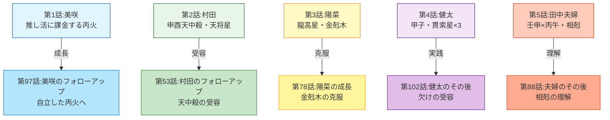
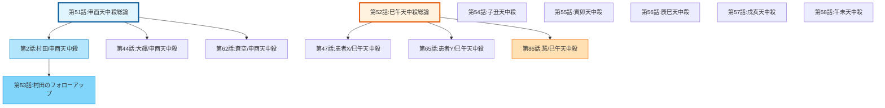
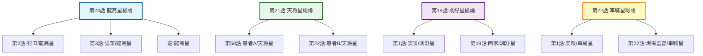
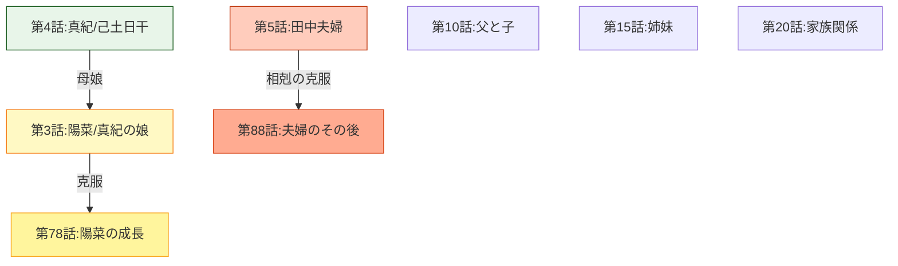
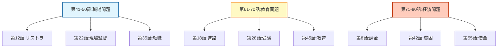
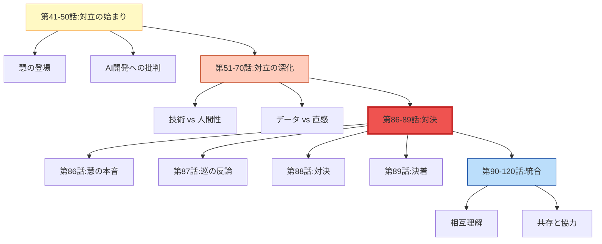
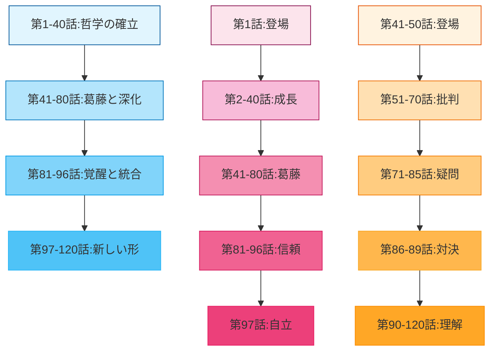

# エピソード間相関図

## 主要エピソードの関連性

```mermaid
graph TD
    %% 第1話: 美咲のフォローアップ
    E1[第1話:美咲<br/>推し活に課金する丙火]
    E97[第97話:美咲のフォローアップ<br/>自立した丙火へ]

    E1 -->|成長| E97

    %% 第2話: 村田のフォローアップ
    E2[第2話:村田<br/>申酉天中殺・天将星]
    E53[第53話:村田のフォローアップ<br/>天中殺の受容]

    E2 -->|受容| E53

    %% 第3話: 陽菜のフォローアップ
    E3[第3話:陽菜<br/>龍高星・金剋木]
    E78[第78話:陽菜の成長<br/>金剋木の克服]

    E3 -->|克服| E78

    %% 第4話: 健太のフォローアップ
    E4[第4話:健太<br/>甲子・貫索星×3]
    E102[第102話:健太のその後<br/>欠けの受容]

    E4 -->|実践| E102

    %% 第5話: 田中夫婦のフォローアップ
    E5[第5話:田中夫婦<br/>壬申×丙午・相剋]
    E88[第88話:夫婦のその後<br/>相剋の理解]

    E5 -->|理解| E88

    style E1 fill:#e1f5fe,stroke:#01579b
    style E97 fill:#b3e5fc,stroke:#0277bd
    style E2 fill:#e8f5e9,stroke:#1b5e20
    style E53 fill:#c8e6c9,stroke:#2e7d32
    style E3 fill:#fff9c4,stroke:#f57f17
    style E78 fill:#fff59d,stroke:#f9a825
    style E4 fill:#f3e5f5,stroke:#4a148c
    style E102 fill:#e1bee7,stroke:#6a1b9a
    style E5 fill:#ffccbc,stroke:#bf360c
    style E88 fill:#ffab91,stroke:#d84315
```

## 天中殺エピソードの相関

```mermaid
graph TD
    %% 申酉天中殺シリーズ
    申酉メイン[第51話:申酉天中殺総論]
    E2[第2話:村田/申酉天中殺]
    E44[第44話:大輝/申酉天中殺]
    E62[第62話:蒼空/申酉天中殺]
    E53[第53話:村田のフォローアップ]

    申酉メイン --> E2
    申酉メイン --> E44
    申酉メイン --> E62
    E2 --> E53

    %% 巳午天中殺シリーズ
    巳午メイン[第52話:巳午天中殺総論]
    E47[第47話:患者X/巳午天中殺]
    E65[第65話:患者Y/巳午天中殺]
    E86[第86話:慧/巳午天中殺]

    巳午メイン --> E47
    巳午メイン --> E65
    巳午メイン --> E86

    %% その他天中殺
    子丑[第54話:子丑天中殺]
    寅卯[第55話:寅卯天中殺]
    辰巳[第56話:辰巳天中殺]
    戌亥[第57話:戌亥天中殺]
    午未[第58話:午未天中殺]

    style 申酉メイン fill:#e1f5fe,stroke:#01579b,stroke-width:3px
    style 巳午メイン fill:#fff3e0,stroke:#e65100,stroke-width:3px
    style E2 fill:#b3e5fc,stroke:#0277bd
    style E53 fill:#81d4fa,stroke:#039be5
    style E86 fill:#ffe0b2,stroke:#ef6c00
```

## 十大主星エピソードの相関

```mermaid
graph TD
    %% 龍高星シリーズ
    龍高メイン[第24話:龍高星総論]
    E2[第2話:村田/龍高星]
    E3[第3話:陽菜/龍高星]
    E巡[巡:龍高星]

    龍高メイン --> E2
    龍高メイン --> E3
    龍高メイン --> E巡

    %% 天将星シリーズ
    天将メイン[第21話:天将星総論]
    E58[第58話:患者A/天将星]
    E22[第22話:患者B/天将星]

    天将メイン --> E58
    天将メイン --> E22

    %% 調舒星シリーズ
    調舒メイン[第19話:調舒星総論]
    E1[第1話:美咲/調舒星]
    E19[第19話:画家/調舒星]

    調舒メイン --> E1
    調舒メイン --> E19

    %% 車騎星シリーズ
    車騎メイン[第22話:車騎星総論]
    E1_2[第1話:美咲/車騎星]
    E22_2[第22話:現場監督/車騎星]

    車騎メイン --> E1_2
    車騎メイン --> E22_2

    style 龍高メイン fill:#e1f5fe,stroke:#01579b,stroke-width:2px
    style 天将メイン fill:#e8f5e9,stroke:#1b5e20,stroke-width:2px
    style 調舒メイン fill:#f3e5f5,stroke:#4a148c,stroke-width:2px
    style 車騎メイン fill:#fff9c4,stroke:#f57f17,stroke-width:2px
```

## 家族関係エピソードの相関

```mermaid
graph TD
    %% 真紀・陽菜シリーズ
    E4[第4話:真紀/己土日干]
    E3[第3話:陽菜/真紀の娘]
    E78[第78話:陽菜の成長]

    E4 -->|母娘| E3
    E3 -->|克服| E78

    %% 田中夫婦シリーズ
    E5[第5話:田中夫婦]
    E88[第88話:夫婦のその後]

    E5 -->|相剋の克服| E88

    %% その他家族シリーズ
    E10[第10話:父と子]
    E15[第15話:姉妹]
    E20[第20話:家族関係]

    style E4 fill:#e8f5e9,stroke:#1b5e20
    style E3 fill:#fff9c4,stroke:#f57f17
    style E78 fill:#fff59d,stroke:#f9a825
    style E5 fill:#ffccbc,stroke:#bf360c
    style E88 fill:#ffab91,stroke:#d84315
```

## 社会問題エピソードの相関

```mermaid
graph TD
    %% 職場問題
    職場メイン[第41-50話:職場問題]
    E12[第12話:リストラ]
    E22[第22話:現場監督]
    E35[第35話:転職]

    職場メイン --> E12
    職場メイン --> E22
    職場メイン --> E35

    %% 教育問題
    教育メイン[第61-70話:教育問題]
    E18[第18話:進路]
    E28[第28話:受験]
    E45[第45話:教育]

    教育メイン --> E18
    教育メイン --> E28
    教育メイン --> E45

    %% 経済問題
    経済メイン[第71-80話:経済問題]
    E8[第8話:課金]
    E42[第42話:貧困]
    E55[第55話:借金]

    経済メイン --> E8
    経済メイン --> E42
    経済メイン --> E55

    style 職場メイン fill:#e1f5fe,stroke:#01579b,stroke-width:2px
    style 教育メイン fill:#fff9c4,stroke:#f57f17,stroke-width:2px
    style 経済メイン fill:#ffccbc,stroke:#bf360c,stroke-width:2px
```

## 対立エピソードの相関

```mermaid
graph TD
    %% 巡 vs 慧
    対立開始[第41-50話:対立の始まり]
    慧登場[慧の登場]
    AI批判[AI開発への批判]

    対立開始 --> 慧登場
    対立開始 --> AI批判

    %% 対立の深化
    対立深化[第51-70話:対立の深化]
    技術論[技術 vs 人間性]
    方法論[データ vs 直感]

    対立開始 --> 対立深化
    対立深化 --> 技術論
    対立深化 --> 方法論

    %% 対立のクライマックス
    対立クライマックス[第86-89話:対決]
    第86話[第86話:慧の本音]
    第87話[第87話:巡の反論]
    第88話[第88話:対決]
    第89話[第89話:決着]

    対立深化 --> 対立クライマックス
    対立クライマックス --> 第86話
    対立クライマックス --> 第87話
    対立クライマックス --> 第88話
    対立クライマックス --> 第89話

    %% 統合
    統合[第90-120話:統合]
    理解[相互理解]
    共存[共存と協力]

    対立クライマックス --> 統合
    統合 --> 理解
    統合 --> 共存

    style 対立開始 fill:#fff9c4,stroke:#f57f17
    style 対立深化 fill:#ffccbc,stroke:#bf360c
    style 対立クライマックス fill:#ef5350,stroke:#c62828,stroke-width:3px
    style 統合 fill:#bbdefb,stroke:#0d47a1
```

## 成長エピソードの相関

```mermaid
graph TD
    %% 巡の成長
    巡成長1[第1-40話:哲学の確立]
    巡成長2[第41-80話:葛藤と深化]
    巡成長3[第81-96話:覚醒と統合]
    巡成長4[第97-120話:新しい形]

    巡成長1 --> 巡成長2
    巡成長2 --> 巡成長3
    巡成長3 --> 巡成長4

    %% 美咲の成長
    美咲成長1[第1話:登場]
    美咲成長2[第2-40話:成長]
    美咲成長3[第41-80話:葛藤]
    美咲成長4[第81-96話:信頼]
    美咲成長5[第97話:自立]

    美咲成長1 --> 美咲成長2
    美咲成長2 --> 美咲成長3
    美咲成長3 --> 美咲成長4
    美咲成長4 --> 美咲成長5

    %% 慧の成長
    慧成長1[第41-50話:登場]
    慧成長2[第51-70話:批判]
    慧成長3[第71-85話:疑問]
    慧成長4[第86-89話:対決]
    慧成長5[第90-120話:理解]

    慧成長1 --> 慧成長2
    慧成長2 --> 慧成長3
    慧成長3 --> 慧成長4
    慧成長4 --> 慧成長5

    style 巡成長1 fill:#e1f5fe,stroke:#01579b
    style 巡成長2 fill:#b3e5fc,stroke:#0277bd
    style 巡成長3 fill:#81d4fa,stroke:#039be5
    style 巡成長4 fill:#4fc3f7,stroke:#29b6f6

    style 美咲成長1 fill:#fce4ec,stroke:#880e4f
    style 美咲成長2 fill:#f8bbd9,stroke:#ad1457
    style 美咲成長3 fill:#f48fb1,stroke:#c2185b
    style 美咲成長4 fill:#f06292,stroke:#d81b60
    style 美咲成長5 fill:#ec407a,stroke:#e91e63

    style 慧成長1 fill:#fff3e0,stroke:#e65100
    style 慧成長2 fill:#ffe0b2,stroke:#ef6c00
    style 慧成長3 fill:#ffcc80,stroke:#f57c00
    style 慧成長4 fill:#ffb74d,stroke:#f9a825
    style 慧成長5 fill:#ffa726,stroke:#fb8c00
```
