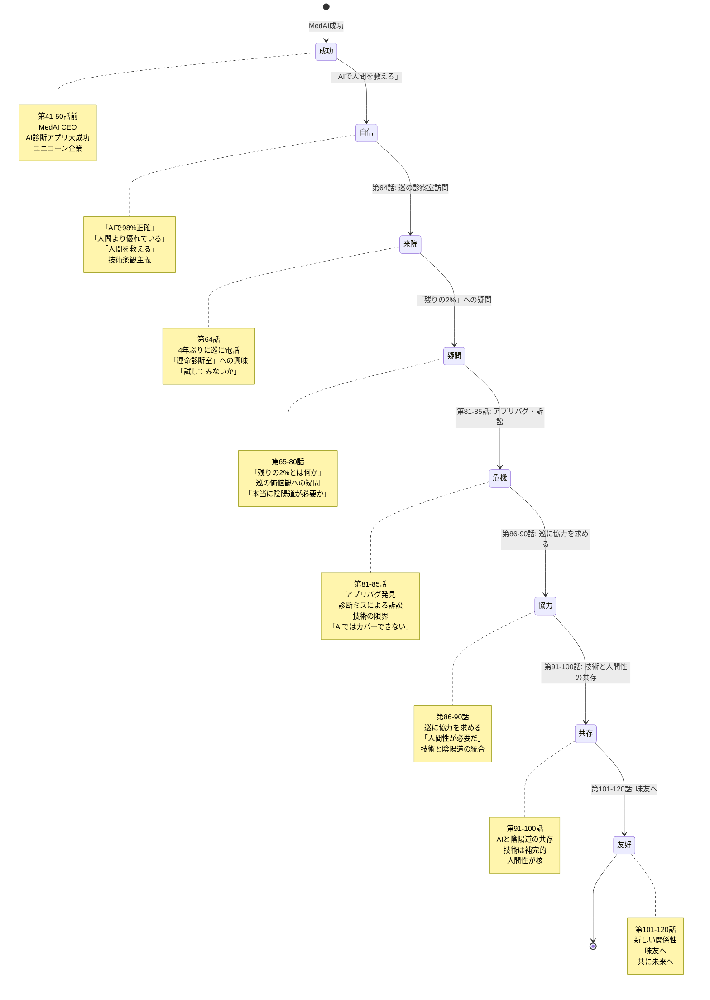

# 藤堂慧の成長 State Machine 図

**作成日**: 2026-02-09
**対象**: 藤堂慧（巡の共同創業者→ライバル→協力者）
**目的**: 慧の成長の状態遷移を視覚化

---

## 1. 全体成長の状態遷移

---

## 2. 価値観の変遷

---

## 3. 巡との関係性の状態遷移

---

## 4. MedAIの成長と危機

---

## 5. 祖父との関係（過去と現在）

---

**作成**: AIエージェントチーム
**適用**: 藤堂慧のキャラクター設計
**更新**: 2026-02-09
