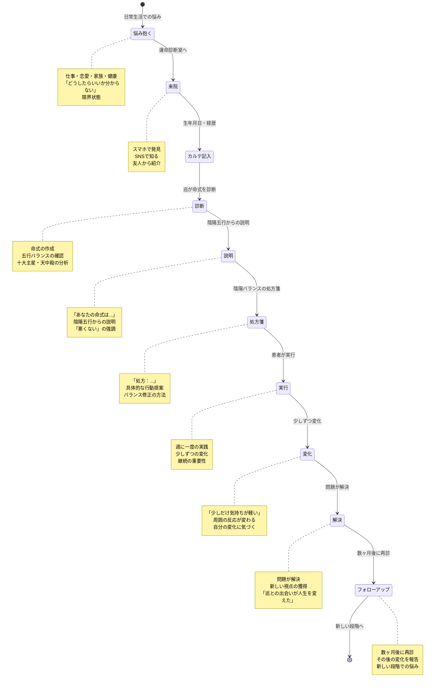
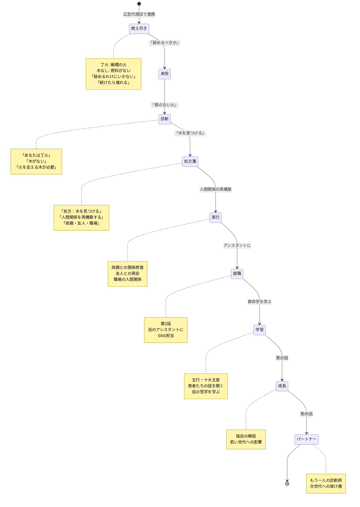
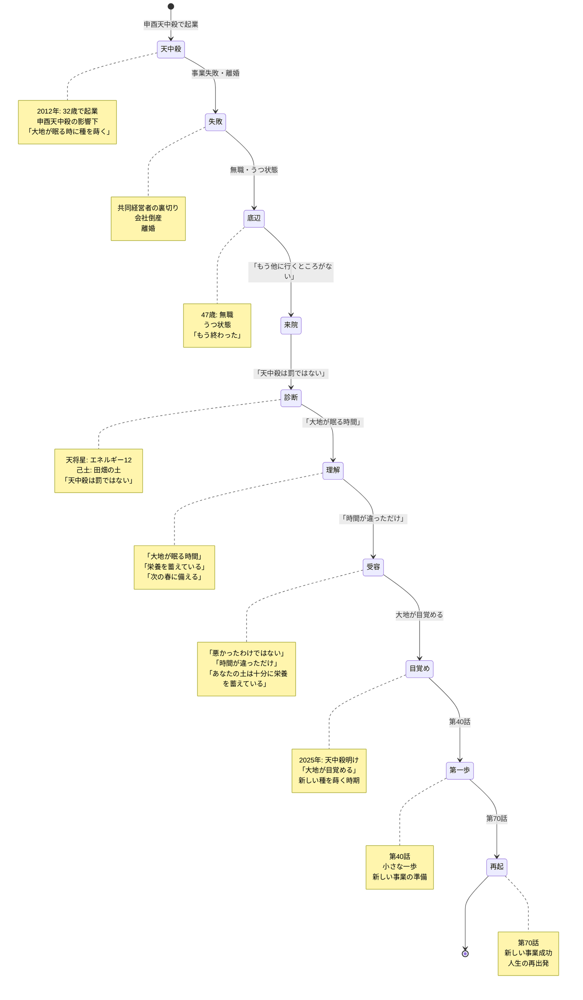
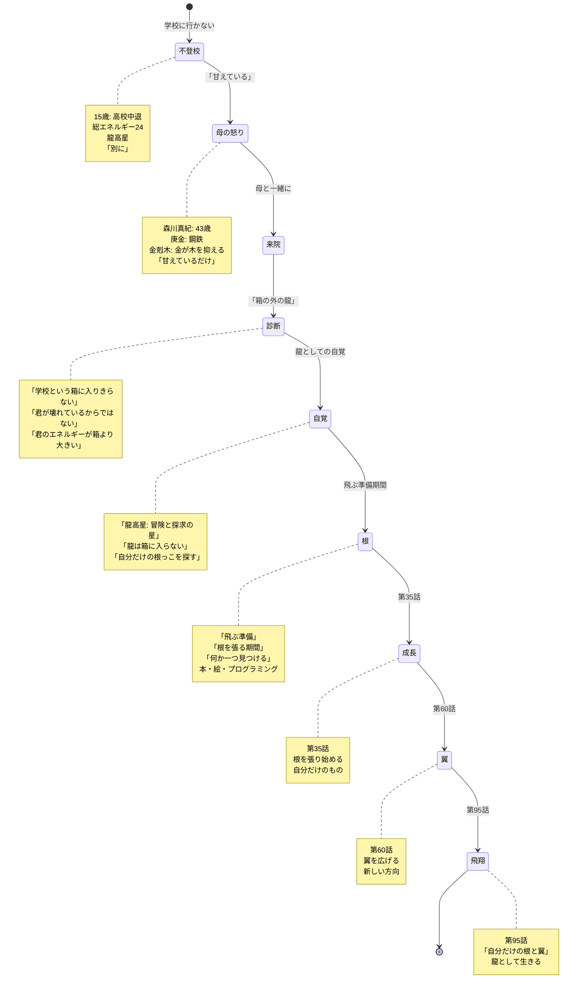
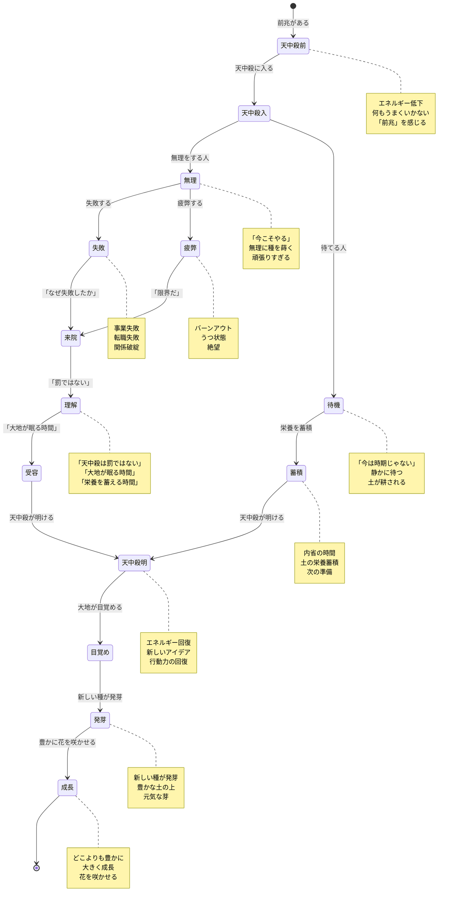
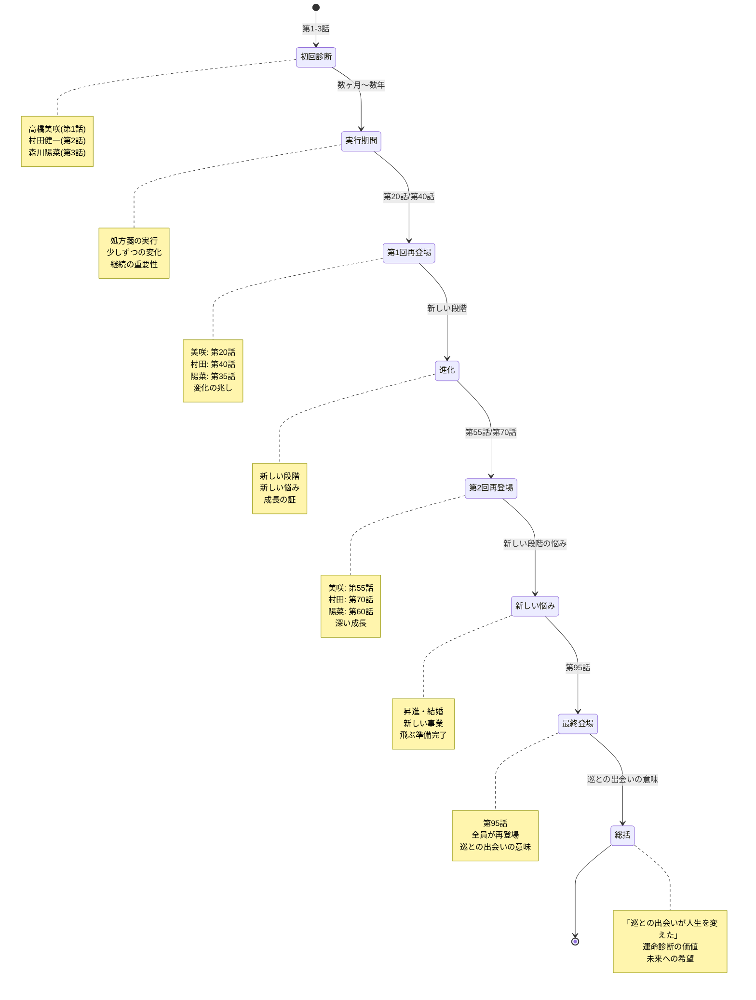
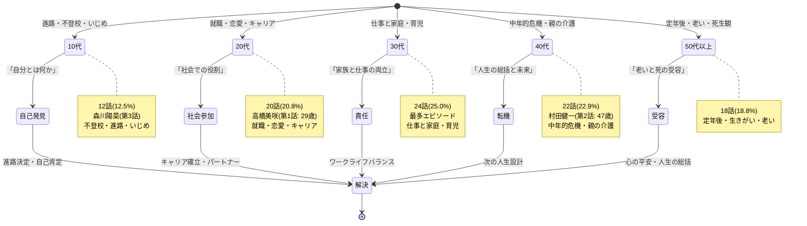

# 患者の状態遷移パターン State Machine 図

**作成日**: 2026-02-09
**目的**: 典型的な患者の診療プロセスを状態遷移図として視覚化

---

## 1. 標準的な患者の状態遷移

---

## 2. 高橋美咲の状態遷移（第1話）

---

## 3. 村田健一の状態遷移（第2話）

---

## 4. 森川陽菜の状態遷移（第3話）

---

## 5. 天中殺患者の状態遷移パターン

---

## 6. 再登場患者の状態遷移

---

## 7. 患者の年齢層別状態遷移

---

**作成**: AIエージェントチーム
**適用**: 患者の状態遷移パターン設計
**更新**: 2026-02-09
