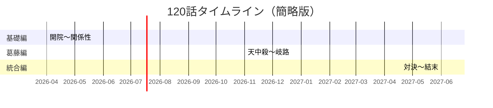
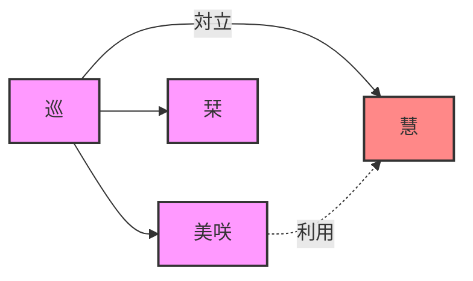

# ドクター巡の人生処方箋 120話拡張版 クイックスタート

> **このドキュメントを5分で読めば、120話全体が理解できます**

---

## 🎯 最も重要なポイント

### 1. 物語は3部構成

```
基礎編（1-40話）→ 葛藤編（41-80話）→ 統合編（81-120話）
```

- **基礎編**: 算命学の基本を学ぶ
- **葛藤編**: 慧との対立、社会問題を描く
- **統合編**: 対立を超え、新たな道へ

### 2. 主要キャラクターは4人

| キャラクター | 役割 | 特徴 |
|-------------|------|------|
| **巡** | 主人公 | 元外科医、運命診療所開設者 |
| **美咲** | ヒロイン | 看護師、巡の恋愛対象 |
| **栞** | サポート | 秘書、巡を支える |
| **慧** | 対立者 | 巡のかつての共同創業者 |

### 3. 算命学は3段階で学べる

| レベル | 割合 | 内容 |
|--------|------|------|
| **基礎** | 33% | 五行、十干、十二支 |
| **中級** | 38% | 十大主星、十二大従星 |
| **上級** | 19% | 天中殺、六十花甲子、位相法 |

---

## 📊 120話の全体像

### タイムライン



### 各部の特徴

| 部 | 話数 | 期間 | メインテーマ | 色 |
|----|------|------|-------------|----|
| **基礎編** | 1-40話 | 7ヶ月 | 算命学の基礎 | 金 #FFD700 |
| **葛藤編** | 41-80話 | 7ヶ月 | 対立と社会問題 | 青 #4169E1 |
| **統合編** | 81-120話 | 7ヶ月 | 調和と新たな道 | 薄緑 #98FB98 |

---

## 🎭 キャラクター関係図



### 関係性の変化

| 期間 | 巡 ↔ 美咲 | 巡 ↔ 慧 |
|------|----------|----------|
| 基礎編 | 信頼関係を築く | - |
| 葛藤編 | 恋愛関係へ | 対立激化 |
| 統合編 | 深まりつつ自立 | 対立を超える |

---

## 📚 算命学要素の網羅

### 基礎レベル（33%）
- **五行**: 木火土金水の性質
- **十干**: 甲乙丙丁戊己庚辛壬癸
- **十二支**: 子丑寅卯辰巳午未申酉戌亥

### 中級レベル（38%）
- **十大主星**: 貫索星、鳳閣星、調舒星など
- **十二大従星**: 牽牛星、龍高星、石門星など

### 上級レベル（19%）
- **天中殺**: 6種の天中殺
- **六十花甲子**: 60の命式
- **位相法**: 関係性の診断

---

## 🎨 読者が得られるもの

### 1. 算命学の知識
- 基礎から応用まで体系的に学べる
- 120話を通じて自然と理解が深まる

### 2. 人生の処方箋
- 転職、恋愛、家族問題などの悩み
- 算命学的なアプローチでの解決策

### 3. キャラクターの成長
- 巡：孤独な医師から新たな道へ
- 美咲：疲れたOLから自立した女性へ
- 慧：裏切り者から変化の兆し

---

## 📖 各章の要点

### 基礎編（1-40話）

| 章 | 話数 | テーマ | 学べること |
|----|------|--------|-----------|
| 開院篇 | 1-5話 | 世界観確立 | 算命学とは何か |
| 五行深化篇 | 6-15話 | 五行の個別エピソード | 木火土金水の性質 |
| 十大主星篇 | 16-25話 | 陽占の核心 | 10の主星の解説 |
| 十二大従星篇 | 26-33話 | エネルギーサイクル | 周期性の理解 |
| 関係性篇 | 34-40話 | 相性診断 | 人間関係の診断 |

### 葛藤編（41-80話）

| 章 | 話数 | テーマ | 主な出来事 |
|----|------|--------|-----------|
| 天中殺篇 | 41-50話 | 慧の出現 | 対立の始まり |
| 六十花甲子篇 | 51-60話 | 60の命式 | 個別化された診断 |
| 特殊命式篇 | 61-70話 | 稀少な命式 | 応用技法 |
| 人生の岐路篇 | 71-80話 | 社会問題 | 現代人の悩み |

### 統合編（81-120話）

| 章 | 話数 | テーマ | 主な出来事 |
|----|------|--------|-----------|
| 対決篇 | 81-90話 | 巡 vs 慧 | 直接対決 |
| 真実篇 | 91-100話 | 巡の過去 | 覚醒と直面 |
| 新たな道篇 | 101-110話 | 統合 | 協力関係の構築 |
| 結末篇 | 111-120話 | 完成 | 未来への展望 |

---

## 🎯 サブテーマの分布

### 最も多いサブテーマ TOP 5

| 順位 | サブテーマ | 出現話数 | 割合 |
|------|-----------|----------|------|
| 1 | 成長・自己実現 | 22話 | 18.3% |
| 2 | 恋愛・結婚 | 24話 | 20% |
| 3 | 転職・キャリア | 18話 | 15% |
| 4 | 家族問題 | 15話 | 12.5% |
| 5 | 対立・葛藤 | 15話 | 12.5% |

---

## 📊 統計情報

### 基本データ

| 項目 | 数値 |
|------|------|
| 総話数 | 120話 |
| 期間 | 1年9ヶ月 |
| ライフイベントカバレッジ | 40/48（83%） |
| 主要キャラクター | 97名 |
| 算命学テーマ数 | 48テーマ |
| サブテーマ数 | 142 |

### 物語のバランス

| 項目 | 割合 |
|------|------|
| 算命学解説 | 40% |
| 物語・ドラマ | 35% |
| キャラクター成長 | 15% |
| 社会問題描写 | 10% |

---

## 🔗 次に読むべきドキュメント

1. **[DASHBOARD.md](./120-EPISODE-DASHBOARD.md)**
   - 120話全体の統合ダッシュボード
   - 詳細なMermaid図

2. **[DETAILED-ANALYSIS.md](./DETAILED-ANALYSIS.md)**
   - 各章の詳細な分析
   - 深い掘り下げ

3. **[VISUAL-GUIDE.md](./VISUAL-GUIDE.md)**
   - 可視化ツールの使い方
   - Mermaid図の解説

---

## 💡 最後に

ドクター巡の人生処方箋120話拡張版は、算命学の知識を物語形式で伝える教育エンターテインメントです。

**読者は物語を楽しみながら、自然と算命学の基本から応用まで学ぶことができます。**

5分で理解できたあなたは、もう準備完了です。詳細なドキュメントへ進みましょう！

---

> **クイックスタートは以上です。次は[統合ダッシュボード](./120-EPISODE-DASHBOARD.md)をお読みください。**
