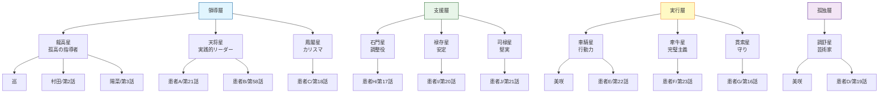
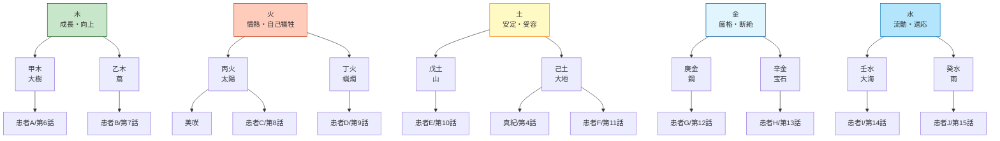
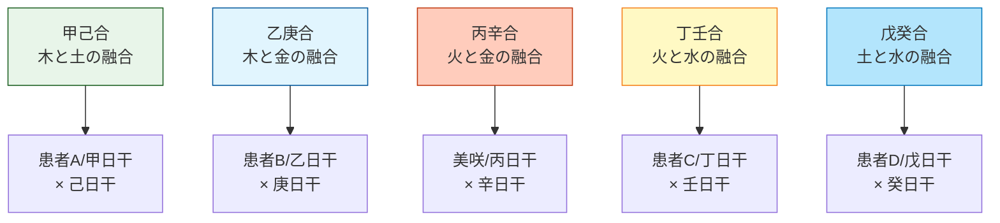
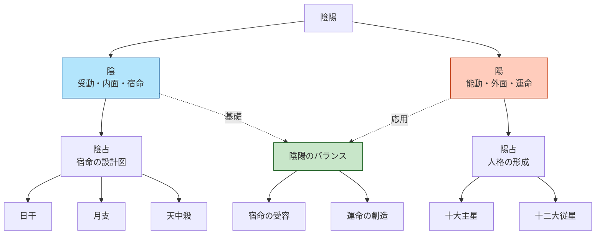
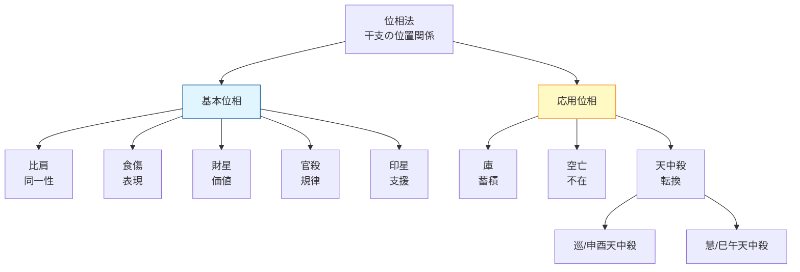
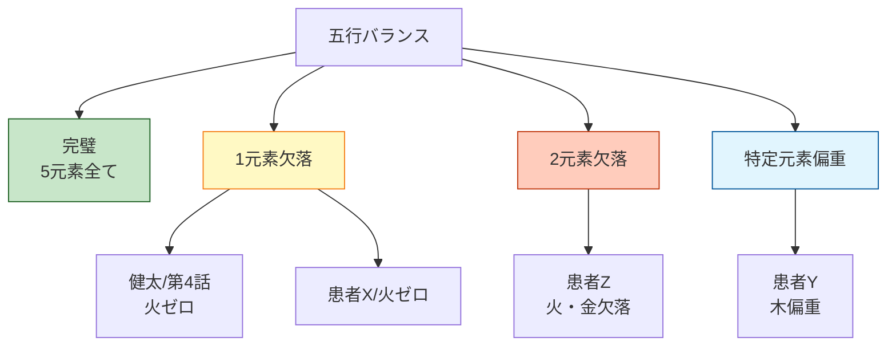

# 算命学要素相関図

## 天中殺の全体相関

```mermaid
graph TD
    %% 天中殺の6種類
    申酉[申酉天中殺<br/>金の性質:厳格・批判]
    巳午[巳午天中殺<br/>火の性質:情熱・自己顕示]
    寅卯[寅卯天中殺<br/>木の性質:成長・変化]
    辰巳[辰巳天中殺<br/>土/木:不安定]
    子丑[子丑天中殺<br/>水/土:保守]
    戌亥[戌亥天中殺<br/>土/水:流浪]
    午未[午未天中殺<br/>火/土:停滞]

    %% 申酉天中殺のキャラクター
    申酉 --> 巡[巡/甲申日干]
    申酉 --> 村田[村田/第2話]
    申酉 --> 大輝[大輝/第44話]
    申酉 --> 蒼空[蒼空/第62話]
    申酉 --> 美咲[美咲/第97話]

    %% 巳午天中殺のキャラクター
    巳午 --> 慧[慧/第86話登場]
    巳午 --> 患者1[患者X/第47話]
    巳午 --> 患者2[患者Y/第65話]

    %% 寅卯天中殺のキャラクター
    寅卯 --> 患者3[患者A/第55話]
    寅卯 --> 患者4[患者B/第73話]

    %% 他の天中殺のキャラクター
    辰巳 --> 患者5[患者C/第56話]
    子丑 --> 患者6[患者D/第54話]
    戌亥 --> 患者7[患者E/第57話]
    午未 --> 患者8[患者F/第58話]

    style 申酉 fill:#e1f5fe,stroke:#01579b,stroke-width:3px
    style 巳午 fill:#fff3e0,stroke:#e65100,stroke-width:3px
    style 巡 fill:#b3e5fc,stroke:#0277bd
    style 慧 fill:#ffe0b2,stroke:#ef6c00
```



## 十大主星の全体相関



## 五行の相関



## 相生・相剋の相関

```mermaid
graph TD
    %% 相生関係（循環）
    相生[相生関係<br/>相互育成]

    木→火[木 → 火<br/>木生火]
    火→土[火 → 土<br/>火生土]
    土→金[土 → 金<br/>土生金]
    金→水[金 → 水<br/>金生水]
    水→木[水 → 木<br/>水生木]

    相生 --> 木→火
    木→火 --> 火→土
    火→土 --> 土→金
    土→金 --> 金→水
    金→水 --> 水→木

    %% 相剋関係（対立）
    相剋[相剋関係<br/>相互対立]

    木X土[木 × 土<br/>木剋土]
    土X水[土 × 水<br/>土剋水]
    水X火[水 × 火<br/>水剋火]
    火X金[火 × 金<br/>火剋金]
    金X木[金 × 木<br/>金剋木]

    相剋 --> 木X土
    相剋 --> 土X水
    相剋 --> 水X火
    相剋 --> 火X金
    相剋 --> 金X木

    %% 物語内の相剋の例
    水X火 --> 田中[田中夫婦/第5話<br/>壬×丙]
    金X木 --> 真紀[真紀と陽菜/第3-4話<br/>金剋木]

    style 相生 fill:#c8e6c9,stroke:#1b5e20
    style 相剋 fill:#ffccbc,stroke:#bf360c
    style 田中 fill:#ffab91,stroke:#d84315
    style 真紀 fill:#ffe0b2,stroke:#ef6c00
```

## 干合の相関



## 陰陽の相関



## 位相法の相関



## 五行バランスの相関


