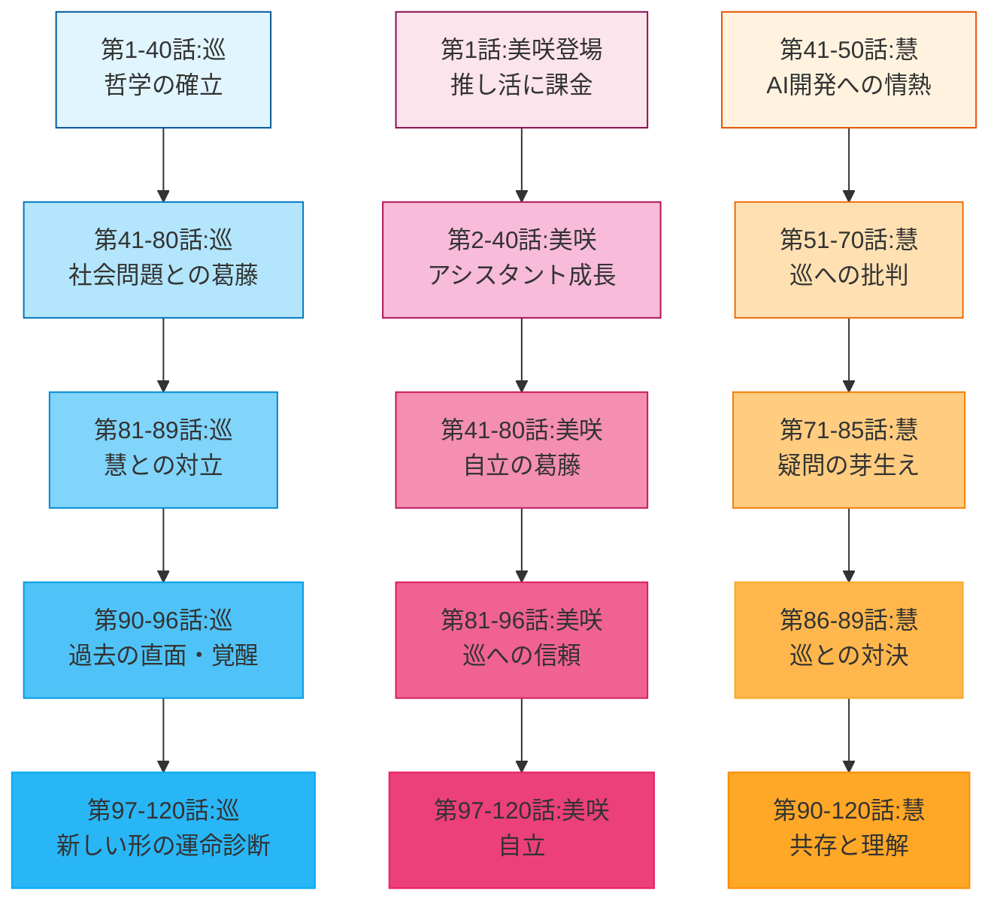
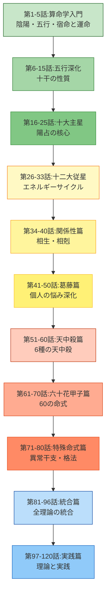
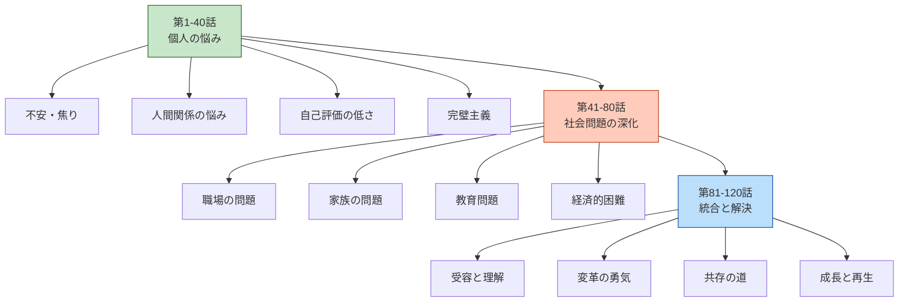
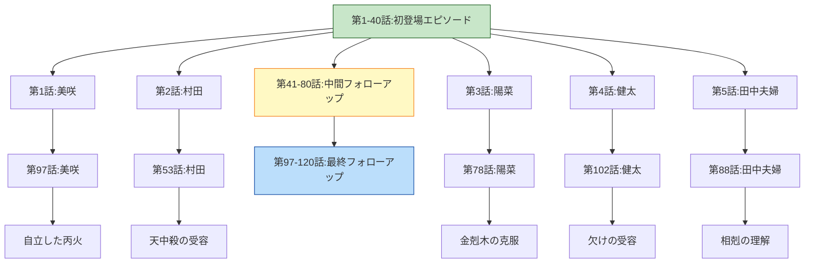

# ストーリーラインマーメイド図

## 120話全体の3部構造

```mermaid
graph LR
    subgraph 基礎編[基礎編 1-40話]
        A1[第1-5話:開院篇<br/>世界観確立]
        A2[第6-15話:五行深化篇<br/>十干×五行]
        A3[第16-25話:十大主星篇<br/>陽占の核心]
        A4[第26-33話:十二大従星篇<br/>エネルギーサイクル]
        A5[第34-40話:関係性篇<br/>相生・相剋]
    end

    subgraph 葛藤編[葛藤編 41-80話]
        B1[第41-50話:葛藤篇・前半<br/>個人の悩み深化]
        B2[第51-60話:天中殺篇<br/>6種の天中殺]
        B3[第61-70話:六十花甲子篇<br/>60の命式]
        B4[第71-80話:特殊命式篇<br/>異常干支・格法]
    end

    subgraph 統合編[統合編 81-120話]
        C1[第81-85話:統合篇・前半<br/>バランスの回復]
        C2[第86-89話:対決篇<br/>巡 vs 慧]
        C3[第90-96話:真実篇<br/>巡の過去・覚醒]
        C4[第97-120話:拡張篇<br/>新たな展開]
    end

    基礎編 --> 葛藤編
    葛藤編 --> 統合編

    style 基礎編 fill:#c8e6c9,stroke:#1b5e20,stroke-width:3px
    style 葛藤編 fill:#ffccbc,stroke:#bf360c,stroke-width:3px
    style 統合編 fill:#bbdefb,stroke:#0d47a1,stroke-width:3px
```

## 主要キャラクターの成長ストーリーライン

```mermaid
graph TD
    %% 巡の成長
    巡1[第1-40話:巡<br/>哲学の確立]
    巡2[第41-80話:巡<br/>社会問題との葛藤]
    巡3[第81-89話:巡<br/>慧との対立]
    巡4[第90-96話:巡<br/>過去の直面・覚醒]
    巡5[第97-120話:巡<br/>新しい形の運命診断]

    巡1 --> 巡2
    巡2 --> 巡3
    巡3 --> 巡4
    巡4 --> 巡5

    %% 美咲の成長
    美咲1[第1話:美咲登場<br/>推し活に課金]
    美咲2[第2-40話:美咲<br/>アシスタント成長]
    美咲3[第41-80話:美咲<br/>自立の葛藤]
    美咲4[第81-96話:美咲<br/>巡への信頼]
    美咲5[第97-120話:美咲<br/>自立]

    美咲1 --> 美咲2
    美咲2 --> 美咲3
    美咲3 --> 美咲4
    美咲4 --> 美咲5

    %% 慧の成長
    慧1[第41-50話:慧<br/>AI開発への情熱]
    慧2[第51-70話:慧<br/>巡への批判]
    慧3[第71-85話:慧<br/>疑問の芽生え]
    慧4[第86-89話:慧<br/>巡との対決]
    慧5[第90-120話:慧<br/>共存と理解]

    慧1 --> 慧2
    慧2 --> 慧3
    慧3 --> 慧4
    慧4 --> 慧5

    style 巡1 fill:#e1f5fe,stroke:#01579b
    style 巡2 fill:#b3e5fc,stroke:#0277bd
    style 巡3 fill:#81d4fa,stroke:#0288d1
    style 巡4 fill:#4fc3f7,stroke:#039be5
    style 巡5 fill:#29b6f6,stroke:#03a9f4

    style 美咲1 fill:#fce4ec,stroke:#880e4f
    style 美咲2 fill:#f8bbd9,stroke:#ad1457
    style 美咲3 fill:#f48fb1,stroke:#c2185b
    style 美咲4 fill:#f06292,stroke:#d81b60
    style 美咲5 fill:#ec407a,stroke:#e91e63

    style 慧1 fill:#fff3e0,stroke:#e65100
    style 慧2 fill:#ffe0b2,stroke:#ef6c00
    style 慧3 fill:#ffcc80,stroke:#f57c00
    style 慧4 fill:#ffb74d,stroke:#f9a825
    style 慧5 fill:#ffa726,stroke:#fb8c00
```

## 算命学理論の学習ステップ

```mermaid
graph TD
    %% 基礎理論
    基礎1[第1-5話:算命学入門<br/>陰陽・五行・宿命と運命]
    基礎2[第6-15話:五行深化<br/>十干の性質]
    基礎3[第16-25話:十大主星<br/>陽占の核心]

    基礎1 --> 基礎2
    基礎2 --> 基礎3

    %% 応用理論
    応用1[第26-33話:十二大従星<br/>エネルギーサイクル]
    応用2[第34-40話:関係性篇<br/>相生・相剋]
    応用3[第41-50話:葛藤篇<br/>個人の悩み深化]

    基礎3 --> 応用1
    応用1 --> 応用2
    応用2 --> 応用3

    %% 高度理論
    高度1[第51-60話:天中殺篇<br/>6種の天中殺]
    高度2[第61-70話:六十花甲子篇<br/>60の命式]
    高度3[第71-80話:特殊命式篇<br/>異常干支・格法]

    応用3 --> 高度1
    高度1 --> 高度2
    高度2 --> 高度3

    %% 統合理論
    統合1[第81-96話:統合篇<br/>全理論の統合]
    統合2[第97-120話:実践篇<br/>理論と実践]

    高度3 --> 統合1
    統合1 --> 統合2

    style 基礎1 fill:#c8e6c9,stroke:#1b5e20
    style 基礎2 fill:#a5d6a7,stroke:#2e7d32
    style 基礎3 fill:#81c784,stroke:#388e3c

    style 応用1 fill:#fff9c4,stroke:#f57f17
    style 応用2 fill:#fff59d,stroke:#f9a825
    style 応用3 fill:#fff176,stroke:#fbc02d

    style 高度1 fill:#ffccbc,stroke:#bf360c
    style 高度2 fill:#ffab91,stroke:#d84315
    style 高度3 fill:#ff8a65,stroke:#e64a19

    style 統合1 fill:#bbdefb,stroke:#0d47a1
    style 統合2 fill:#90caf9,stroke:#1565c0
```

## 社会問題の深化

```mermaid
graph TD
    %% 基礎編：個人の悩み
    個人1[第1-40話<br/>個人の悩み]
    不安[不安・焦り]
    人間関係[人間関係の悩み]
    自己評価[自己評価の低さ]
    完璧主義[完璧主義]

    個人1 --> 不安
    個人1 --> 人間関係
    個人1 --> 自己評価
    個人1 --> 完璧主義

    %% 葛藤編：社会問題へ
    社会1[第41-80話<br/>社会問題の深化]
    職場[職場の問題]
    家族[家族の問題]
    教育[教育問題]
    経済[経済的困難]

    個人1 --> 社会1
    社会1 --> 職場
    社会1 --> 家族
    社会1 --> 教育
    社会1 --> 経済

    %% 統合編：解決への道
    統合1[第81-120話<br/>統合と解決]
    受容[受容と理解]
    変革[変革の勇気]
    共存[共存の道]
    成長[成長と再生]

    社会1 --> 統合1
    統合1 --> 受容
    統合1 --> 変革
    統合1 --> 共存
    統合1 --> 成長

    style 個人1 fill:#c8e6c9,stroke:#1b5e20
    style 社会1 fill:#ffccbc,stroke:#bf360c
    style 統合1 fill:#bbdefb,stroke:#0d47a1
```

## 対立と統合のストーリーライン

```mermaid
graph LR
    subgraph 第1期[第1-30話:巡中心]
        巡哲学[巡の哲学の確立]
        患者対話[初期患者との対話]
        世界観[算命学世界観の構築]
    end

    subgraph 第2期[第31-60話:慧の登場]
        慧AI[慧のAI開発]
        批判[巡への批判]
        対立始まり[対立の始まり]
    end

    subgraph 第3期[第61-90話:三者の対立]
        巡葛藤[巡の葛藤]
        美咲立場[美咲の立場]
        慧挑戦[慧の挑戦]
        三角関係[三者の対立と葛藤]
    end

    subgraph 第4期[第91-120話:統合]
        対決[巡と慧の対決]
        覚醒[巡の覚醒]
        理解[慧の理解]
        新しい形[新しい形の運命診断]
        共存[共存と協力]
    end

    第1期 --> 第2期
    第2期 --> 第3期
    第3期 --> 第4期

    style 第1期 fill:#c8e6c9,stroke:#1b5e20
    style 第2期 fill:#fff9c4,stroke:#f57f17
    style 第3期 fill:#ffccbc,stroke:#bf360c
    style 第4期 fill:#bbdefb,stroke:#0d47a1
```

## フォローアップエピソードのストーリーライン

```mermaid
graph TD
    %% 初登場
    初期[第1-40話:初登場エピソード]
    E1[第1話:美咲]
    E2[第2話:村田]
    E3[第3話:陽菜]
    E4[第4話:健太]
    E5[第5話:田中夫婦]

    初期 --> E1
    初期 --> E2
    初期 --> E3
    初期 --> E4
    初期 --> E5

    %% 中間フォローアップ
    中間[第41-80話:中間フォローアップ]
    E2 --> E53[第53話:村田]
    E3 --> E78[第78話:陽菜]

    初期 --> 中間

    %% 最終フォローアップ
    最終[第97-120話:最終フォローアップ]
    E1 --> E97[第97話:美咲]
    E4 --> E102[第102話:健太]
    E5 --> E88[第88話:田中夫婦]

    中間 --> 最終

    %% 成長の可視化
    E97 --> 成功1[自立した丙火]
    E53 --> 成功2[天中殺の受容]
    E78 --> 成功3[金剋木の克服]
    E102 --> 成功4[欠けの受容]
    E88 --> 成功5[相剋の理解]

    style 初期 fill:#c8e6c9,stroke:#1b5e20
    style 中間 fill:#fff9c4,stroke:#f57f17
    style 最終 fill:#bbdefb,stroke:#0d47a1
```
