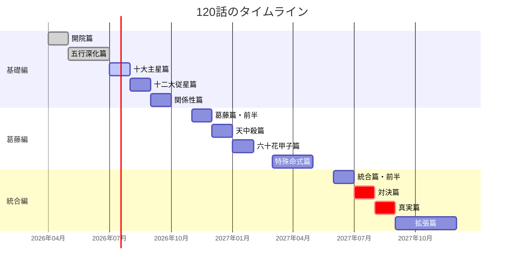
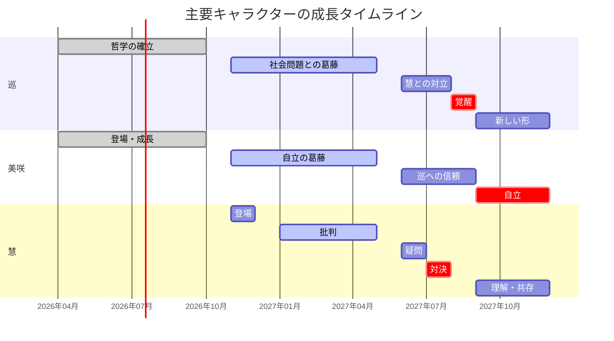
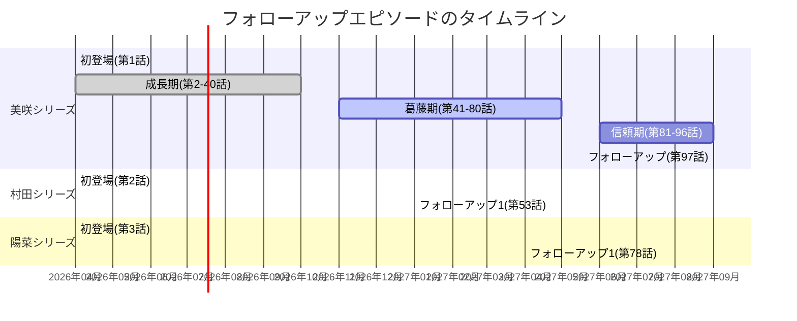
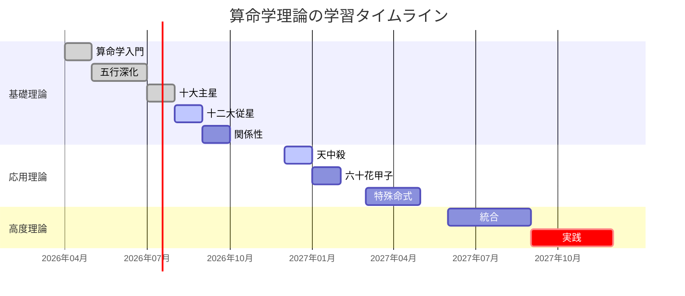
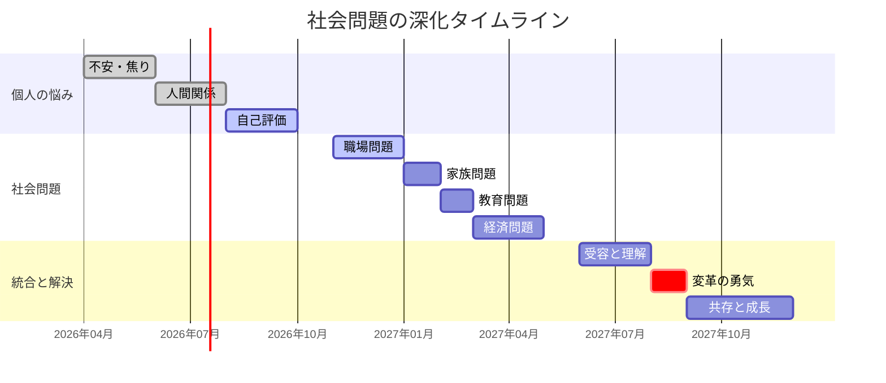
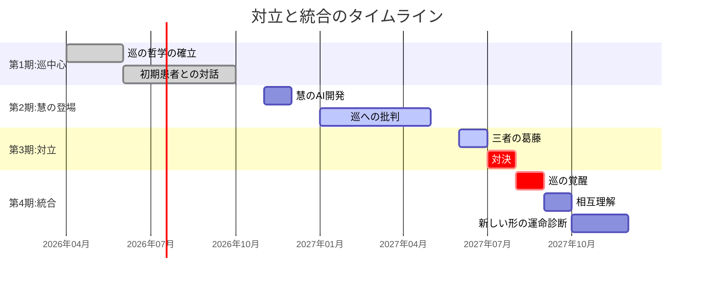
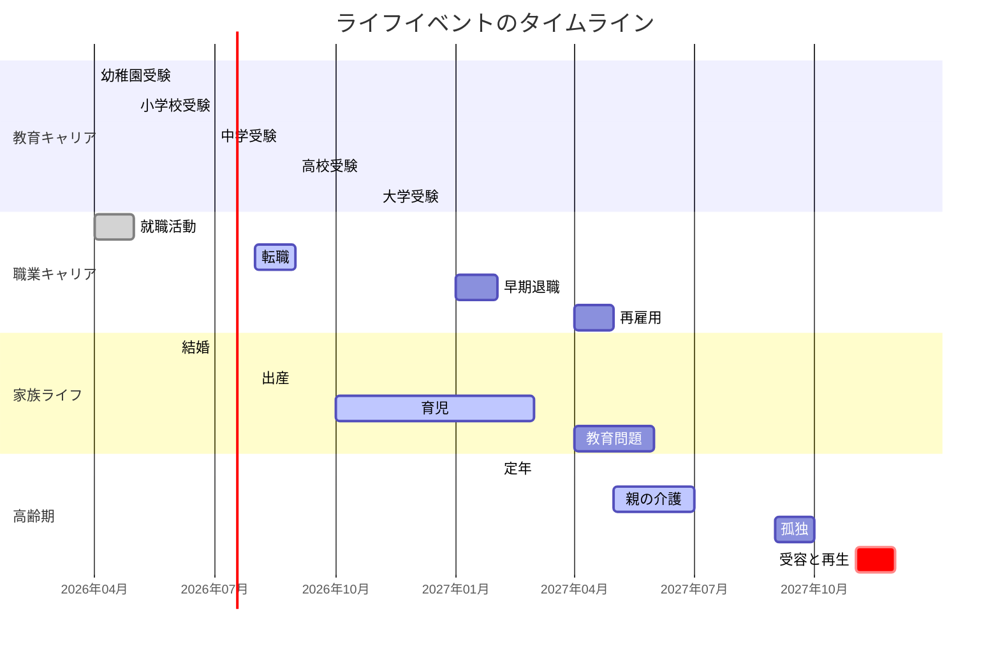
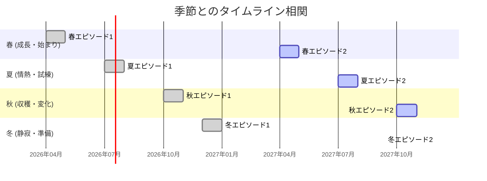
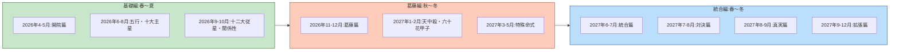

# タイムラインマーメイド図

## 120話全体タイムライン

```mermaid
gantt
    title 120話のタイムライン
    dateFormat  YYYY-MM
    axisFormat  %Y年%m月

    section 基礎編
    開院篇          :done,    2026-04, 2026-05
    五行深化篇      :done,    2026-05, 2026-07
    十大主星篇      :active,  2026-07, 2026-08
    十二大従星篇    :         2026-08, 2026-09
    関係性篇        :         2026-09, 2026-10

    section 葛藤編
    葛藤篇・前半    :         2026-11, 2026-12
    天中殺篇        :         2026-12, 2027-01
    六十花甲子篇    :         2027-01, 2027-02
    特殊命式篇      :         2027-03, 2027-05

    section 統合編
    統合篇・前半    :         2027-06, 2027-07
    対決篇          :crit,    2027-07, 2027-08
    真実篇          :crit,    2027-08, 2027-09
    拡張篇          :         2027-09, 2027-12
```

## 主要キャラクターのタイムライン

```mermaid
gantt
    title 主要キャラクターの成長タイムライン
    dateFormat  YYYY-MM
    axisFormat  %Y年%m月

    section 巡
    哲学の確立      :done,    2026-04, 2026-10
    社会問題との葛藤:active,  2026-11, 2027-05
    慧との対立      :         2027-06, 2027-08
    覚醒            :crit,    2027-08, 2027-09
    新しい形        :         2027-09, 2027-12

    section 美咲
    登場・成長      :done,    2026-04, 2026-10
    自立の葛藤      :active,  2026-11, 2027-05
    巡への信頼      :         2027-06, 2027-09
    自立            :crit,    2027-09, 2027-12

    section 慧
    登場            :         2026-11, 2026-12
    批判            :active,  2027-01, 2027-05
    疑問            :         2027-06, 2027-07
    対決            :crit,    2027-07, 2027-08
    理解・共存      :         2027-09, 2027-12
```

## フォローアップエピソードのタイムライン

```mermaid
gantt
    title フォローアップエピソードのタイムライン
    dateFormat  YYYY-MM
    axisFormat  %Y年%m月

    section 美咲シリーズ
    初登場(第1話)        :done,    2026-04, 2026-04
    成長期(第2-40話)     :done,    2026-04, 2026-10
    葛藤期(第41-80話)    :active,  2026-11, 2027-05
    信頼期(第81-96話)    :         2027-06, 2027-09
    フォローアップ(第97話):crit,    2027-09, 2027-09

    section 村田シリーズ
    初登場(第2話)        :done,    2026-04, 2026-04
    フォローアップ1(第53話):active, 2027-01, 2027-01

    section 陽菜シリーズ
    初登場(第3話)        :done,    2026-04, 2026-04
    フォローアップ1(第78話):       2027-04, 2027-04
```

## 算命学理論の学習タイムライン

```mermaid
gantt
    title 算命学理論の学習タイムライン
    dateFormat  YYYY-MM
    axisFormat  %Y年%m月

    section 基礎理論
    算命学入門      :done,    2026-04, 2026-05
    五行深化        :done,    2026-05, 2026-07
    十大主星        :done,    2026-07, 2026-08
    十二大従星      :active,  2026-08, 2026-09
    関係性          :         2026-09, 2026-10

    section 応用理論
    天中殺          :active,  2026-12, 2027-01
    六十花甲子      :         2027-01, 2027-02
    特殊命式        :         2027-03, 2027-05

    section 高度理論
    統合            :         2027-06, 2027-09
    実践            :crit,    2027-09, 2027-12
```

## 社会問題の深化タイムライン

```mermaid
gantt
    title 社会問題の深化タイムライン
    dateFormat  YYYY-MM
    axisFormat  %Y年%m月

    section 個人の悩み
    不安・焦り          :done,    2026-04, 2026-06
    人間関係            :done,    2026-06, 2026-08
    自己評価            :active,  2026-08, 2026-10

    section 社会問題
    職場問題            :active,  2026-11, 2027-01
    家族問題            :         2027-01, 2027-02
    教育問題            :         2027-02, 2027-03
    経済問題            :         2027-03, 2027-05

    section 統合と解決
    受容と理解          :         2027-06, 2027-08
    変革の勇気          :crit,    2027-08, 2027-09
    共存と成長          :         2027-09, 2027-12
```

## 対立と統合のタイムライン

```mermaid
gantt
    title 対立と統合のタイムライン
    dateFormat  YYYY-MM
    axisFormat  %Y年%m月

    section 第1期:巡中心
    巡の哲学の確立      :done,    2026-04, 2026-06
    初期患者との対話    :done,    2026-06, 2026-10

    section 第2期:慧の登場
    慧のAI開発          :         2026-11, 2026-12
    巡への批判          :active,  2027-01, 2027-05

    section 第3期:対立
    三者の葛藤          :active,  2027-06, 2027-07
    対決                :crit,    2027-07, 2027-08

    section 第4期:統合
    巡の覚醒            :crit,    2027-08, 2027-09
    相互理解            :         2027-09, 2027-10
    新しい形の運命診断  :         2027-10, 2027-12
```

## ライフイベントのタイムライン

```mermaid
gantt
    title ライフイベントのタイムライン
    dateFormat  YYYY-MM
    axisFormat  %Y年%m月

    section 教育キャリア
    幼稚園受験          :done,    2026-04, 2026-04
    小学校受験          :done,    2026-05, 2026-05
    中学受験            :active,  2026-07, 2026-07
    高校受験            :         2026-09, 2026-09
    大学受験            :         2026-11, 2026-11

    section 職業キャリア
    就職活動            :done,    2026-04, 2026-05
    転職                :active,  2026-08, 2026-09
    早期退職            :         2027-01, 2027-02
    再雇用              :         2027-04, 2027-05

    section 家族ライフ
    結婚                :done,    2026-06, 2026-06
    出産                :done,    2026-08, 2026-08
    育児                :active,  2026-10, 2027-03
    教育問題            :         2027-04, 2027-06

    section 高齢期
    定年                :         2027-02, 2027-02
    親の介護            :active,  2027-05, 2027-07
    孤独                :         2027-09, 2027-10
    受容と再生          :crit,    2027-11, 2027-12
```

## 季節とのタイムライン相関

```mermaid
gantt
    title 季節とのタイムライン相関
    dateFormat  YYYY-MM
    axisFormat  %Y年%m月

    section 春 (成長・始まり)
    春エピソード1       :done,    2026-04, 2026-05
    春エピソード2       :active,  2027-04, 2027-05

    section 夏 (情熱・試練)
    夏エピソード1       :done,    2026-07, 2026-08
    夏エピソード2       :active,  2027-07, 2027-08

    section 秋 (収穫・変化)
    秋エピソード1       :done,    2026-10, 2026-11
    秋エピソード2       :active,  2027-10, 2027-11

    section 冬 (静寂・準備)
    冬エピソード1       :done,    2026-12, 2027-01
    冬エピソード2       :active,  2027-12, 2027-12
```

## 3部構造の季節相関

```mermaid
graph LR
    subgraph 基礎編[基礎編:春〜夏]
        春1[2026年4-5月:開院篇]
        夏1[2026年6-8月:五行・十大主星]
        秋1[2026年9-10月:十二大従星・関係性]
    end

    subgraph 葛藤編[葛藤編:秋〜冬]
        秋2[2026年11-12月:葛藤篇]
        冬1[2027年1-2月:天中殺・六十花甲子]
        春2[2027年3-5月:特殊命式]
    end

    subgraph 統合編[統合編:春〜冬]
        夏2[2027年6-7月:統合篇]
        夏3[2027年7-8月:対決篇]
        秋3[2027年8-9月:真実篇]
        冬2[2027年9-12月:拡張篇]
    end

    基礎編 --> 葛藤編
    葛藤編 --> 統合編

    style 基礎編 fill:#c8e6c9,stroke:#1b5e20
    style 葛藤編 fill:#ffccbc,stroke:#bf360c
    style 統合編 fill:#bbdefb,stroke:#0d47a1
```
