# 三者関係の動的変化

## 巡・美咲・慧の三角形：全体図

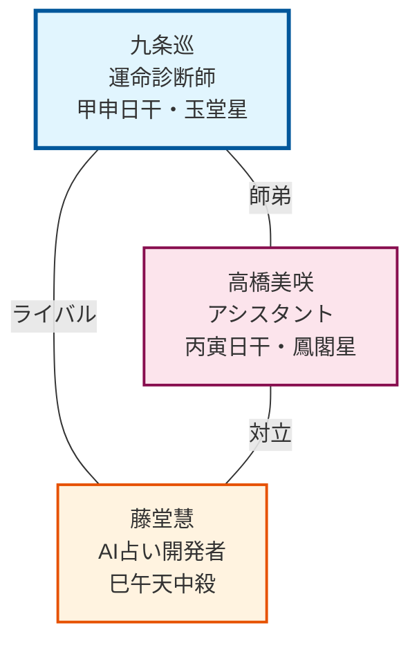

## 第1期：巡中心の物語（第1-30話）

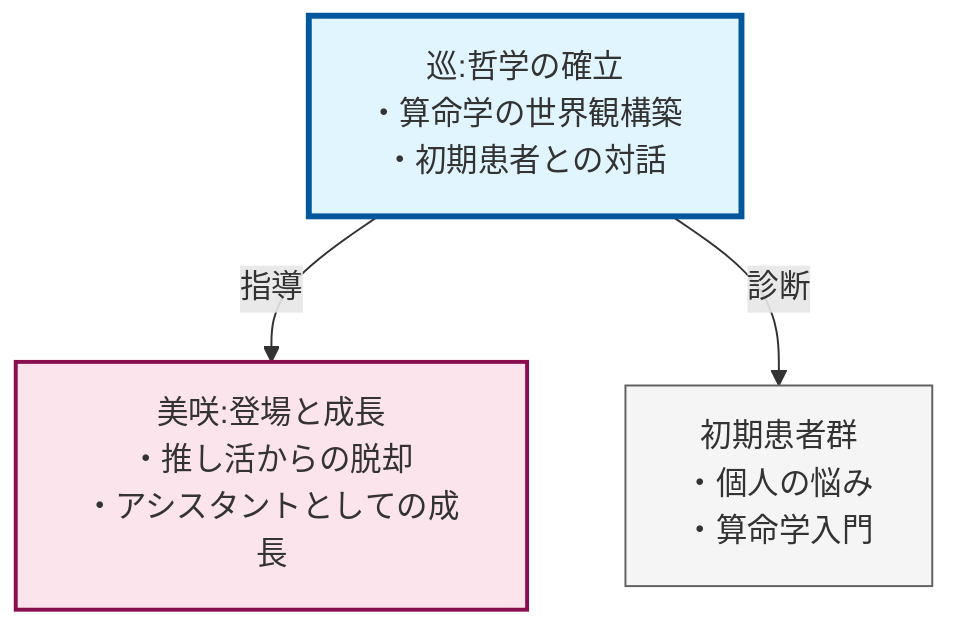

## 第2期：慧の登場（第31-60話）

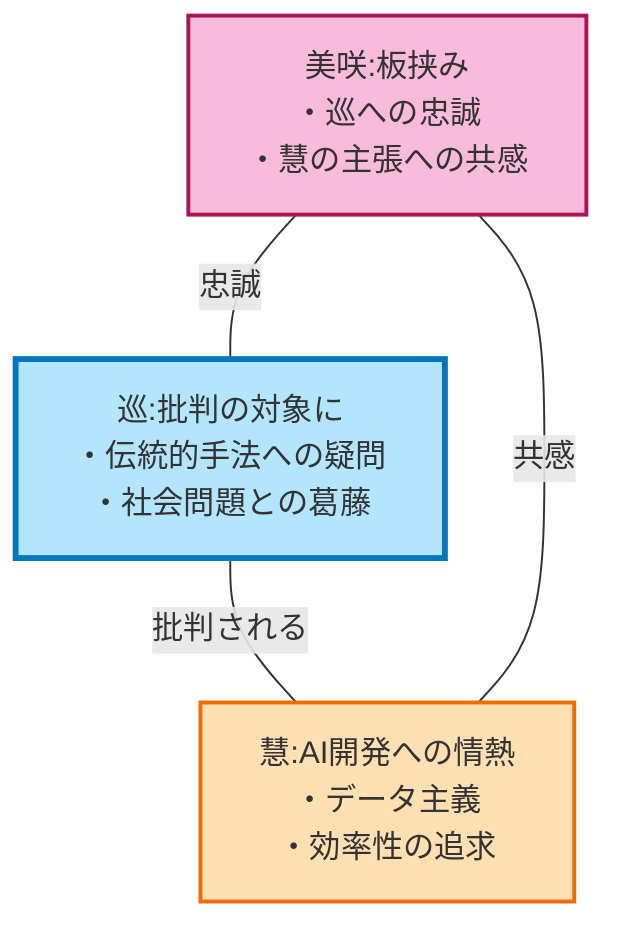

## 第3期：三者の対立と葛藤（第61-90話）

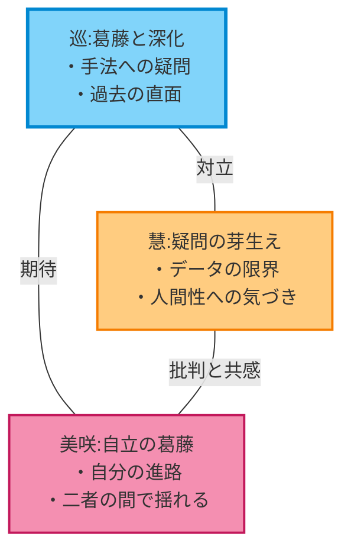

## 第4期：統合と共存（第91-120話）

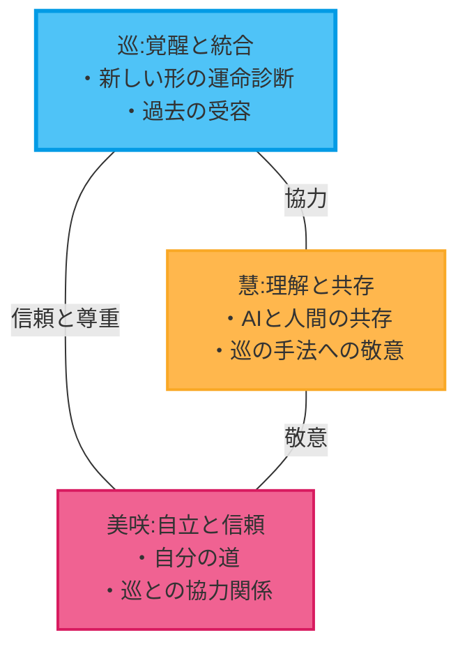

## 三者関係の動的変化：時系列

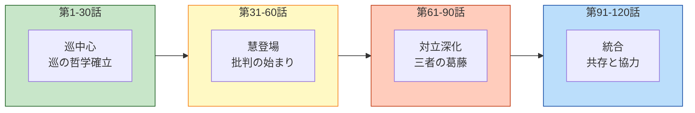

## 価値観の対立と統合

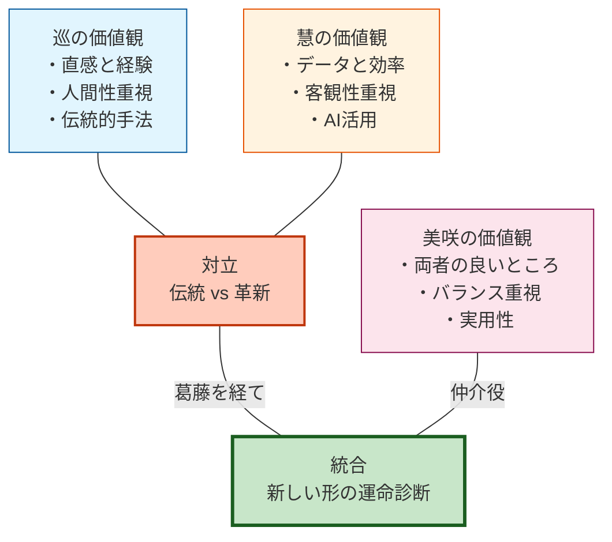

## 三者関係の距離感の変化

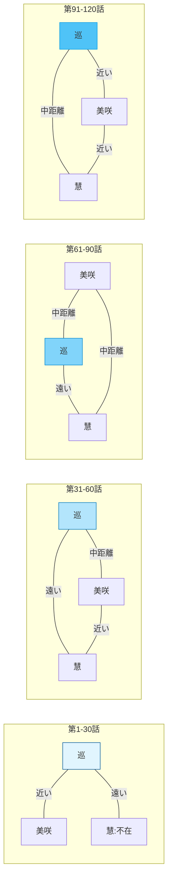

## 三者関係の力関係の変化

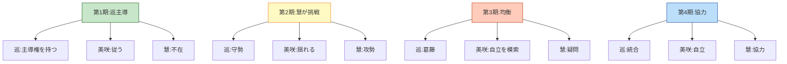

## 三者関係の感情の流れ

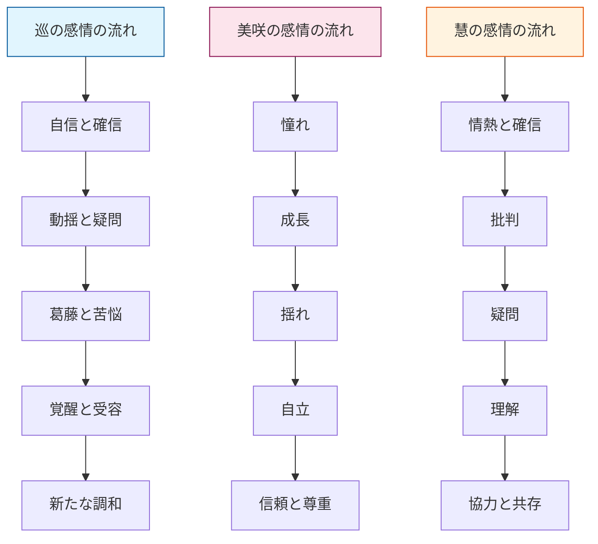

## 三者関係の相互作用のサイクル

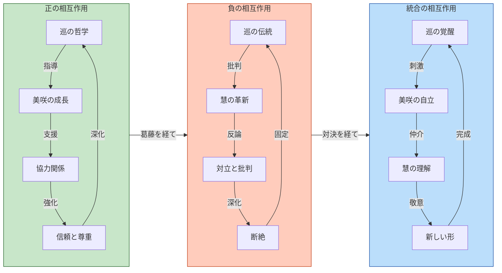
