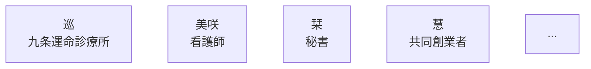
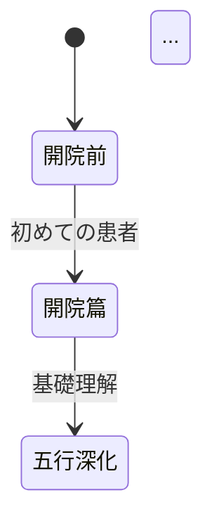
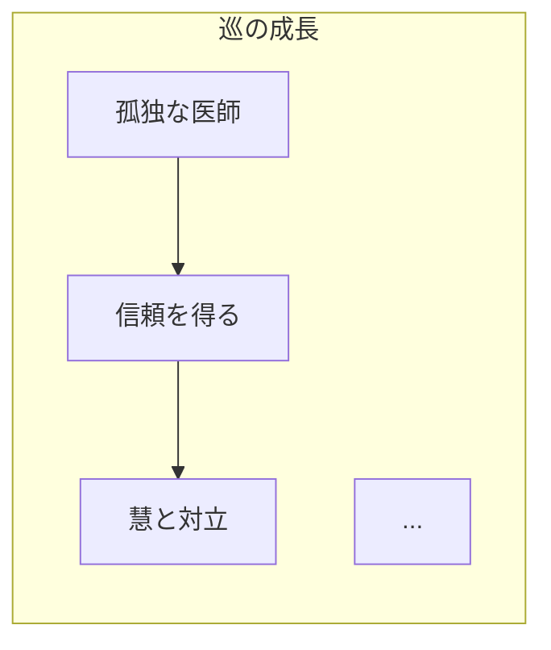
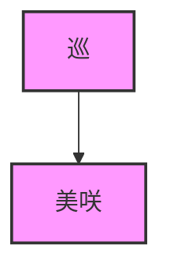
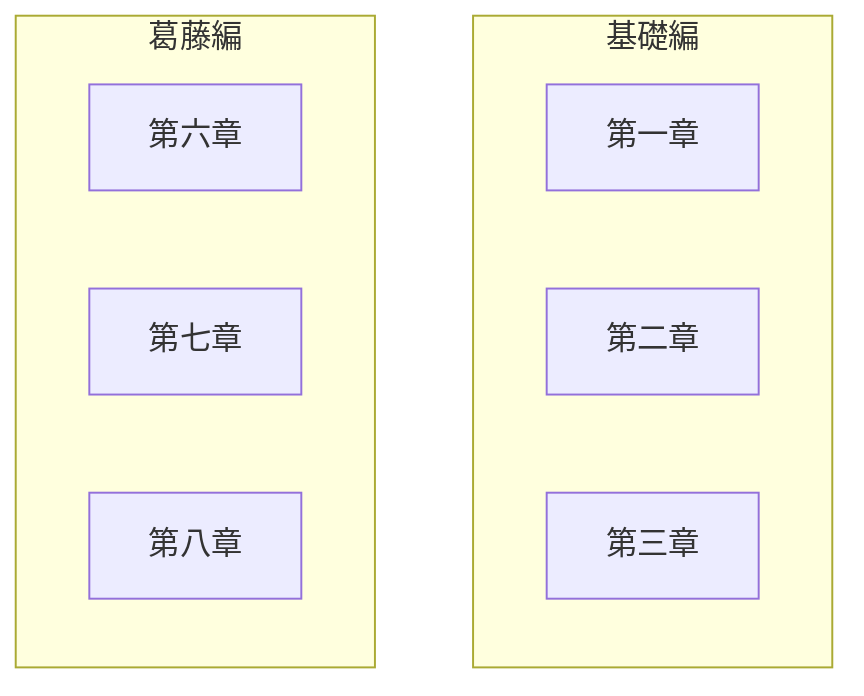
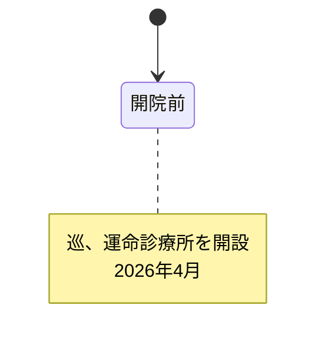

# ドクター巡の人生処方箋 120話拡張版 可視化ガイド

> **Mermaid図の使い方と解説**
> **最終更新**: 2026年2月9日

---

## 目次

1. [Mermaid図とは](#mermaid図とは)
2. [このドキュメントに含まれる図](#このドキュメントに含まれる図)
3. [図の見方](#図の見方)
4. [レンダリング方法](#レンダリング方法)
5. [図のカスタマイズ](#図のカスタマイズ)

---

## Mermaid図とは

### Mermaidとは

Mermaidは、テキストベースで図を描画できるツールです。

**メリット**:
- テキストで記述できるため、バージョン管理しやすい
- GitHub / VS Code で直接レンダリング可能
- 更新が容易

**ドクター巡の人生処方箋での活用**:
- タイムライン
- キャラクター関係図
- State Machine
- 統計グラフ

---

## このドキュメントに含まれる図

### 1. タイムライン図（Gantt Chart）

**場所**: [DASHBOARD.md](./120-EPISODE-DASHBOARD.md)

**目的**: 120話の期間と各章の配置を視覚化

```mermaid
gantt
    title ドクター巡の人生処方箋 120話タイムライン
    dateFormat YYYY-MM-DD
    axisFormat %Y-%m

    section 基礎編（1-40話）
    開院篇（1-5話）        :2026-04-01, 14d
    五行深化篇（6-15話）   :2026-04-15, 60d
    ...
```

**読み方**:
- 横軸：期間
- 縦軸：各章
- バーの長さ：その章の期間

### 2. キャラクター関係図（Graph）

**場所**: [DASHBOARD.md](./120-EPISODE-DASHBOARD.md)

**目的**: 主要キャラクターの関係性を視覚化



**読み方**:
- 矢印の種類：
  - `-->`: 信頼、サポート
  - `-.->`: 対立、利用
  - `==>`: 恋愛
- 色：
  - ピンク：主要キャラクター
  - 赤：対立者
  - 緑：患者

### 3. State Machine（State Diagram）

**場所**: [DASHBOARD.md](./120-EPISODE-DASHBOARD.md)

**目的**: 物語全体の状態遷移を視覚化



**読み方**:
- 丸：状態（各章）
- 矢印：遷移（どの章へ進むか）
- note：注釈（重要な出来事）

### 4. キャラクター成長曲線（Graph）

**場所**: [DASHBOARD.md](./120-EPISODE-DASHBOARD.md)

**目的**: 主要キャラクターの成長過程を視覚化



**読み方**:
- 矢印：成長のステップ
- 色：
  - 緑：肯定的な変化
  - 赤：否定的な状態
  - 黄：変化の兆し

---

## 図の見方

### タイムライン図（Gantt Chart）

**構成要素**:
- **セクション**: 各部（基礎編、葛藤編、統合編）
- **タスク**: 各章
- **期間**: タスクの長さ

**活用方法**:
- 全体のスケジュールを把握
- 各章の期間を確認
- 重複や並列を確認

### キャラクター関係図（Graph）

**構成要素**:
- **ノード**: キャラクター
- **エッジ**: 関係性
- **スタイル**: 色、形

**活用方法**:
- キャラクター間の関係を把握
- 対立構造を理解
- グループ化を確認

### State Machine（State Diagram）

**構成要素**:
- **状態**: 各章、段階
- **遷移**: 状態の移動
- **注釈**: 重要な出来事

**活用方法**:
- 物語の流れを把握
- 分岐点を確認
- 状態の遷移を理解

---

## レンダリング方法

### GitHubでレンダリング

**手順**:
1. リポジトリにMarkdownファイルをプッシュ
2. GitHub上でファイルを開く
3. 自動的にレンダリングされる

**注意点**:
- GitHubはMermaidをネイティブサポート
- 一部の機能は制限される場合がある

### VS Codeでレンダリング

**手順**:
1. 拡張機能「Mermaid Preview」をインストール
2. Markdownファイルを開く
3. コマンドパレット（Cmd+Shift+P）で「Mermaid: Open Preview」
4. プレビューが表示される

**おすすめ拡張機能**:
- Mermaid Preview
- Mermaid Editor

### オンラインエディタ

**ツール**:
- [Mermaid Live Editor](https://mermaid.live/)
- [Mermaid Chart](https://www.mermaidchart.com/)

**使い方**:
1. サイトにアクセス
2. Mermaidコードを貼り付け
3. リアルタイムでプレビュー

---

## 図のカスタマイズ

### 色の変更

**例**: キャラクター関係図の色を変更



**色コード**:
- ピンク: #f9f
- 青: #bbf
- 赤: #f88
- 緑: #8f8

### スタイルの変更

**例**: ノードの形を変更


**形の種類**:
- `[矩形]`: デフォルト
- `([丸形])`: 角丸
- `{菱形}`: 判断
- `[(平行)]`: データベース

### レイアウトの変更

**例**: 方向を変更

```mermaid
graph LR  # 左から右
    ME --> MI

graph TB  # 上から下
    ME --> MI

graph TD  # 上から下（デフォルト）
    ME --> MI
```

---

## よく使われるパターン

### 1. サブグラフ（グループ化）



### 2. 注釈（Note）



### 3. スタイルの定義


---

## トラブルシューティング

### 図がレンダリングされない

**原因**:
- Mermaidの構文エラー
- GitHubの制限
- ファイルのエンコーディング

**解決策**:
1. Mermaid Live Editorで構文を確認
2. ファイルをUTF-8で保存
3. GitHubの最新版を使用

### 図が見づらい

**原因**:
- ノードが多すぎる
- エッジが交差している
- レイアウトが複雑

**解決策**:
1. ノードをグループ化（サブグラフ）
2. 方向を変更（LR/TB）
3. 複数の図に分割

### レスポンシブ対応

**課題**:
- スマートフォンで見づらい
- 画面サイズに合わせて調整が必要

**解決策**:
1. シンプルな図にする
2. 複数の図に分割
3. ズーム機能を活用

---

## ベストプラクティス

### 1. シンプルさを保つ

- ノードは10個以内
- エッジは複雑にしすぎない
- 階層は3階層以内

### 2. 一貫性を保つ

- 色の使い方を統一
- 形の使い方を統一
- レイアウトを統一

### 3. 説明を追加する

- タイトルを必須
- 注釈を活用
- 凡例を追加

### 4. アクセシビリティ

- 色だけに依存しない
- コントラストを確保
- テキストを明確に

---

## リソース

### 公式ドキュメント
- [Mermaid公式サイト](https://mermaid.js.org/)
- [Mermaid GitHub](https://github.com/mermaid-js/mermaid)

### チュートリアル
- [Mermaid入門](https://mermaid-js.github.io/mermaid/#/)
- [Mermaid Live Editor](https://mermaid.live/)

### コミュニティ
- [Mermaid Gitter](https://gitter.im/mermaid-js/mermaid)
- [Stack Overflow](https://stackoverflow.com/questions/tagged/mermaid)

---

## まとめ

**ドクター巡の人生処方箋120話拡張版では、以下の図を使用しています**:

1. **タイムライン図**: 全体のスケジュール
2. **キャラクター関係図**: 関係性の可視化
3. **State Machine**: 物語の流れ
4. **成長曲線**: キャラクターの変化

**これらの図は、読者が全体構造を直感的に理解するのに役立ちます。**

---

> **このガイドを参考に、自分でも図を作成してみましょう！**
> **Mermaidはシンプルで強力なツールです。**
