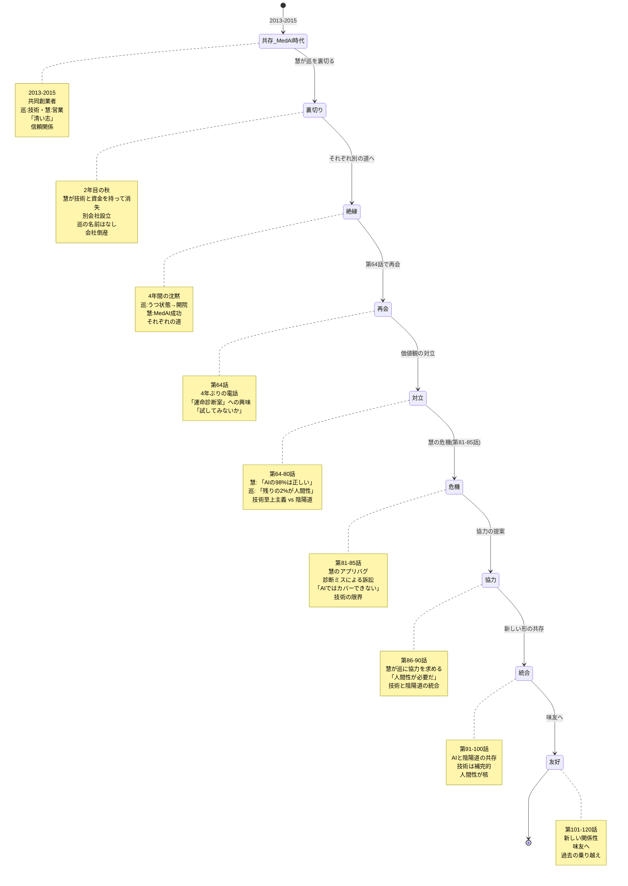
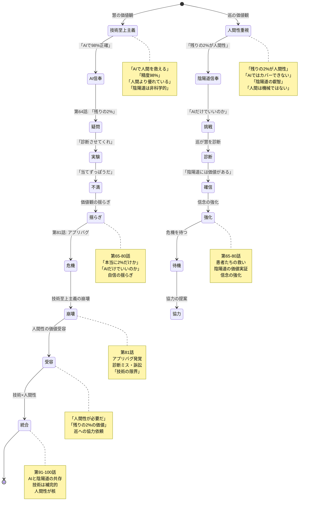
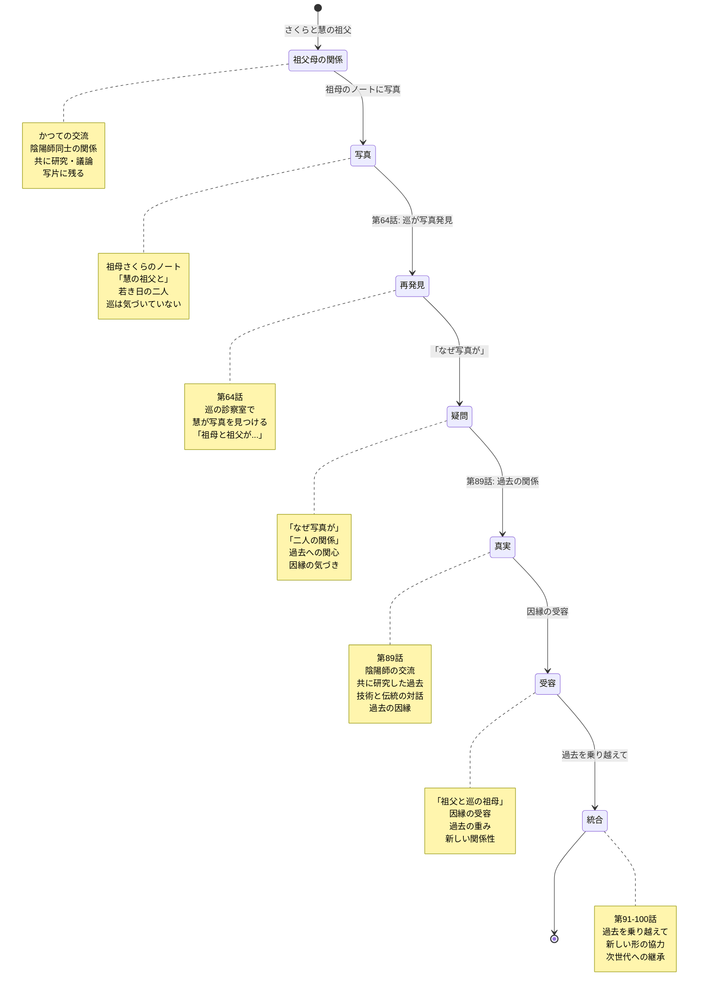
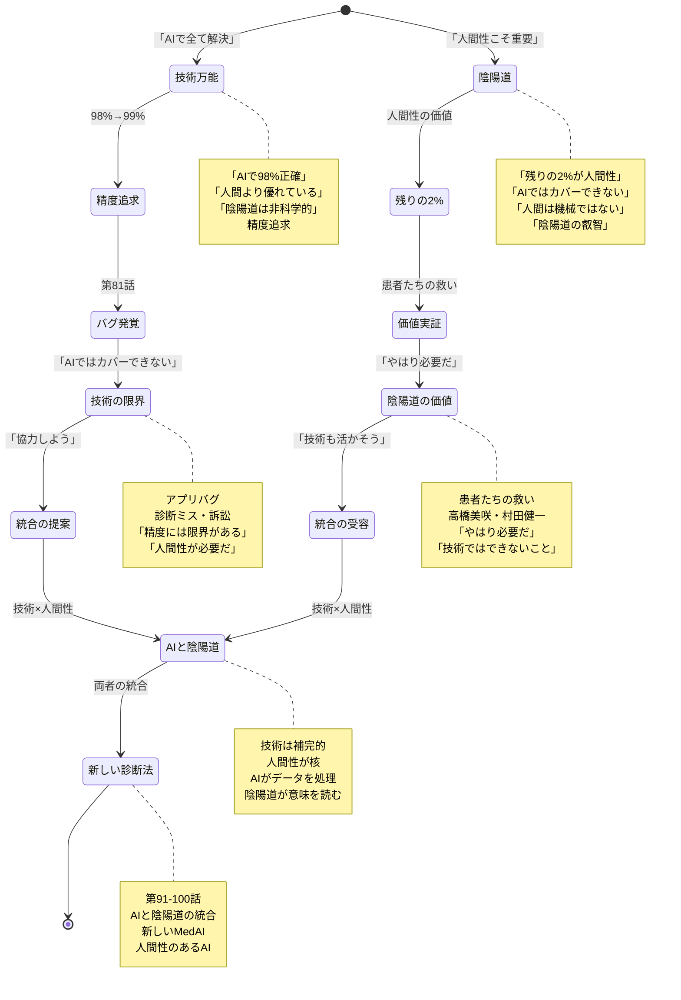
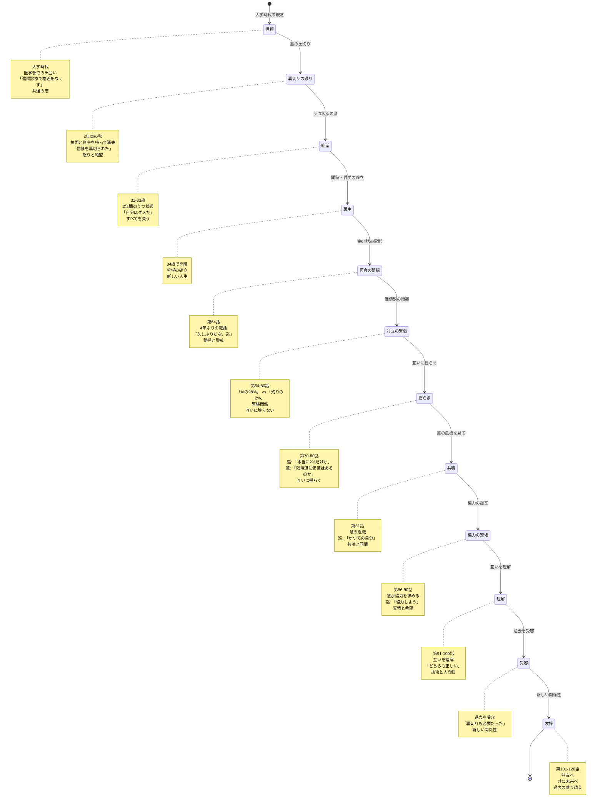
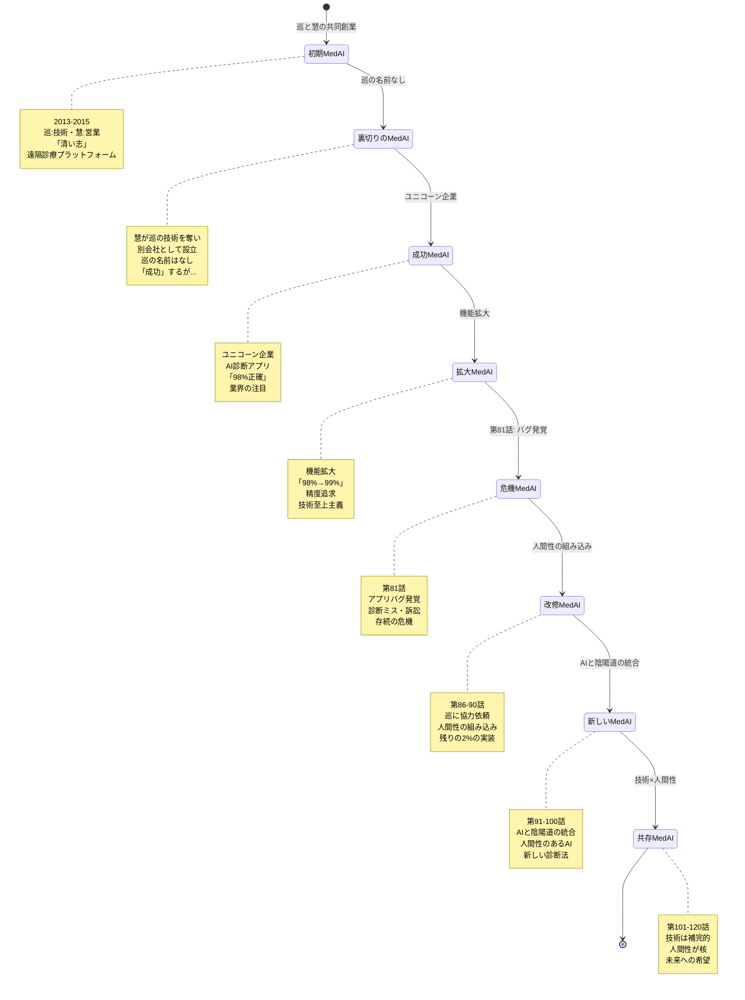
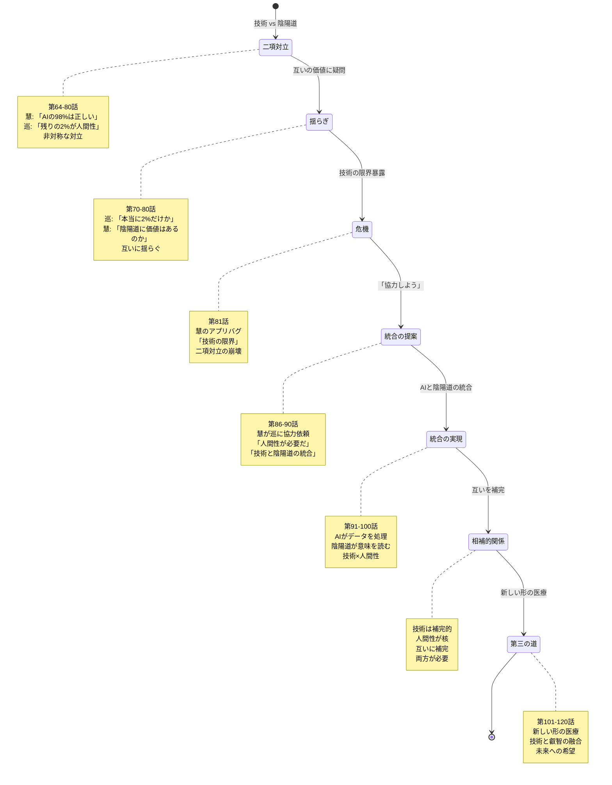

# 対立構造の State Machine 図

**作成日**: 2026-02-09
**対象**: 巡 vs 慧 の対立構造
**目的**: 二人の関係性の状態遷移を視覚化

---

## 1. 全体関係性の状態遷移

---

## 2. 価値観対立の状態遷移

---

## 3. 過去の因縁の状態遷移

---

## 4. 技術 vs 陰陽道の対立

---

## 5. 感情の動きの状態遷移

---

## 6. MedAIの変遷と対立

---

## 7. 対立から統合へのプロセス

---

**作成**: AIエージェントチーム
**適用**: 対立構造の理解と解決
**更新**: 2026-02-09
