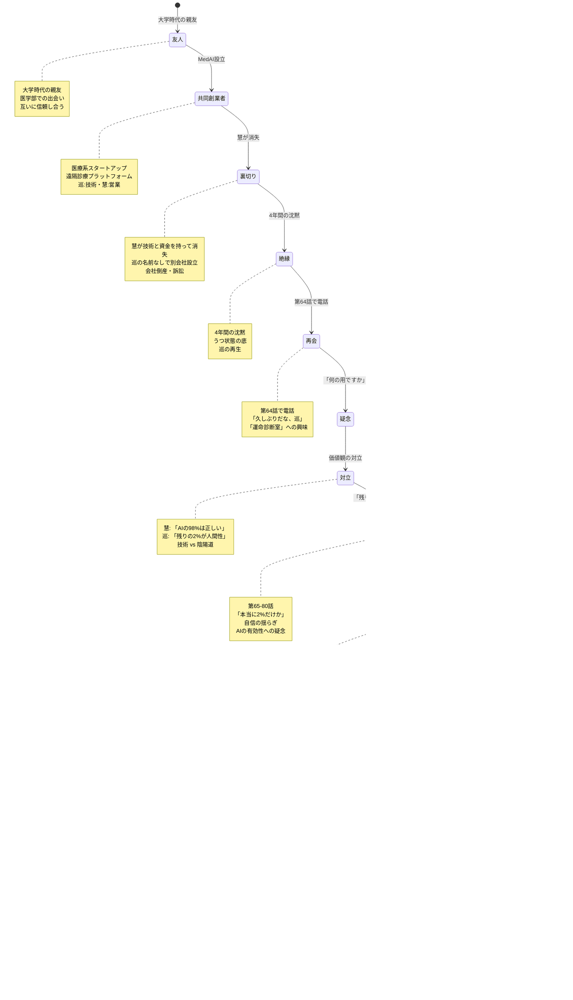

# 九条巡の成長 State Machine 図

**作成日**: 2026-02-09
**対象**: 九条巡（主人公）
**目的**: 巡の内面の状態遷移を視覚化

---

## 1. 全体成長の状態遷移


---

## 2. 哲学的成長の状態遷移


---

## 3. 申酉天中殺との向き合い


---

## 4. 慧との関係性の状態遷移



---

## 5. 医師としての成長

```mermaid
stateDiagram-v2
    [*] --> 外科医: 身体の治療
    外科医 --> 疑問: 「心も診たい」
    疑問 --> 起業: もっと多くの人を救う
    起業 --> 失敗: すべてを失う
    失敗 --> 陰陽師: 人生全体を診る
    陰陽師 --> 実践: 患者たちとの対話
    実践 --> 深化: 診断の精度向上
    深化 --> 統合: 医学×陰陽道×技術
    統合 --> 完成: 新しい形の医師
    完成 --> [*]

    note right of 外科医
        身体を開いて病を切り取る
        確かな手技
        周囲の信頼
    end note

    note right of 疑問
        「心も診たい」
        「人生全体を支えたい」
        医学の限界
    end note

    note right of 起業
        「もっと多くの人を救える」
        遠隔診療・AI診断
        へき地への医療
    end note

    note right of 陰陰師
        祖母さくらのノート
        算命学の体系
        人生全体を診る
    end note

    note right of 実践
        第1-40話
        高橋美咲・村田健一・森川陽菜
        陰陽五行からの診断
        処方箋の提案
    end note

    note right of 深化
        第41-80話
        五行・十大主星・天中殺
        深い理解と経験
        哲学の体系化
    end note

    note right of 統合
        第81-100話
        医学的知識
        陰陽道の叡智
        技術の有効活用
    end note

    note right of 完成
        第101-120話
        新しい形の医師
        身体×心×人生
        過去の患者たちのその後
    end note
```

---

**作成**: AIエージェントチーム
**適用**: 九条巡のキャラクター設計
**更新**: 2026-02-09
