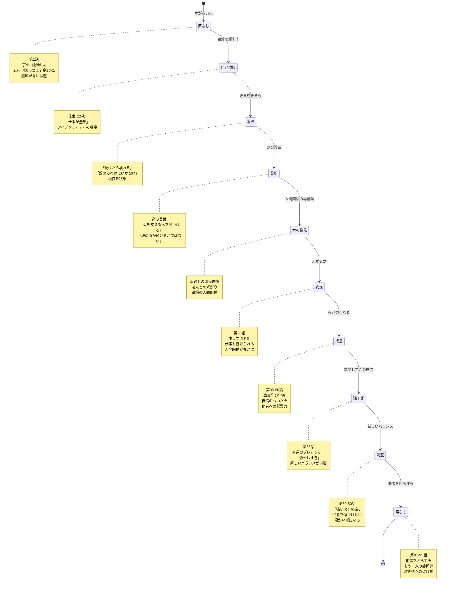
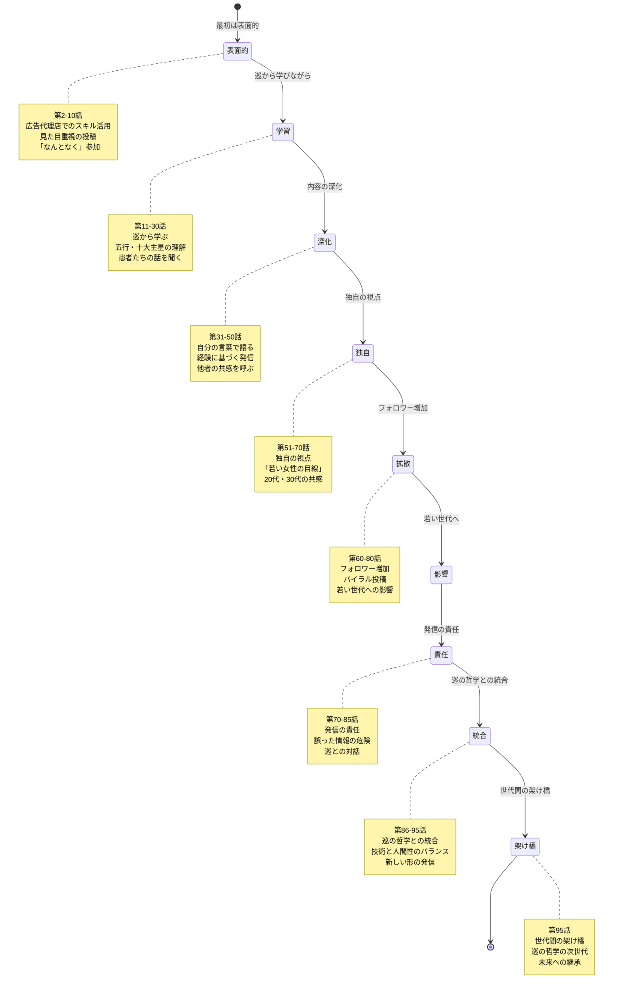
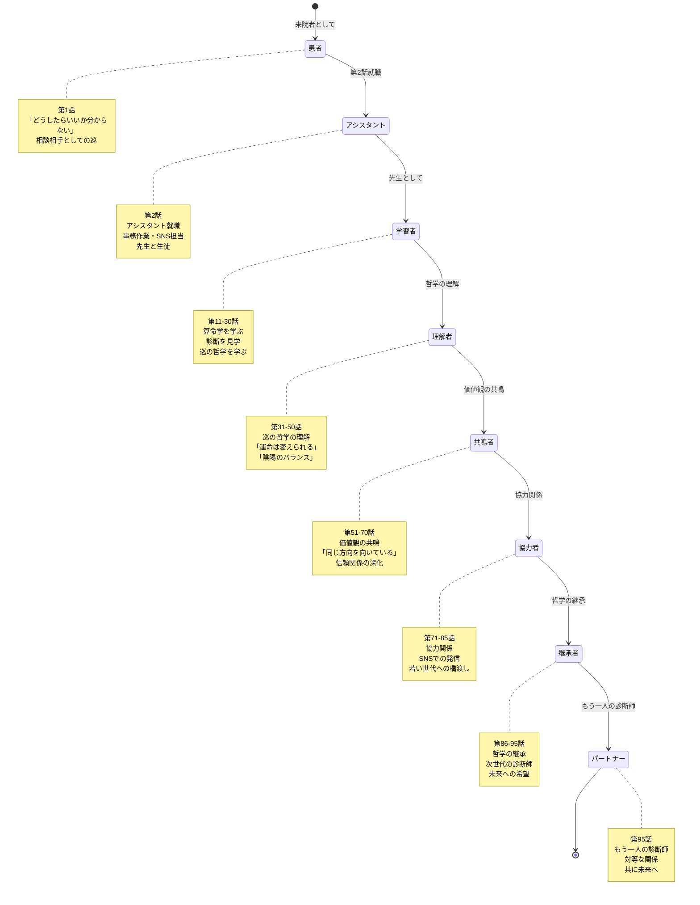
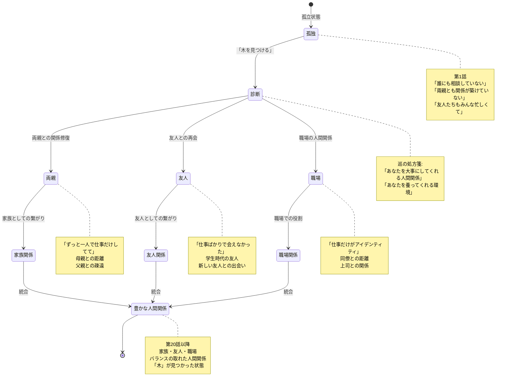

# 高橋美咲の成長 State Machine 図

**作成日**: 2026-02-09
**対象**: 高橋美咲（第1話の患者）
**目的**: 美咲の成長の状態遷移を視覚化

---

## 1. 全体成長の状態遷移

```mermaid
stateDiagram-v2
    [*] --> 来院: 第1話: 転職悩み
    来院 --> 診断: 「薪のない火」
    診断 --> 実行: 木を探す
    実行 --> 変化: 第20話: 変化の兆し
    変化 --> 就職: アシスタント就職
    就職 --> 学習: 巡から学ぶ
    学習 --> 深化: 第35話: 深い理解
    深化 --> 独自: 独自の解説展開
    独自 --> 新しい悩み: 第55話: 昇進・結婚
    新しい悩み --> 再診断: 新しい段階
    再診断 --> パートナー: 第91-95話: もう一人の診断師
    パートナー --> [*]

    note right of 来院
        第1話
        29歳: 広告代理店勤務
        転職すべきか迷う
        燃え尽きそうな状態
    end note

    note right of 診断
        丁火: 蝋燭の火
        木なし: 燃料がない
        「火を支える木を見つける」
    end note

    note right of 実行
        人間関係の再構築
        兩親との関係修復
        友人との繋がり
    end note

    note right of 変化
        第20話
        少しずつ変化
        仕事も続けられるように
        人間関係が豊かに
    end note

    note right of 就職
        第2話で巡のアシスタントに
        運命診断を学ぶ
        SNSで活動開始
    end note

    note right of 学習
        第11-30話
        巡から算命学を学ぶ
        五行・十大主星の理解
        患者たちの話を聞く
    end note

    note right of 深化
        第31-50話
        深い理解へ
        独自の視点の芽生え
        他者への共感深化
    end note

    note right of 独自
        第51-70話
        独自の解説を展開
        SNSでの発信
        若い世代への訴求
    end note

    note right of 新しい悩み
        第55話
        昇進の機会
        結婚のプレッシャー
        「木を見つけた後の迷い」
    end note

    note right of 再診断
        新しい段階の課題
        火が強くなった後のバランス
        「燃やしすぎない」
    end note

    note right of パートナー
        第91-95話
        もう一人の診断師へ
        巡の哲学を受け継ぐ
        若い世代の架け橋
    end note
```

---

## 2. 丁火の成長の状態遷移

---

## 3. SNS活動の成長

---

## 4. 巡との関係性の成長

---

## 5. 人間関係の再構築

---

**作成**: AIエージェントチーム
**適用**: 高橋美咲のキャラクター設計
**更新**: 2026-02-09
