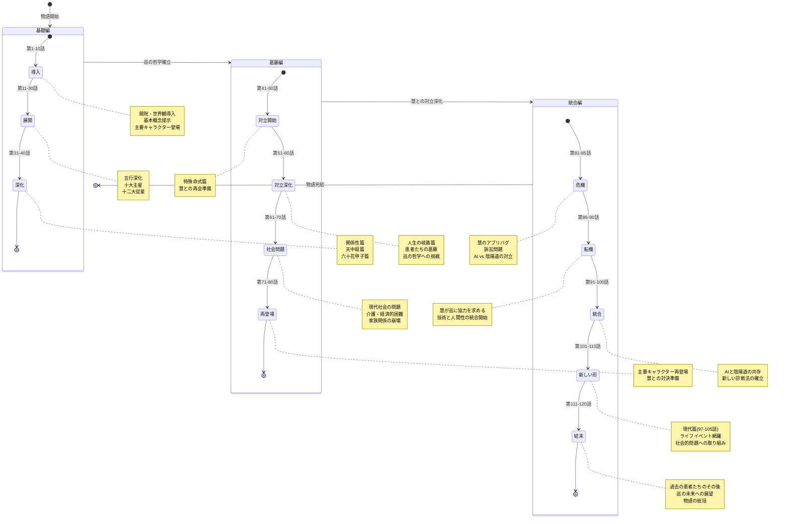
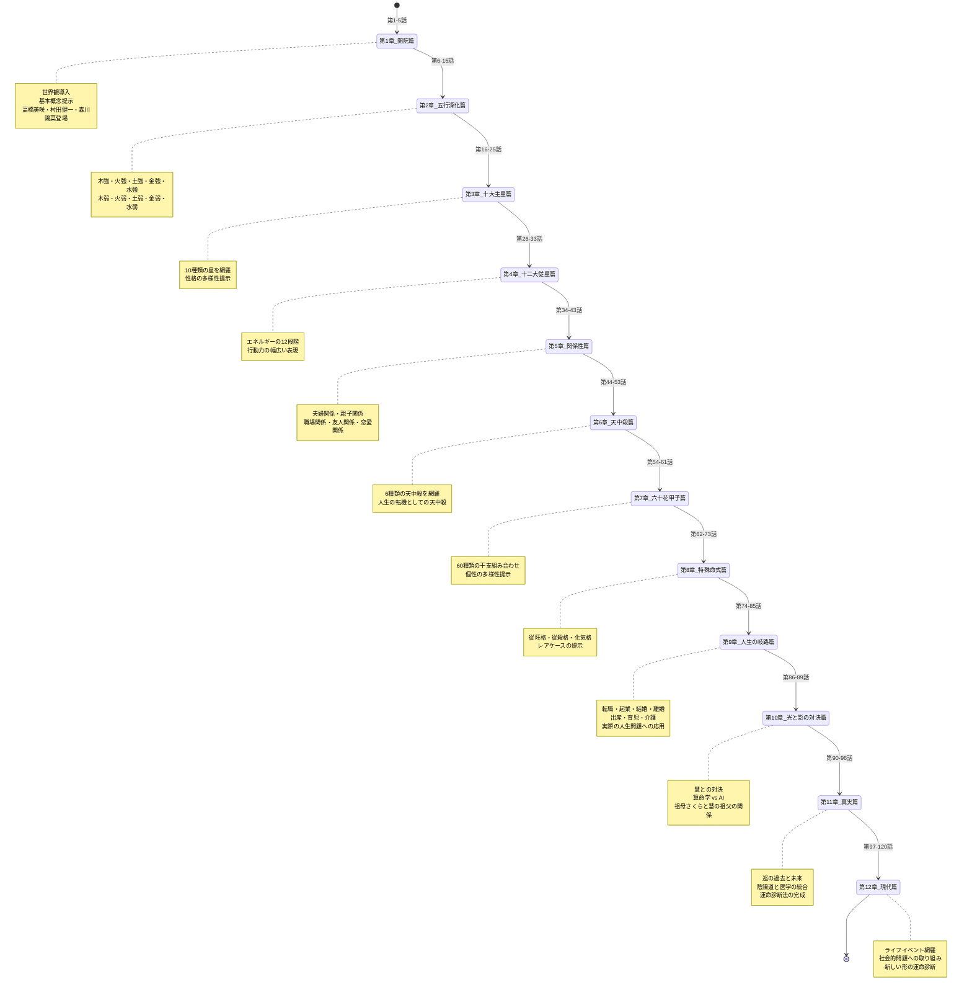
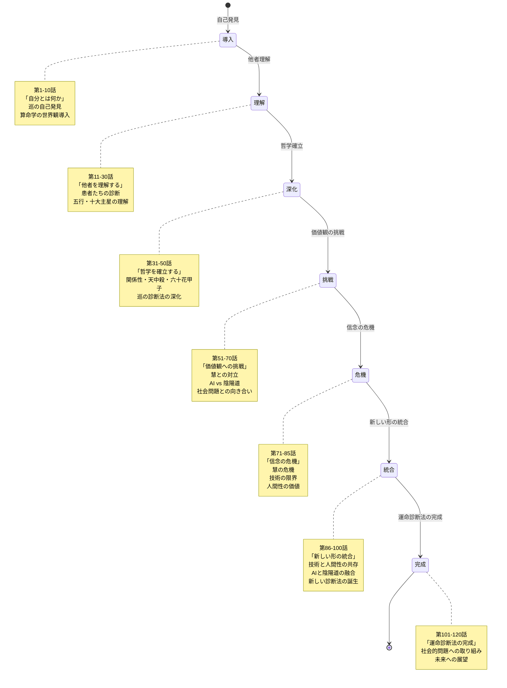
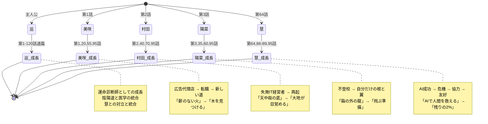
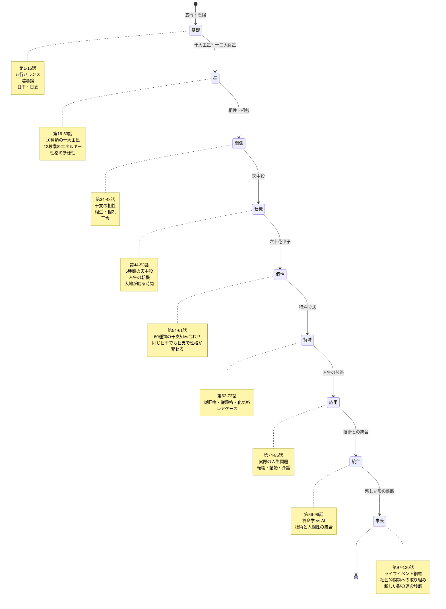
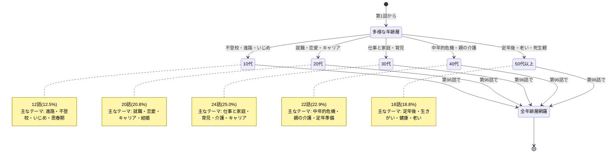

# 120話拡張版 物語全体 State Machine 図

**作成日**: 2026-02-09
**目的**: 120話の物語構造を状態遷移図として視覚化

---

## 1. 3部構造の状態遷移

---

## 2. 11章構成の詳細状態遷移

---

## 3. 物語のテーマ遷移

---

## 4. 主要キャラクターの物語関与

---

## 5. 算命学的トピックの網羅性

---

## 6. 年齢層カバレッジの遷移

---

**作成**: AIエージェントチーム
**適用**: 全120話エピソード構造
**更新**: 2026-02-09
