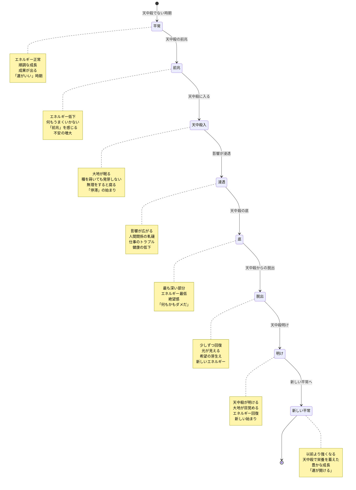
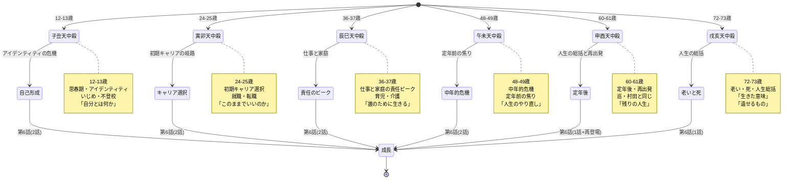
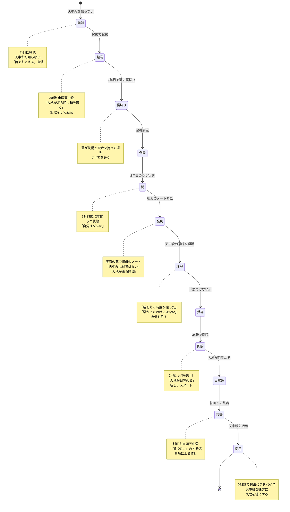
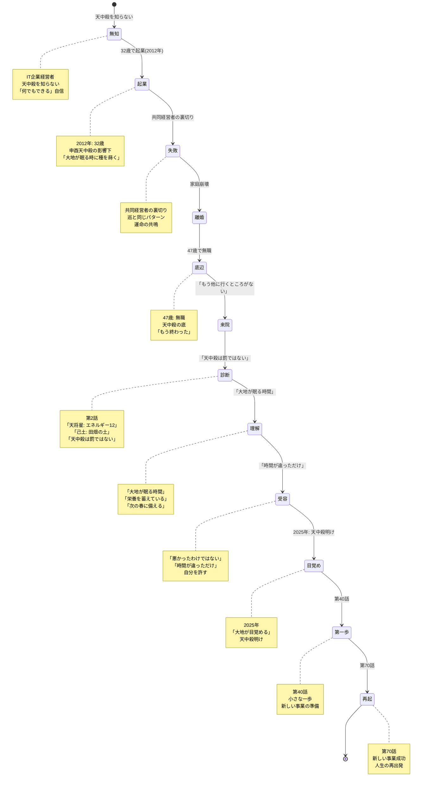
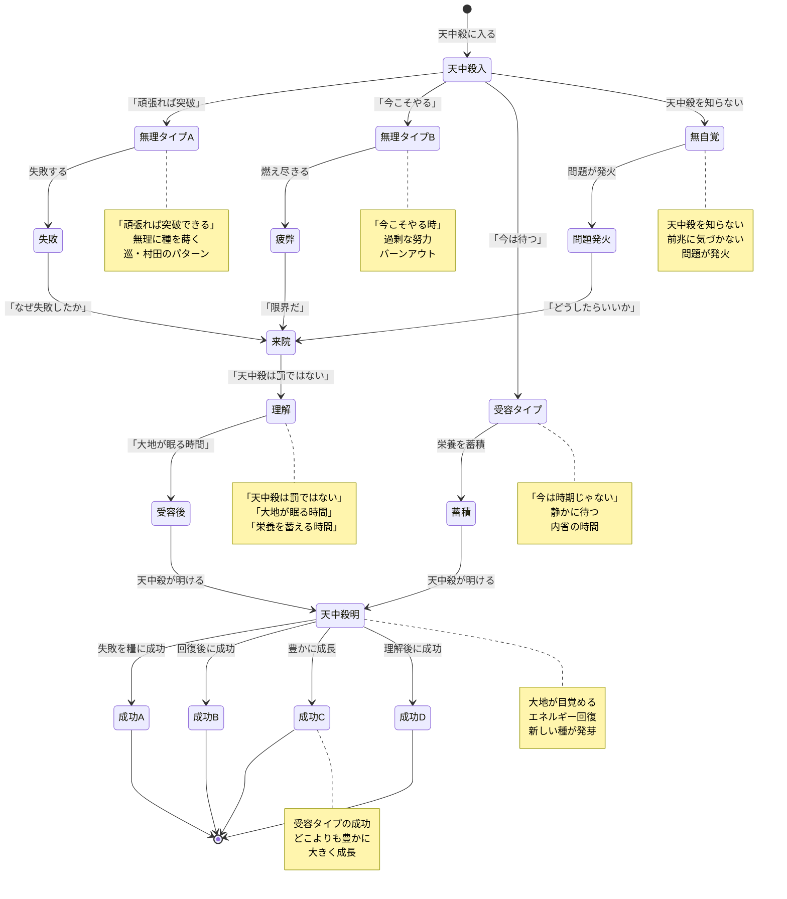
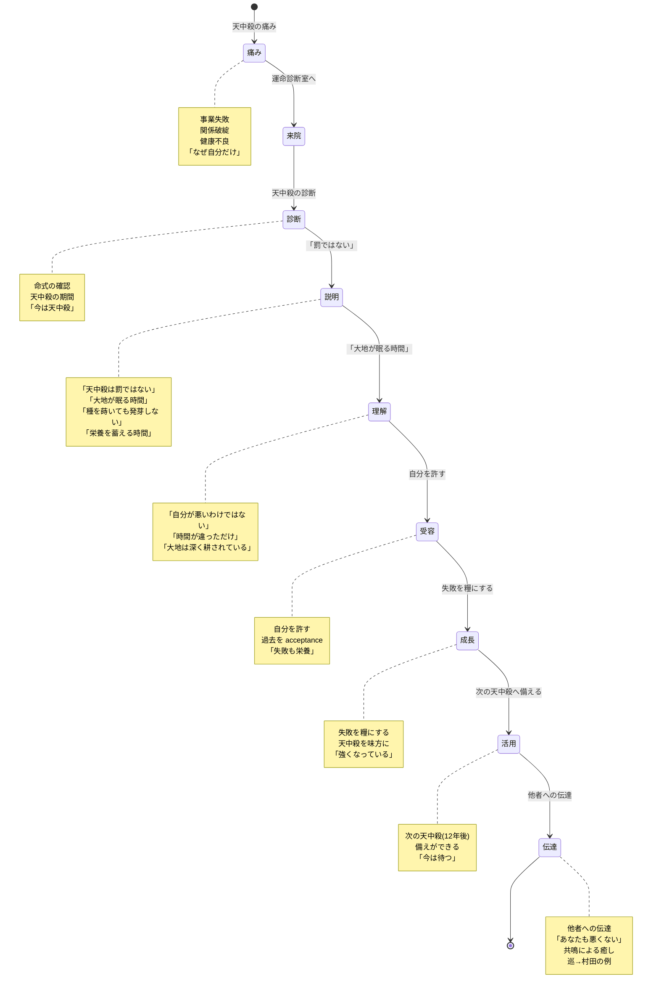

# 天中殺の State Machine 図

**作成日**: 2026-02-09
**目的**: 天中殺のサイクルと患者への影響を状態遷移図として視覚化

---

## 1. 天中殺の基本サイクル



---

## 2. 6種類の天中殺の状態遷移



---

## 3. 巡の天中殺体験（申酉天中殺）



---

## 4. 村田の天中殺体験（申酉天中殺）



---

## 5. 天中殺への対処パターン



---

## 6. 天中殺の教育的価値



---

## 7. 天中殺と人生のサイクル

```mermaid
stateDiagram-v2
    [*] --> 0-12歳: 子丑天中殺準備
    0-12歳 --> 12-24歳: 寅卯天中殺準備
    12-24歳 --> 24-36歳: 辰巳天中殺準備
    24-36歳 --> 36-48歳: 午未天中殺準備
    36-48歳 --> 48-60歳: 申酉天中殺準備
    48-60歳 --> 60-72歳: 戌亥天中殺準備
    60-72歳 --> 72-84歳: 人生の総括
    72-84歳 --> [*]

    0-12歳 --> 子丑: 12-13歳
    12-24歳 --> 寅卯: 24-25歳
    24-36歳 --> 辰巳: 36-37歳
    36-48歳 --> 午未: 48-49歳
    48-60歳 --> 申酉: 60-61歳
    60-72歳 --> 戌亥: 72-73歳

    子丑 --> アイデンティティ: 「自分とは何か」
    寅卯 --> キャリア: 「何をするか」
    辰巳 --> 責任: 「誰のために」
    午未 --> 総括1: 「人生のやり直し」
    申酉 --> 再出発: 「残りの人生」
    戌亥 --> 総括2: 「生きた意味」

    アイデンティティ --> 成長: 第6話(2話)
    キャリア --> 成長: 第6話(2話)
    責任 --> 成長: 第6話(2話)
    総括1 --> 成長: 第6話(2話)
    再出発 --> 成長: 第6話(1話+再登場)
    総括2 --> 成長: 第6話(1話)

    note right of 0-12歳
        自己形成の基礎
        子丑天中殺前
    end note

    note right of 12-24歳
        社会参加の準備
        寅卯天中殺前
    end note

    note right of 24-36歳
        キャリア形成
        辰巳天中殺前
    end note

    note right of 36-48歳
        責任のピーク
        午未天中殺前
    end note

    note right of 48-60歳
        定年前の焦り
        申酉天中殺前
        巡: 30歳で起業(天中殺)
    end note

    note right of 60-72歳
        定年後の再出発
        戌亥天中殺前
    end note
```

---

**作成**: AIエージェントチーム
**適用**: 天中殺の理解と教育
**更新**: 2026-02-09
