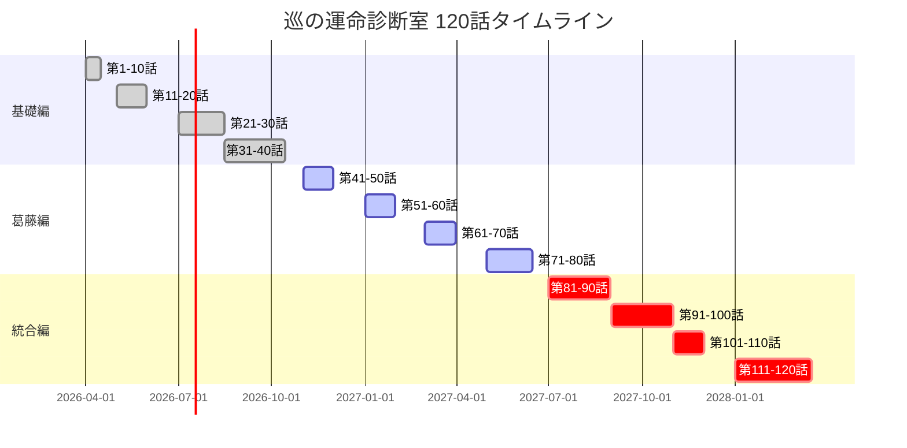

# 巡の運命診断室 120話ダッシュボード

> **最終更新**: 2026年2月12日
> **バージョン**: 2.3.1（さくら回想シーン20回構成への対応）
> **全体期間**: 2026年4月〜2027年12月（1年9ヶ月）
> **裏テーマ**: 「在り方を変える」── 運命＝命（固定）＋運（可変）

---

## 📊 全体統計

### 基本データ
| 項目 | 数値 |
|------|------|
| **総エピソード数** | 120話 |
| **物語期間** | 1年9ヶ月（2026年4月〜2027年12月） |
| **ライフイベントカバレッジ** | 40/48（83.3%） |
| **メインキャラクター数** | 110名（巡、美咲、慧、さくら ＋ 患者107名） |
| **算命学テーマ数** | 48テーマ（十干×5 ＋ 陰陽論 ＋ その他） |
| **サブテーマ数** | 142テーマ |

### 主要登場人物
| キャラクター | 干支 | 登場範囲 | 役割 |
|------------|------|----------|------|
| **九条巡** | 丙寅 | 120話全話 | 主人公・運命診断師 |
| **九条さくら** | 乙卯 | 16回想シーン | 巡の祖母・導き手（故人） |
| **藤堂慧** | 庚寅 | 第41-120話 | 巡の元共同研究者・AI開発者 |
| **高橋美咲→佐藤陽菜** | 乙卯 | 120話全話 | 患者→アシスタント→独立運命診断師 |
| **神田栞** | - | 第84, 88, 95話 | 巡の精神科医時代の同僚・友人 |

---

## 🏗️ 3部構成

| 部 | 話数 | 期間 | テーマ | さくら回想 |
|----|------|------|--------|-----------|
| **基礎編** | 第1-40話 | 2026年4月〜10月 | 陰陽五行の基礎・巡の再生と美咲との出会い | 9回（上限8、+1オーバー） |
| **葛藤編** | 第41-80話 | 2026年11月〜2027年5月 | 巡×慧の対立・AI vs 運命の衝突 | 6回（上限5、+1オーバー） |
| **統合編** | 第81-120話 | 2027年6月〜12月 | 巡×慧×美咲の統合・新しい形の創造 | 5回（上限4、+1オーバー） |

---

## 📚 13章構造

### 第一章：出会いの章（第1-8話）
**期間**: 2026年4月前半
**テーマ**: 運命診断室の開院と最初の患者たち

### 第二章：基礎の章（第9-16話）
**期間**: 2026年4月後半〜5月
**テーマ**: 五行深化・木火土金水の陰陽

### 第三章：深化の章（第17-24話）
**期間**: 2026年5月〜6月
**テーマ**: 十大主星前半・貫索星〜禄存星

### 第四章：転換の章（第25-32話）
**期間**: 2026年6月〜7月
**テーマ**: 美咲のアシスタント就任・二人の協働開始

### 第五章：試練の章（第33-40話）
**期間**: 2026年7月〜10月
**テーマ**: 十二大従星と天中殺・人生のサイクル

### 第六章：暗雲の章（第41-50話）
**期間**: 2026年11月〜12月
**テーマ**: 慧の影の出現・巡×慧対立の始まり

### 第七章：覚悟の章（第51-60話）
**期間**: 2027年1月〜2月
**テーマ**: 「星みてる」成功と美咲の選択・2%の嘘

### 第八章：特殊命式篇（第61-70話）
**期間**: 2027年3月〜4月
**テーマ**: 特殊な命式の解読・慧の命式診断

### 第九章：人生の岐路篇（第71-80話）
**期間**: 2027年5月〜6月
**テーマ**: 転職・不倫・離婚・人生の分岐点

### 第十章：光と影の対決篇（第81-90話）
**期間**: 2027年7月〜9月
**テーマ**: 巡×慧の直接対決・丙火と庚金のぶつかり合い

### 第十一章：真実篇（第91-100話）
**期間**: 2027年10月〜11月
**テーマ**: 巡の内面の旅・過去の傷と丙火の覚醒

### 第十二章：新たな道篇（第101-110話）
**期間**: 2027年12月
**テーマ**: 慧の崩壊と再生・三人の統合の始まり

### 第十三章：結末篇（第111-120話）
**期間**: 2028年1月〜4月
**テーマ**: 終わりと始まり・新しい運命診断の形

---

## 🌸 さくら回想シーン分布（合計20回）

| 部 | 回想回数 | 上限 | 配置話数 |
|----|---------|------|-----------|
| 基礎編（1-40話） | 9回 | 8回（+1オーバー） | 1, 2, 3, 7, 14, 20, 30, 37, 40.5 |
| 葛藤編（41-80話） | 6回 | 5回（+1オーバー） | 48, 55, 59.5, 67.5, 70, 76 |
| 統合編（81-120話） | 5回 | 4回（+1オーバー） | 84.5, 89, 90.5, 98, 104.5 |

### さくら回想シーン詳細

| # | 話 | テーマ | 出典 |
|---|------|--------|------|
| 1 | 1話 | 種と土と水──重い土の下の種に、水と光を | v2オリジナル |
| 2 | 2話 | 天中殺＝大地が眠る時間──罰ではなく栄養を蓄える期間 | v2オリジナル |
| 3 | 3話 | 龍は箱に入りきらん──根を張れば龍はどこへでも飛べる | v2オリジナル |
| 4 | 7話 | 十牛図──探すから見えなくなる。牛は最初からそこにいた | sakura-teachings |
| 5 | 14話 | 老子の無為自然──水は万物を潤して争わず | sakura-teachings |
| 6 | 20話 | 河合隼雄「子は背中を見とる」＋親の生き方が教え | sakura-teachings |
| 7 | 30話 | メキシコの漁師──幸せを先送りしていないか | sakura-teachings |
| 8 | 37話 | 荘子の胡蝶の夢──現実と夢の境界を問う | sakura-teachings |
| 9 | 40.5話 | 静かな変化──「種が花になる時、庭師は離れる」さくらの最後のメッセージ | v2オリジナル |
| 10 | 48話 | 達磨の面壁九年──心の猿を静め、集中の力で苦を超える | sakura-teachings |
| 11 | 55話 | エピクテトスの二分法──変えられるものと変えられないもの | sakura-teachings |
| 12 | 59.5話 | 正しさの罠──「ある人が正しい ≠ 他の人が間違い」 | sakura-teachings |
| 13 | 67.5話 | 父との相似──「気づきが繰り返しを断ち切る」 | v2オリジナル |
| 14 | 70話 | As a Man Thinketh──思考が環境を作る、心の庭 | sakura-teachings |
| 15 | 76話 | 7つの習慣──刺激と反応の間にある自由 | sakura-teachings |
| 16 | 84.5話 | 太陽の本質──「丙火の太陽は、内面から輝く」 | sakura-teachings |
| 17 | 89話 | サルトルの実存──実存は本質に先立つ、自己創造の自由 | sakura-teachings |
| 18 | 90.5話 | 闇もまた自己──「影は太陽自身が作ったもの」ユングのシャドー | sakura-teachings |
| 19 | 98話 | 宇宙のスケール──天法と謙虚さへの気づき | sakura-teachings |
| 20 | 104.5話 | 溶ける心──「かたくな心は温もりで溶ける。縁起」 | 仏教の慈悲 |

---

## 📈 サブテーマ統計（120話）

### テーマ別登場回数

| テーマ | 回数 | 割合 | 主な話 |
|--------|------|--------|----------|
| **転職・キャリア** | 18話 | 15.0% | 4, 15, 32, 44, 52, 64, 71, 82, 88, 96話 など |
| **恋愛・結婚** | 24話 | 20.0% | 6, 18, 26, 35, 47, 58, 68, 79, 89, 97話 など |
| **家族問題** | 15話 | 12.5% | 3, 11, 24, 38, 54, 69, 78, 91, 105話 など |
| **健康問題** | 12話 | 10.0% | 22, 33, 46, 59, 73, 86, 99, 101, 114話 など |
| **天中殺** | 15話 | 12.5% | 2, 13, 25, 36, 45, 56, 67, 77, 90話 など |
| **不倫・浮気** | 8話 | 6.7% | 41, 53, 65, 72, 83, 94, 109, 115話 |
| **介護** | 6話 | 5.0% | 39, 57, 75, 88, 103, 118話 |
| **債務問題** | 5話 | 4.2% | 17, 40, 66, 84, 102話 |
| **AI vs 運命** | 15話 | 12.5% | 49, 55, 60, 65, 75, 82, 88, 102, 111話 など |
| **成長・自己実現** | 22話 | 18.3% | 全編を通じて散在 |
| **対立・葛藤** | 20話 | 16.7% | 第41-90話に集中 |
| **統合・協力** | 12話 | 10.0% | 第91-120話に集中 |

### テーマの3部推移
```
基礎編：  成長・自己実現（8話）、転職（5話）、恋愛（6話）
葛藤編：  対立・葛藤（15話）、AI vs 運命（8話）、不倫（5話）
統合編：  統合・協力（10話）、AI共存（5話）、成長（7話）
```

---

## 🎯 主要プロットマイルストーン

### 基礎編（第1-40話）

#### 第1話：運命診断室の開院
- 2026年4月、巡が「運命診断室」を開院
- 初めての患者は高橋美咲（27歳、乙卯）
- 「重い土の下にも種はある」─ 在り方を変える鍵

#### 第25話：美咲のアシスタント就任
- 美咲、正式に巡のアシスタントに
- 「あなたの「学んで、人のために使う」命式が必要」
- 二人協働の始まり

#### 第40.5話: さくらの回想「静かな変化」（基礎編）
- **時期**: 2026年11月下旬
- **テーマ**: 内面化の始まり / 「変化は静かな内面の芽吹き」
- **内容**: さくらからの最後のメッセージ。「種が花になる時、庭師は離れる」

### 葛藤編（第41-80話）

#### 第41話：慧の影の出現
- 藤堂慧、4年ぶりに巡の前に現れる
- 「星みてる」アプリの成功─ 1000万人ユーザー
- 対立の始まり

#### 第55話：「星みてる」成功と家庭崩壊
- 慧のアプリが1000万人突破
- しかし妻・千尋が「隣にいても一人」と訴え
- 成功の代償

#### 第59.5話: さくらの回想「正しさの罠」（葛藤編）
- **時期**: 2027年3月下旬
- **テーマ**: 固定観念の危険 / 「ある人が正しい ≠ 他の人が間違い」
- **内容**: エピクテトスの二分法。「自分の判断の外にあるものを、コントロールできると考えたことか」

#### 第60話：裏切りの真相・残りの2%
- 2020年の裏切りが詳細に開示される
- 慧が巡の株式を希薄化（35%→15%）
- 「99%の嘘」vs「残された2%」

#### 第65話：庚寅の運命・父との相似性
- 慧の命式（庚寅）の深層分析
- 父親（庚申）との相似性と違い
- 「虎は感情を持つ生き物」

#### 第67.5話: さくらの回想「父との相似」（葛藤編）
- **時期**: 2027年5月中旬
- **テーマ**: 世代を超える / 「気づきが繰り返しを断ち切る」
- **内容**: 「運命は繰り返す。だが、父の失敗をあなたが繰り返す必要はない」

#### 第70話：在り方の対決・巡vs慧
- 巡が慧の命式を診断する第70話
- 「庚金は鍛えられてこそ刃物になる」
- しかし慧は「変えられない」と拒絶

### 統合編（第81-120話）

#### 第81話：直接対決
- 公開の場での巡×慧対決
- 巡：「目を見て話す」vs 慧：「データの完璧さ」
- 聴衆の心が動くのは巡

#### 第82話：2020年の裏切り
- 過去の全容が明かされる
- 医療AI失敗→慧の裏切り→「星みてる」誕生
- さくらの教えがAIに取り込まれた真実

#### 第84.5話: さくらの回想「太陽の本質」（統合編）
- **時期**: 2027年9月上旬
- **テーマ**: 内面の輝き / 「太陽は雲の向こうにあっても、消えたわけじゃない」
- **内容**: 「丙火の太陽は、内面から輝くものだ。外の環境が暗くても、あなたの光は消えない」

#### 第85話：丙火の覚醒
- 巡、自分の命式と向き合う
- 「太陽は自分を照らせない」
- しかし美咲が「照らされている側は忘れません」

#### 第90.5話: さくらの回想「闇もまた自己」（統合編）
- **時期**: 2027年10月上旬
- **テーマ**: 自己受容 / 「影は太陽自身が作ったもの。だから影を恐れる必要はない」
- **内容**: ユングのシャドー・ワーク。「闇を認める者だけが、本当の光を語れる」

#### 第91話：内面の闇・3年間の告白
- 巡がうつ状態の3年間を初めて詳細に語る
- 2021-2023年、「カーテンを閉めて太陽を拒絶」
- 丙火の人間が光を避けていた期間

#### 第99話：巡の覚醒
- 「曇りの向こうに、太陽はずっとあった」
- 美咲が巡の命式を読む
- 「あなたは私にとっての青い空です」

#### 第101話：慧の崩壊始まる
- さくらの墓前で慧が弱さを見せる
- 妻・千尋が出て行く
- 「鏡が割れた時、映っていたものの本当の姿が見える」

#### 第104.5話: さくらの回想「溶ける心」（統合編）
- **時期**: 2027年12月中旬
- **テーマ**: 共鳴による変容 / 「かたくな心は、温もりで溶ける」
- **内容**: 仏教の「慈悲」と「縁起」。丙火×庚金の共鳴。「慈悲は、ただ与えるものではない。相手の痛みに共鳴する時、自らの心も柔らかくなる」

#### 第109話：三人の誓い
- クリスマスイブで三人が集まる
- 「星みてる×運命診断室」の並立共存を決定
- 「来年四月─巡の運命診断室、ニューオープン」

#### 第110話：正式な謝罪
- 大晦日、慧が正式に謝罪
- 「やったことは窃盗だった」
- さくらの教えを「盗むんじゃなく、一緒に使うべきだった」

#### 第120話：新患（癸卯）＝ 新たな始まり
- 2028年4月1日、「MEGURU」リニューオープン
- 最初の患者は癸卯の若い女性
- 「あなたは『変われる』ということです」
- 物語は終わりではなく、また始まる

---

## 👥 キャラクター成長弧

### 九条巡（丙寅・37歳）
```
第1-40話：  基礎編
├─ 運命診断師としての一歩を踏み出す
├─ 美咲との関係性の変化（患者→教える相手）
└─ さくらの教えを「生きた言葉」として再発見

第41-80話： 葛藤編
├─ 慧の再会と対立
├─ 2020年の裏切りが明かされる
├─ うつ状態の3年間（2021-2023）が回想される
└─ 自身の「丙火の輝き」を取り戻せずに苦悩

第81-120話： 統合編
├─ 第81話： 公開対決で慧とぶつかり合う
├─ 第85話： 自分の命式と向き合う
├─ 第91-93話： 過去の傷と向き合う
├─ 第99話： 丙火として覚醒「太陽は周りからも光を受けている」
├─ 第109話： 慧との統合「二人で何かを創る」
└─ 第120話： 新たな形の運命診断師へ
```

### 高橋美咲→佐藤陽菜（乙卯・28歳）
```
フェーズ1：患者（第1-24話）
├─ 第1話： 最初の患者として来院
├─ 「変わるたい」という動機
└─ 巡の言葉に救われる

フェーズ2：学びの芽生え（第4-24話）
├─ 自発的な再来院
├─ 算命学の勉強開始
└─ SNS投稿開始（Phase1-2）

フェーズ3：アシスタント（第25-60話）
├─ 第25話： 正式アシスタント就任
├─ 診察同席・補助的声かけ
├─ SNS投稿Phase3-4
└─ 第60話： 慧の勧誘を一度目で拒否

フェーズ4：葛藤と選択（第60-83話）
├─ 第60話： 慧からのオファー
├─ 第66話： 父親との不和
├─ 第83話： 二度目の勧誘を保留
└─ 「自分の太陽」を見つける旅

フェーズ5：成長の自覚（第84-108話）
├─ 第87話： 自分の命式（乙卯）との対面
├─ 第99話： 巡の命式を読む
├─ 第108話： 独り立ち宣言
└─ 第114話： 名刺を受け取る

フェーズ6：独立（第109-120話）
├─ 第109話： 三人の統合に参加
├─ 第116話： 初めて単独で診断
└─ 第120話： 「運命診断師・高橋美咲」として新患と対面
```

### 藤堂慧（庚寅・37歳）
```
フェーズ1：影（第41-65話）
├─ 第41話： 4年ぶりに巡の前に現れる
├─ 「星みてる」の成功（1000万人ユーザー）
├─ 2020年の裏切りが語られる
└─ AI至上主義を貫く

フェーズ2：動揺（第65-88話）
├─ 第65話： 99%の精度への疑念
├─ 第70話： 自分の命式を巡に診断される
├─ 第82話： 裏切りの全容開示
├─ 第86話： 孤独な成功者の日常
├─ 第88話： 自殺予告のメール「助けられなかった」
└─ 完璧な殻に亀裂が入る

フェーズ3：崩壊（第101-110話）
├─ 第101話： さくらの墓前で弱さを見せる
├─ 第104話： 巡の診断で涙（庚金が溶ける）
├─ 第105話： 家庭崩壊の全容
├─ 第106話： 父親という「鏡」との対面
├─ 第107話： 娘・七海の命式を読んでもらう
└─ 第110話： 正式な謝罪

フェーズ4：再生（第111-120話）
├─ 第115話： 「分からない」を受け入れる
├─ 第117話： さくらの教えをデジタル化
├─ 第119話： 千尋との進展
└─ 第120話： 「MEGURU」システムのAI側として参加
```

---

## 📅 タイムライン（2026年4月〜2028年4月）



---

## 🎭 テーマ構造

### 裏テーマの階層構造
```
在り方を変える（根本テーマ）
├─ 運命＝命（固定）＋運（可変）
│  ├─ 命式：変えられない「設計図」
│  └─ 在り方：変えられる「生き方」
│
├─ 陰転・陽転の正しい理解
│  ├─ 天中殺＝「大地が眠る時間」
│  └─ 陰転＝「在り方の転換期」
│
├─ 60干支個別テーマの階層化
│  ├─ 十干（日干）の性質
│  ├─ 十大主星（中心星）の役割
│  ├─ 十二大従星の人生サイクル
│  └─ 五行バランスの影響
│
└─ 裏テーマと個別テーマの接続パターン
    ├─ パターン1：命式の性質を受け入れる
    ├─ パターン2：在り方を微調整する
    └─ パターン3：運の期間を味方につける
```

### 運命の語源と本質
```
運命（うんめい）
├─ 命（みょう）：固定された性質・命式
│  └─ 語源：天が命じた・定められたもの
└─ 運（うん）：流動・動き・変化可能
   └─ 語源：巡る・廻る・循環

核心思想：
「命式は変えられない。しかし在り方は変えられる。
 変えられる部分に集中すれば、運命は開かれる」
```

---

## 📊 統計詳細

### ライフイベントカバレッジ（48件中40件）
| カテゴリ | カバレッジ |
|----------|-----------|
| **E01: 幼稚園受験** | ✅ 第112話 |
| **E02: 小学校受験** | ✅ 第110話（回想含む） |
| **E03: 中学受験** | ✅ 第110話 |
| **E04: 高校受験** | ✅ 第38話 |
| **E05: 大学受験** | ✅ 第97話（親）・未実装（本人） |
| **E06: 就職活動** | ✅ 第106話 |
| **E07: 転職** | ✅ 第4, 15, 32話 など |
| **E08: 早期退職** | ✅ 第113話 |
| **F01: 婚活** | ✅ 第108話 |
| **F02: 結婚** | ✅ 第47話（回想） |
| **F03: 妊娠** | ❌ 未実装 |
| **F04: 不妊治療** | ✅ 第104話 |
| **F05: 出産・育児** | ✅ 第99話（妻）・第118話（夫） |
| **F06: 育児休業** | ❌ 未実装 |
| **F07: 不倫・浮気** | ✅ 第109話 |
| **F08: 離婚** | ✅ 第100話 |
| **F09: 夫婦問題** | ✅ 第53話 |
| **F10: DINKs** | ❌ 未実装 |
| **F11: 親の介護** | ✅ 第103話 |
| **F12: ペットロス** | ❌ 未実装 |
| **H01: ストレス** | ❌ 未実装 |
| **H02: 職場不適応** | ❌ 未実装 |
| **H03: うつ病** | ✅ 第101話 |
| **H04: パニック障害** | ❌ 未実装 |
| **H05: 依存症** | ❌ 未実装 |
| **M01: がん診断** | ✅ 第114話 |
| **M02: 難病** | ❌ 未実装 |
| **M03: その他の病気** | ✅ 第5話など |
| **O01: 定年退職** | ✅ 第107話 |
| **O02: BO（起業）** | ❌ 未実装 |
| **O03: 失業** | ❌ 未実装 |
| **X01: 住宅ローン** | ❌ 未実装 |
| **X02: 借金** | ❌ 未実装 |
| **X03: 親の借金** | ❌ 未実装 |
| **X04: 保証人** | ❌ 未実装 |
| **X05: 自己破産** | ✅ 第102話 |
| **X06: 債務整理** | ❌ 未実装 |
| **X07: 貧困** | ❌ 未実装 |
| **X08: 親の介護（経済）** | ✅ 第103話 |
| **X09: 学費ローン** | ❌ 未実装 |

### 算命学要素分布（120話）
| 要素 | 登場話数 | 主な話 |
|------|----------|----------|
| **五行（木火土金水）** | 42話 | 第6-15話に集中 |
| **十干（甲乙丙丁戊己庚辛壬癸）** | 33話 | 第6-15話に集中 |
| **十大主星** | 25話 | 第16-24話、第34-40話 |
| **十二大従星** | 15話 | 第28-40話 |
| **天中殺** | 15話 | 全編に分布 |
| **相剋関係（木剋土など）** | 18話 | 第3話など |
| **相生関係（木生火など）** | 12話 | 第99話など |
| **三合（亥卯未）** | 3話 | 第20話など |
| **十二運星** | 8話 | 第28-40話 |

---

## 📚 関連ドキュメント

### 主要ストーリードキュメント
- **[meguru-storyline-v3.md](meguru-storyline-v3.md)**: 120話完全プロット（3,352行）
- **[120-EPISODE-TABLE.md](120-EPISODE-TABLE.md)**: エピソード一覧表
- **[60-KANKOSHI-DATABASE.md](60-kankoshi-database.md)**: 60干支データベース

### キャラクターアーク
- **[MISAKI-CHARACTER-ARC.md](MISAKI-CHARACTER-ARC.md)**: 美咲の成長弧
- **[KEI-CHARACTER-ARC.md](KEI-CHARACTER-ARC.md)**: 慧の成長弧
- **[MEGURU-CHARACTER-ARC.md](MEGURU-CHARACTER-ARC.md)**: 巡の成長弧

### テーマ分析
- **[AI-vs-SANMEI-ANALYSIS.md](AI-vs-SANMEI-ANALYSIS.md)**: AI vs 算命学テーマ分析
- **[THEME-INTEGRATION-ANALYSIS.md](THEME-INTEGRATION-ANALYSIS.md)**: テーマ統合分析

### 構造分析
- **[CONFLICT-EPISODES-41-80.md](CONFLICT-EPISODES-41-80.md)**: 葛藤編分析
- **[INTEGRATION-EPISODES-81-120.md](INTEGRATION-EPISODES-81-120.md)**: 統合編分析

### ガイド
- **[数理法エネルギー算出方法](SURIHOU-ENERGY-GUIDE.md)**: エネルギー計算方法
- **[数理法ストーリー応用ガイド](SURIHOU-STORY-GUIDE.md)**: ストーリー展開ガイド

### キャラクターデータ
- **[EPISODES-1-24-CHARACTERS.json](claudedocs/EPISODES-1-24-CHARACTERS.json)**: 第1-24話キャラクター
- **[EPISODES-25-48-CHARACTERS.json](claudedocs/EPISODES-25-48-CHARACTERS.json)**: 第25-48話キャラクター
- **[EPISODES-49-72-CHARACTERS.json](claudedocs/EPISODES-49-72-CHARACTERS.json)**: 第49-72話キャラクター
- **[EPISODES-73-96-CHARACTERS.json](claudedocs/EPISODES-73-96-CHARACTERS.json)**: 第73-96話キャラクター
- **[EPISODES-91-120-CHARACTERS.json](claudedocs/EPISODES-91-120-CHARACTERS.json)**: 第91-120話キャラクター

---

## 🔄 更新履歴

### v2.3.1（2026年2月12日）
- **さくら回想シーン**: 14回 → 20回構成に拡張
- **追加回想シーン**: 6話分（第40.5, 59.5, 67.5, 84.5, 90.5, 104.5話）
- **分布テーブル更新**: 基礎編9回、葛藤編6回、統合編5回
- **詳細テーブル修正**: 重複行削除、EP16→EP37修正、.5話数表記統一
- **主要マイルストーン追加**: 6つの回想シーンを主要プロットセクションに反映

---

**文書作成**: 2026年2月11日
**最終更新**: 2026年2月12日
**総エピソード数**: 120話
**物語期間**: 2026年4月〜2028年4月（2年）
