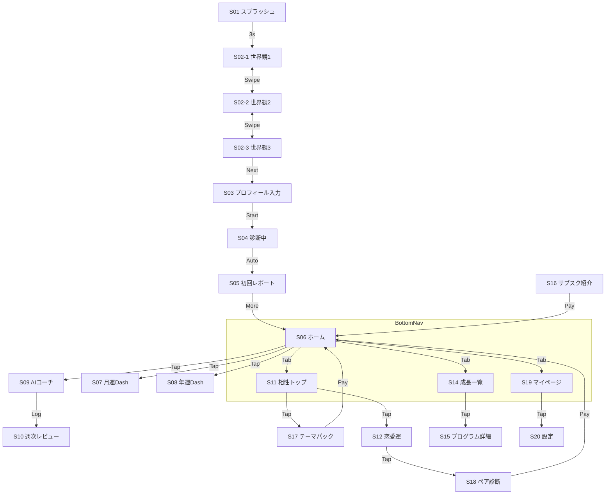

# AI × 占い × ライフコーチ アプリ 画面遷移指示書

## 1. 全体マップ (Page 1)

## 2. 画面詳細定義

### A. 初回導線
| ID | 画面名 | 要素・機能 | 遷移先 |
|---|---|---|---|
| **S01** | スプラッシュ | ロゴ, "流れを読み、未来を創る" | 自動 -> S02-1 |
| **S02-1** | 世界観1 | "生まれた時の流れ" | Swipe -> S02-2 |
| **S02-2** | 世界観2 | "読み方で味方に" | Swipe -> S02-3 |
| **S02-3** | 世界観3 | "未来は行動で変える" | Btn -> S03 |
| **S03** | プロフィール | 生年月日, 時間, 性別, 名前 | Btn -> S04 |
| **S04** | 診断中 | 五行アニメーション | 自動 -> S05 |
| **S05** | 初回レポート | 五行チャート, 本質タイプ, 一言 | Btn -> S06 |

### B. ホーム / 運勢
| ID | 画面名 | 要素・機能 | 遷移先 |
|---|---|---|---|
| **S06** | ホーム | 今日の運勢, 行動アドバイス, AIボタン | S07, S08, S09, Tabs |
| **S07** | 月運Dash | 月の運勢, カレンダー | Back -> S06 |
| **S08** | 年運Dash | 年の波, テーマ | Back -> S06 |

### C. AIコーチ
| ID | 画面名 | 要素・機能 | 遷移先 |
|---|---|---|---|
| **S09** | AIコーチ | チャット, 選択肢ボタン, ログ | Modal(Action) |
| **S10** | 週次レビュー | 行動履歴, 来週の目標 | Back -> S09 |

### D. 相性・恋愛・仕事
| ID | 画面名 | 要素・機能 | 遷移先 |
|---|---|---|---|
| **S11** | 相性トップ | パートナー入力, スコア | S17 |
| **S12** | 恋愛運 | 恋愛の流れ, アプローチ | S18 |
| **S13** | 仕事運 | ビジネス適性 | S17 |

### E. 成長プログラム
| ID | 画面名 | 要素・機能 | 遷移先 |
|---|---|---|---|
| **S14** | 成長一覧 | プログラムカード(自信, 習慣, 恋愛) | S15 |
| **S15** | 詳細 | ステップ表示, Startボタン | Action |

### F. 課金
| ID | 画面名 | 要素・機能 | 遷移先 |
|---|---|---|---|
| **S16** | サブスク | 機能比較, 加入ボタン | Modal -> S06 |
| **S17** | テーマパック | パック内容, 購入ボタン | Modal |
| **S18** | ペア診断 | 2人の詳細鑑定, 購入ボタン | Modal |

### G. 設定
| ID | 画面名 | 要素・機能 | 遷移先 |
|---|---|---|---|
| **S19** | マイページ | プロフィール, 履歴, メニュー | S05, S20 |
| **S20** | 設定 | 通知, バックアップ, 規約 | Back -> S19 |

## 3. インタラクション
- **Swipe**: S02 (Onboarding)
- **Modal**: S09 (Action), Payment Success
- **Floating**: S06 AI Coach Button
- **Animation**: S04 (Loading), S15 (Progress)
